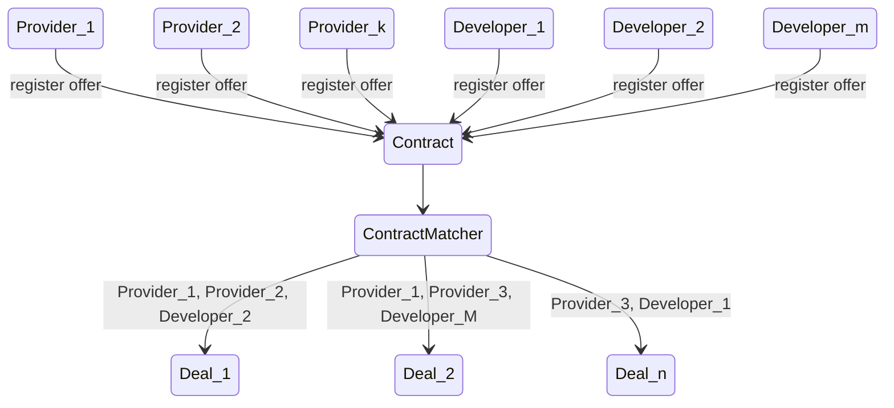
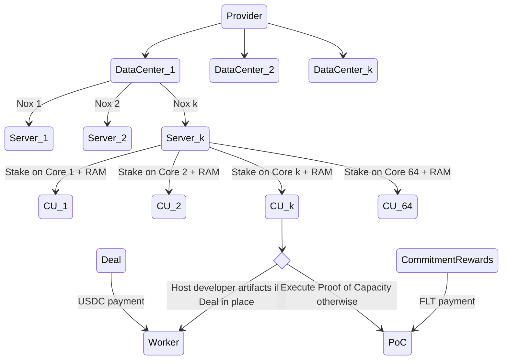

# Marketplace+

## Overview

The Fluence marketplace is a blockchain-based matcher of offers provided by data center operators (Providers) interested in monetizing their resources and offers put forward by developers looking for compute capacity to host and execute their serverless functions. Matching is based on attribute parameters provided by both providers and developer offers, respectively, where offer attributes include but are not limited to (escrowed) willingness to pay and accept and duration of capacity commitment. See [link to finalized deal sol](). Both Provider and Developer Offers are on-chain commitments which, upon matching, result in a contract called a Deal that governs the compute capacity provisioning and compensation over the agreed upon period of time between a developer and one or more providers. See Figure 1.

Figure 1: Stylized On-Chain Deal Generation From Offer Commitments
mermaid


The remainder of this chapter presents developers with the core concepts of the capacity supply side and then dives into the processes developers need to follow to construct deals that reflect their compute, availability and budget requirements.

## Capacity Units And Capacity Compensation

Capacity providers (Providers) agree to operate protocol-compliant Fluence peers on servers with specific CPU and RAM capacity that is provable and verifiable on-chain with Fluence's Proof of Capacity protocol. Moreover, provider capacity is denominated, addressed and staked in terms of capacity units (CU) where one (1) CU is one core, two threads and four (4) GB of RAM. The Fluence peer allows providers to dynamically re-allocate CUs from the capacity commitment prover (CCP) to a worker and vice versa. Capacity allocated to deployment no longer produces proofs of capacity (PoC) and no longer generates commitment rewards. Instead, these resources now generate Deal rewards for the provider. See Figure 2.

Figure 2: Overview Of Verifiable Provider Capacity And Compute Units
mermaid


See [Capacity Commitment Protocol]() for a detailed presentation. 

Providers monetize CUs not utilized by developer request by computing Proofs of Capacity which result in capacity rewards. This allows the network to always have readily available capacity to server developer demands. 


The takeaway from this short introduction for developers is that 

* providers commit compute capacity that is verifiable on-chain
* capacity commitments are provided in form of specific compute units (CU) defined by one core and 4GiB of RAM 
* for CUs to be discoverable for matching with developer offers, each CU requires (delegated) stake and additional offer attributes including CU price per epoch committed to the Fluence IPC blockchain
* these on-chain commitments result in provider offers eligible for matching with developer offers on a per CU basis
* the capacity provided through the Fluence marketplace is indeed decentralized hardware

## DePin: A Quick Excursion

Decentralized physical infrastructure (DePin) is the "*critical first mile*" to make decentralized solutions a reality. There is little point devising and implementing decentralized protocols when the resulting peers or nodes are deployed on centralized infrastructure such as AWS EC2, for example. That is, decentralized middleware and applications need to execute on decentralized infrastructure in order to be able to live up to their namesake.

DePin, as explained by [Technopedia](https://www.techopedia.com/definition/decentralized-physical-infrastructure-networks-depin#:~:text=Decentralized%20physical%20infrastructure%20networks%20(DePIN)%20are%20blockchain%20protocols%20that%20build,%2C%20data%20collection%2C%20and%20more.) is a peer-to-peer network that meets hardware demand through and open and decentralized marketplace. While brief, the above sections should make it clear that staked, verifiable capacity committed to the on-chain marketplace is in fact DePin allowing Fluence developers to build their decentralized serverless compute applications on DePin: decentralization without compromise from the bottom up!  


## From Deployment Plans to Deployment

So, you have compiled your business logic to Wasm, have done all your testing and are ready to deploy your code to the network for hosting and on-demand execution. Fluence gives you a very fine-grained ... 


In a nutshell, developers want to deploy their functions to one or more peers for subsequent, event-driven execution. In order for data center providers to be interested in hosting and executing developers' functions, they want to be paid. 


Once you have your business logic compiled to Wasm and tested, they are ready to deploy to the network based on their deployment plan. A deployment plan contains ... such as number of instances, which providers, willingness to pay, etc.


Figure ?: Deployment Plan Parameters
```solidity!
function initialize(
        ICore globalCore_,
        CIDV1 calldata appCID_,
        IERC20 paymentToken_,
        uint256 minWorkers_,
        uint256 targetWorkers_,
        uint256 maxWorkersPerProvider_,
        uint256 pricePerWorkerEpoch_,
        CIDV1[] calldata effectors_,
        AccessType providersAccessType_,
        address[] calldata providersAccessList_
    ) external;

```
https://github.com/fluencelabs/deal/blob/f16fce85f8d917eb212de7f3355832af6ce218a1/src/deal/interfaces/IDeal.sol#L35C5-L46C16


