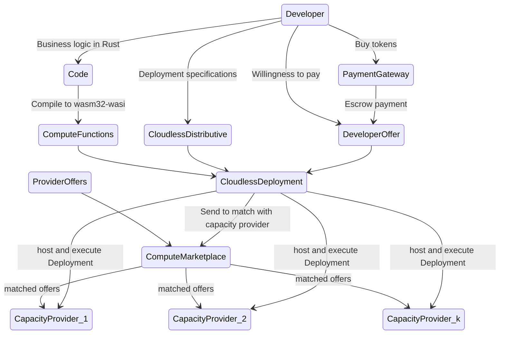

# Fluence Cloudless Function

Fluence Cloudless Function is a decentralized serverless solution deeply rooted in the decentralized physical infrastructure [(DePin)](https://www.bitstamp.net/learn/web3/what-are-decentralized-physical-infrastructure-networks-depin/) paradigm. Even more than most serverless solutions, Fluence Cloudless Function lets you do more with less code and without having to worry about the underlying infrastructure. Unlike centralized cloud providers, Cloudless Function lets you select capacity providers, i.e., data centers, a la carte from a [marketplace](../glossary.md/#compute-marketplace) allowing you to customize the serverless infrastructure exactly to your Cloudless App's availability, performance, SLA and budget needs. By virtue of its DePin roots, Cloudless Function scales at exceptionally low cost without foregoing performance and service level. Moreover, Cloudless Function is supported with a [proof system](../glossary.md/#proofs) concerning function execution, i.e., [Proof of Execution](../glossary.md/#proof-of-execution) (PoE), and correctness of execution, i.e., [Proof of Processing](../glossary.md/#proof-of-processing) (PoP), that revolutionizes a broad range of audits while simplifying accurate billing.

## In A Nutshell

To make Fluence Cloudless Function work for you, you need to complete three fundamental steps:

* Create and manage your [Compute Functions](../glossary.md/#compute-functions) by compiling your business logic to Marine Wasm
* Create your Aqua scripts to choreograph your Compute Functions
* Create your [Developer Offer](../glossary.md/#developer-offer) to package your compute artifacts and deployment requirements
* Submit your Developer Offer 

Cloudless Function is available on a Wasm runtime called [Marine](../glossary.md/#marine), with more runtimes already under development, providing performant, available and portable compute functions across capacity providers participating in the [Compute Marketplace](../glossary.md/#compute-marketplace). Moreover, [Aqua](../glossary.md/#aqua) lets you choreograph compute functions into [Cloudless Deployments](../glossary.md/#cloudless-deployment).

Once you have coded your business logic in Rust and compiled it to the wasm-wasi compile target, you are ready to create your [Cloudless Deployment](../glossary/#cloudless-deployment), which simply specifies [Cloudless Distributive](../glossary.md/#cloudless-distributive), i.e., how many instances of your functions you want deployed, for how long, to what kind of (CPU and RAM)resources, in what locales, etc, and your [Developer Offer](../glossary.md/#developer-offer) where you specify your willingness to pay for the resources desired and the payment for your deployment. 

Upon completion, you submit your deployment plan to the Fluence marketplace where the given deployment attributes are matched with [Provider Offers](../glossary.md/#provider-offer). Depending on the matching success, your functions are deployed to the chosen providers or you are asked to refine your deployment. See Figure 1 for a stylized workflow.

mermaid

Figure 1: Stylized Fluence Cloudless Development And Deployment Flow

Prior to being able to submit your Deployment, you need to acquire tokens `<compute tokens, USDC tokens>` from one of the (Fiat) gateway providers. `<Compute, USDC>` tokens are escrowed according to each Deployment and used to periodically compensate capacity providers for executing your Cloudless Functions commensurate with the execution loads, i.e., CPU and memory model, length of execution, data payload, etc. 

:::info
For the purpose of launching the Fluence mainnet, billing follows an epoch rather than execution-based model also known as a subscription model. That is, you are billed for having a provider host your Deployments for some period of time regardless of the number of executions or loads. This is a temporary constraint.
:::

An integral part of the Fluence Lambda developer experience is the Fluence CLI, which supports all development and deployment aspects of a Fluence Lambda application.

## Comparative Positioning

From a capabilities and development perspective, Fluence Cloudless Function is very similar to other serverless solutions such as [AWS Lambda](https://aws.amazon.com/lambda/), [Azure Functions](https://azure.microsoft.com/en-us/products/functions) and [Google Cloud Functions](https://cloud.google.com/serverless). Unlike these centralized serverless cloud providers, Fluence Cloudless Function leverages the power and portability of Wasm to provide a high-performance compute runtime hosted and executed across a customizable, high-availability capacity mesh, thereby eliminating single points of failure, access controls, high exit barriers and excessive rent seeking. See Table 1.

Table 1: High Level Serverless Provider Comparison

|  |Fluence Lambda| AWS Lambda| Azure Functions| Google Cloud Functions |
|:--- |:---: |:---: |:---: |:---: |
|Runtime| Wasm more coming| Multiple| Multiple| Multiple|
|Languages| Rust more coming| Multiple| Multiple| Multiple|
|Workflow Management|Aqua | Step Functions| Azure Logic App| Cloud Functions Workflow|
|&nbsp; &nbsp; &nbsp; &nbsp;Orchestration| | √| √| √|
  | &nbsp; &nbsp; &nbsp; &nbsp;Choreography| √| | | |
|Endpoint Access| P2P or HTTP Gateway| HTTP| HTTP| HTTP|
|Capacity (Data Center)| Transparent & Selectable| Blackbox |  Blackbox |  Blackbox |
|CLI | Fluence CLI| AWS CLI| Azure CLI, Azure PowerShell | gcloud CLI |

Unlike centralized cloud providers, the [Fluence Protocol](../glossary.md/#fluence-protocol) enables an open, permisisonless peer-to-peer network and compute marketplace that facilitates crowd sourcing of (data center) capacity. Make no mistake, the Fluence network is backed by a large number of Tier 4 data centers offering top of the line CPU and RAM configurations at extremely competitive prices for extraordinary SLAs. The Fluence Compute Marketplace is built on [InterPlanetary Consensus](https://www.ipc.space/) (IPC), an EVM-compatible, modern high-performance PoS blockchain. 

While developers can ignore the intricacies of the peer-to-peer network,including network security solutions such as DDOS and other attack prevention or mitigation schemes, a salient difference between Fluence Protocol and other serverless solutions is that Fluence network does not natively support HTTP request and response calls. That is, function choreography happens on the peer-to-peer level. However, this is easily solved with existing Fluence solutions at both (p2p) network ingress and egress such as the [HTTP Gateway](../glossary.md/#gateway) and [HTTP cURL Adapter].

## Use Cases

By virtue of its on-demand, easy-to-scale and pay-per-execution model, serverless compute is inherently suitable to enable [event-driven architectures and systems](https://en.wikipedia.org/wiki/Event-driven_architecture). Some of the use cases Fluence Cloudless Function enable are summarized in Table 2.

Table 2: Sample Use Cases For Fluence Lambda

|Type|Applications |
|--- |--- |
|Data Processing| Data preparation and processing|
|Process Control|Task scheduling|
|Messaging| Send notifications|
|APIs| Mobile and web apps|
|Serverless Workflows| Choreograph and compose functions|

In summary, Fluence Cloudless Function supports the full breadth of event- and time-based triggers serverless developers like yourself are accustomed to.
