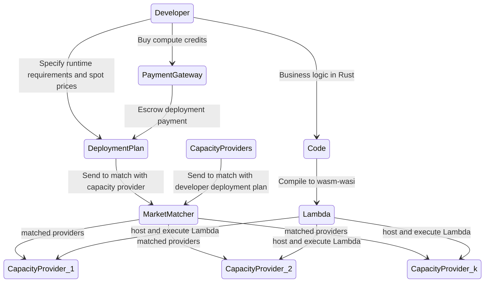

# Fluence Functions

Fluence Functions is a decentralized serverless solution deeply rooted in the decentralized physical infrastructure [(DePin)](https://www.bitstamp.net/learn/web3/what-are-decentralized-physical-infrastructure-networks-depin/) paradigm. Even more than most serverless solutions, Fluence Functions lets you do more with less code and without having to worry about the underlying infrastructure. Unlike centralized cloud providers, Fluence Functions lets you select capacity providers, i.e., data centers, a la carte from a [marketplace](http://example.com) allowing you to customize the serverless infrastructure exactly to your applications' performance, SLA and budget needs. By virtue of its DePin roots, Fluence Functions scales at speed at exceptionally low cost without foregoing performance and service level. Moreover, Fluence Functions is supported with a proof system concerning Lambda execution, i.e., Proof of Execution (PoE), and correctness of execution, i.e., Proof of Processing (PoP), that revolutionizes a broad range of audits and, of course, billing.

## In A Nutshell

To make Fluence Functions work for you, you essentially need to complete three distinct steps:

* Code and compile your business logic to Wasm
* Create and execute your deployment plan
* Create and manage your payments and billing

Fluence Functions is available as a Wasm runtime called Marine, with more runtimes already under development, providing performant, available and portable functions across arbitrary capacity providers participating in the Fluence marketplace. Moreover, Fluence tooling includes Aqua, a distributed workflow engine akin to [AWS Step Functions](https://aws.amazon.com/step-functions/), for example, that allows you to choreograph and compose your distributed Lambdas into applications and even protocols.

Once you have coded your business logic in Rust and compiled it to the wasm-wasi compile target, you are ready to create your deployment plan. A deployment plan simply specifies how many instances of your Lambdas you want deployed, for how long, to what kind of (CPU and RAM)resources, in what locales, etc. You also specify your willingness to pay for those resources and are asked to escrow the total amount for your deployment. 

Upon completion, you submit your deployment plan to the Fluence marketplace where the given deployment attributes are matched with capacity provider, i.e., data centers, attributes. Depending on the matching success, your Lambdas are deployed to the chosen providers or you are asked to refine your deployment plan. See Figure 1 for a stylized workflow.

Figure 1: Stylized Fluence Functions Development And Deployment Flow

mermaid

Prior to being able to execute your deployment plan, you are required to acquire to purchase <compute tokens, USDC tokens> from one of the (Fiat) gateway providers. <Compute, USDC> tokens are escrowed according to each deployment plan and used to periodically compensate capacity providers for executing your Lambdas commensurate with the execution loads, i.e., CPU and memory model, length of execution, data payload, etc. 

:::info
For the purpose of launching the Fluence Functions public compute network, billing follows an epoch rather than execution-based model also known as a subscription model. That is, you are billed for having a provider host your Lambdas for some period of time regardless of execution instances or loads. This is a temporary constraint. For more info, see ???.
:::

An integral part of the Fluence Functions developer experience is the Fluence CLI, which supports all development and deployment aspects of a Fluence Functions application.

## Comparative Positioning

From a capabilities and development perspective, Fluence Functions is very similar to other serverless solutions such as [AWS Lambda](https://aws.amazon.com/lambda/), [Azure Functions](https://azure.microsoft.com/en-us/products/functions) and [Google Cloud Functions](https://cloud.google.com/serverless). Unlike these centralized serverless cloud providers, Fluence Functions leverages the power and portability of Wasm to provide a high-performance compute runtime hosted and executed across a customizable, high-availability capacity mesh, thereby eliminating single points of failure, access controls, high exit barriers and excessive rent seeking. See Table 1.

Table 1: High Level Serverless Provider Comparison

|  |Fluence Functions| AWS Lambda| Azure Functions| Google Cloud Functions |
|--- |--- |--- |--- |--- |
|Runtime| Wasm  more coming| Multiple| Multiple| Multiple|
|Languages| Rust more coming| Multiple| Multiple| Multiple|
|Workflow Engine|Aqua | Step Functions| Durable Functions| Cloud Functions Workflow|
|Endpoint Access| P2P or HTTP Gateway| HTTP| HTTP| HTTP|
|Capacity (Data Center)| Transparent & Selectable| Blackbox |  Blackbox |  Blackbox |
|Security Network| | | | |
|Security Serverless| | | | 
|CLI | Fluence CLI| AWS CLI| Azure CLI, Azure PowerShell | gcloud CLI |

Unlike centralized cloud providers, the Fluence protocol enables an open, permisisonless peer-to-peer network that facilitates crowd sourcing of data center capacity. Make no mistake, the Fluence network is backed by a large number of Tier 4 data centers offering the best CPUs and RAM configurations at extremely competitive prices compared centralized cloud providers. The Fluence marketplace, backed by an innovative blockchain solution, allows you to create deployment contracts according to a variety of attributes necessary for you to build your Flunece Lambdas' performance, availability and security suitable for your budget in an entirely transparent manner. A blockchain-based algorithm is employed to match capacity provides against developers requirements.

While developers can ignore the intricacies of the peer-to-peer network, including network security solutions such as DDOS and other attack prevention or mitigation schemes, a salient difference between Fluence Functions and other serverless solutions is that Fluence Functions does not natively support HTTP request and response calls. However, this an easily surmountable challenge and Fluence already provides an out-of-the box solution to manage HTTP requests from your Fluence Functions.

## Use Cases

By virtue of its on-demand, easy-to-scale and pay-per-execution model, serverless compute is inherently suitable to enable [event-driven architectures and systems](https://en.wikipedia.org/wiki/Event-driven_architecture). Some of the use cases Fluence Functions enables are summarized in Table 2.

Table 2: Sample Use Cases For Fluence Functions

|Type|Applications |
|--- |--- |
|Data Processing| Data preparation and processing|
|Process Control|Task scheduling|
|Messaging| Send notifications|
|APIs| Mobile and web apps|
|Serverless Workflows| Choreograph and compose Lambdas|

In summary, Fluence Functions supports the full breadth of event- and trigger-based solutions serverless developers like yourself are accustomed to.

