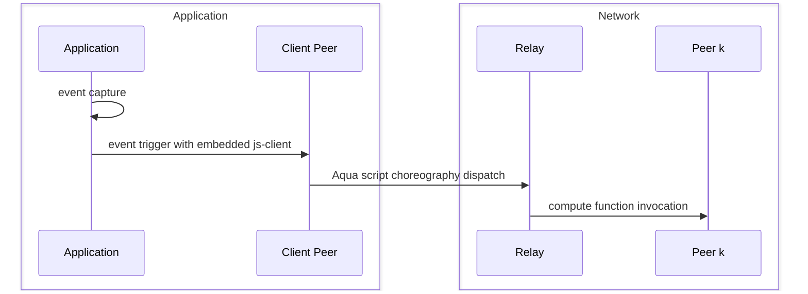
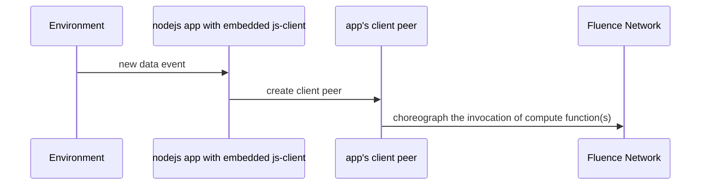
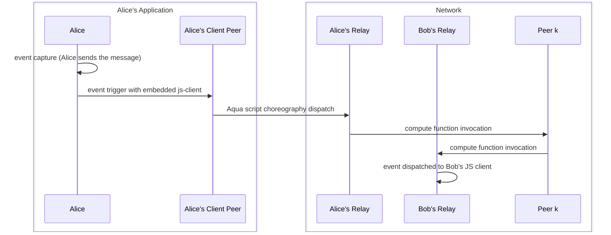

# Introduction

> Make sure you've read ***Getting Started*** and ***Quickstart*** pages.

Fluence Cloud Functions are hosted on distributed peers in the Fluence network waiting to be called. That is, your functions need to be triggered in order to do some work. Event triggers may arise from a multitude of sources ranging from browser click-events to changes in a database column. Regardless of the source, the event needs to trigger the function(s) which, as you already know from the introduction and quickstart chapters, requires Aqua to orchestrate the invocation of your distributed compute function(s).

One way of triggering the orchestration of your function(s) is interactively with the Fluence CLI: `fluence run -f 'your function(args)'`. However, events may require (near) real-time processing which in turn requires the orchestration of your function(s) immediately after the event occurred. Whether this is in the browser or some other application, we need to trigger the appropriate Aqua script from a (embedded) client peer.

The [js-client](https://github.com/fluencelabs/js-client) provides this functionality and can be used in your frontend web app or nodejs application to provide the connection to the Fluence network via a relay peer. See Figure 1.

Figure 1: Using js-client to trigger compute function
mermaid

## Interaction with deployed services

### Motivation
Imagine you've deployed your services to Fluence Network and now wondering how to interact with them, e.g., call Aqua function.

Let's forget about CLI for a minute because CLI relies on the described below event handling process.

To interact with peers of Fluence network, i.e., to execute an Aqua functions, the "client" has to be a peer.
Such client peers don't have to be publicly accessible or long-running in nature, but they need to follow the protocol.

For this reason, Fluence provides thin and simple client peer for interacting with Fluence network - JS client.
Actually, FCLI relies on JS client when interacts with Fluence Network by executing Aqua functions.
The client is dedicated to JavaScript ecosystems.
It works seamlessly in browser, Node.js and other JS environments.

It's a perfect fit for JS projects because the client is easy to install and manage.

Moreover, client have additional unique features, which extend Fluence protocol.

- Host services locally in contrast with the hosting logic remotely on peers in Fluence Network.
- Send and receive Fluence network events
- Exchange events between multiple JS clients.

### Specification

`js-client` easily embeds into any frontend or Node.js application to invoke remote compute functions. For example, your Node.js application maybe processing sensor inputs on an IoT device or scan a database for changes. See Figure 2.

Figure 2: Triggering Compute Functions with js-client

## Exchanging events between clients

Let's imagine that we're building a secret chat app atop Fluence Network
Chat is secret because messages aren't stored anywhere.

The Chat app consists of minimum two peers or JS clients connected to Fluence network.
Each JS client is running in the browser because that's where the app is.
JS client uses the **relay** as a proxy to Fluence network because direct connection is not always possible due to network limitation, e.g., provider allows connection to a limited set of IP addresses.
Publicly accessible relays (in contract with regular Fluence peers, which could be publicly inaccessible) allow the chat participants to communicate with each other from any location.
Fluence network acknowledged about connected peers via relays and events could be passed forth and back. More peers could be involved in this communication.

Let's check the figure 3 and review the possible interactions between two participants in the chat.

Figure 3: Secret chat interaction diagram

## Examples

- Try to run `fluence init --env kras --template ts frontend`. After that you can review `./frontend/src/gateway` and `./frontend/src/gateway` folders and check their code.
- Check out more examples in the [example repo](https://github.com/fluencelabs/examples/tree/main/js-client-examples); You can find browser to browser interaction example there.

