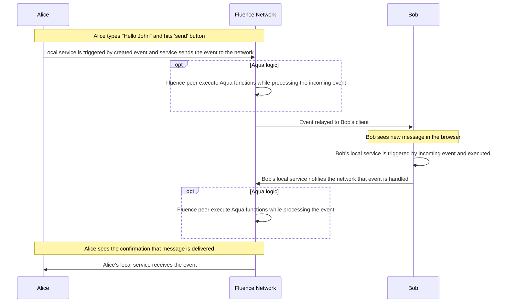

# Introduction

> Make sure you've read ***Getting Started*** and ***Quickstart*** pages.

### Recap

As you already know, Fluence allows you to host logic on remote peers.
Fluence allows you to write WASI services, match deals and deploy services to the Fluence Network's remote peers. That way your services are available while the deal is active, and you can interact with them any minute.

## Interaction with deployed services

### Motivation
Imagine you deployed your services to Fluence Network and now wondering how to interact with them.

Let's forget about CLI for a minute because CLI relies on the described below event handling process.

In order to interact with peers of Fluence network, i.e., to execute an Aqua functions, the "client" has to be a peer.
Such client peers don't have to be publicly accessible or long-running in nature, but they need to follow the protocol.

For this reason, Fluence provides thin and simple client peer for interacting with Fluence network - JS client.
Actually, FCLI relies on JS client when interacts with Fluence Network by executing Aqua functions.
The client is dedicated for JavaScript ecosystems. It works seamlessly in browser, Node.js and other JS environments.

It's perfect fit for JS projects because the client is easy to install and manage.

Moreover, client have additional unique features, which extend Fluence protocol.

- Host services locally in contrast with the hosting logic remotely on peers in Fluence Network.
- Send and receive events to Fluence Peer.
- Exchange events between multiple JS clients.

### Examples

JS client can be easily integrated in Frontend projects which the main use case for it.

#### Secret chat app atop Fluence Network

> Chat is secret because messages aren't stored anywhere.

> In this diagram - ***event*** is created once and persists the same ID between interactions.

mermaid

Of course, you could add some auxiliary logic for handling disconnected users, channels etc., but the concept is given.

> Check out more examples in [example repo](https://github.com/fluencelabs/examples/tree/main/js-client-examples);

