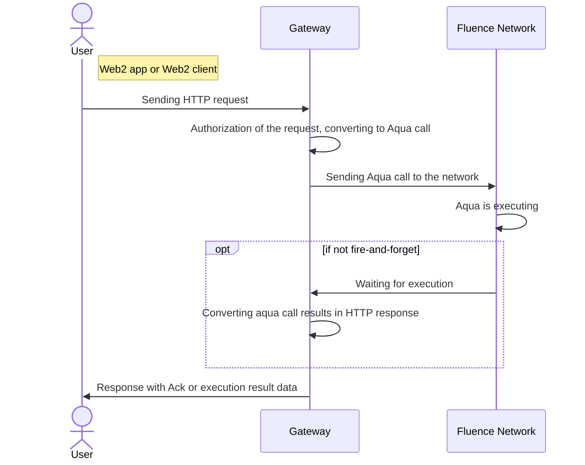

# Handling HTTP Events

Many Web2 services don't know about Fluence Network and thus cannot interact with it via Fluence protocol described earlier.
Regular Web2 services usually communicate via REST (HTTP calls or HTTP events in terms of Fluence interaction).
Conceptually, it's possible to build a special Web2 service which handles regular HTTP calls and convert them to interactions understandable by Fluence Network.
That's the time to present Fluence gateway (??? should it be defined in glossary ???).
The gateway, in essence, is a Fluence peer itself, which keeps the connection with Fluence network and wrapping code, which listens for HTTP request.

## Fluence gateway

Gateway consists of the following parts:
- Web server, which is able to accept HTTP calls, process them and return the result.
- App which Web server is connected to. It can process incoming HTTP requests, parse their headers/body and call the appropriate Aqua function with given params, encoded in the request. App consists of the following parts:
  - Request rate limiter. Be mindful about Fluence network and prevent spamming it with noisy requests. Some reasonable values should be set there.
  - Auth token. Only authenticated parties should be able to interact with the gateway, otherwise anyone could interact with the network by your gateway's name.
  - Properly generated and hidden private peer id. It will allow you to identify requests from the gateway into your subnet and use `init_peer_id` for authorization.

**Gateway flow**

## Example

CLI's init command produces gateway template:

- `fluence init --env kras -t ts gateway-template`
- `cd ./gateway-template/src/gateway`

Now you can peek around and check gateway source files written in JS.
