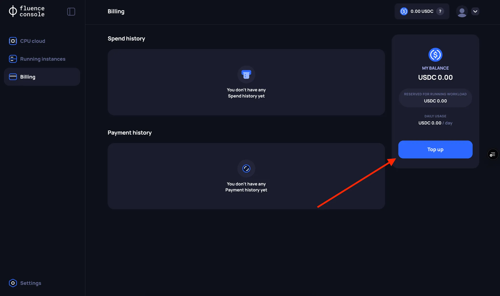
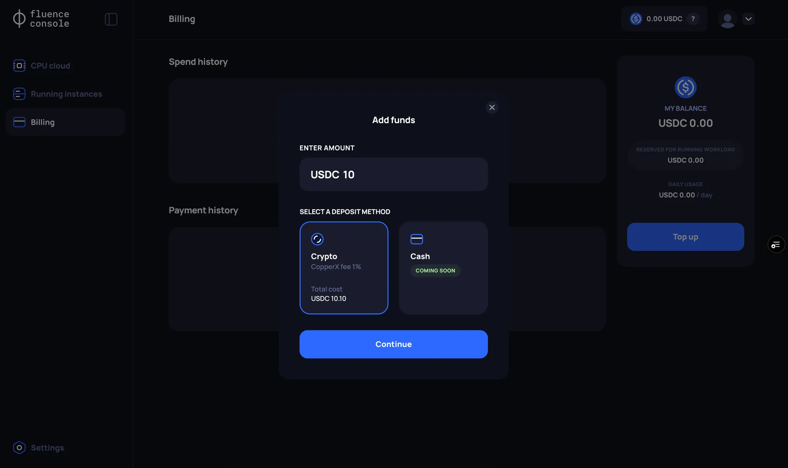

# Payment and balance management

In order to rent a VM from the Fluence marketplace, you need to provide funds to the marketplace which are used to pay for your rented resources. It is important to note that allocated funds are managed by smart contracts and based on your VM configuration and price, the smart contracts periodically charge the rent due to the compute provider. Throughout this document, we refer to the funds escrowed to these smart contracts as the Balance.

The Fluence Console simplifies interacting with the blockchain by using [account abstraction](https://web3auth.io/docs/features/account-abstraction) to manage balances. As a result, topping up your balance is reflected as a transaction in the secure [Balance smart contract](https://blockscout.mainnet.fluence.dev/address/0xF0C308C622eeBA94aeEc2E3Fd67F34619f86761B) and not the Web3Auth wallet created during registration. Note that the Balance can only be used to rent resources from the Fluence network and that you cannot directly withdraw funds from the Balance contract. If a refund is required, please contact the Fluence team.

:::info
Fluence Console users **cannot** top up their Balance from the newly created Web3Auth or any other wallet you may own. This restriction is related to AML (Anti-Money Laundering) limitations. Instead, Fluence Console users need to go through whitelisted payment portals such as CopperX.
:::

## Topping up the Balance

:::info
Participants in the Alpha VM testing program receive 256 USDC in balance credits. This amount should easily get you through the testing period and it is doubtful that you will need to top up the Balance during the testing phase.
:::

Currently, you fund your Balance using [CopperX](https://copperx.io/), which offers payment options for Ethereum (USDC) and Polygon (USDC.e). The Fluence Console integrates CopperX payment and event monitoring providing a seamless experience to establish payments to the Balance smark contracts. Once your CopperX payment is successfully executed, the Balance smart contract will reflect the transaction.

To initiate a payment with CopperX, follow these steps:

### 1. Click the Top Up button

Go to the **Billing page** and click the **“Top Up”** button.

:::info
You can check for pending payment sessions on the **Billing page**, in the **Payments History** section. Pending payment sessions have the status `Pending`.
:::

### 2. Enter the amount you want to top up your Balance with

:::info
Currently, the minimum top up amount is **USDC 10.00**, while your total Balance amount cannot exceed **USDC 5000.00**.
:::

### 3. Enter your details

You will be redirected to the CopperX payment page.

#### Cancel payment
:::info
To cancel a payment, use the corresponding option in the CopperX interface. If a payment is not completed within 15 minutes, the payment will be automatically cancelled.
:::

:::info
If you accidentally close the CopperX payment page, go back to the Fluence Console payment page.
:::

### 4. Choose one of the payment methods and complete the payment

:::info
If you encounter issues with the “Wallet” payment option, we recommend using the “Scan QR code” option.
:::

### 5. Return to the Fluence Console

After a successful payment, you will be redirected back to the **Fluence Console** page. The payment will be in the `Pending` status for a bit.

:::info
You cannot have multiple `Pending` transactions. If you cannot complete a CopperX payment and don't want to wait 15 minutes, you need to [cancel to the payment](#cancel-payment). 
:::

### 6. Wait for the "Completed" payment status

Once the on-chain transactions are processed, the Balance smart contract will reflect your payment and the FLuence Console payment status updates to `Completed`.
