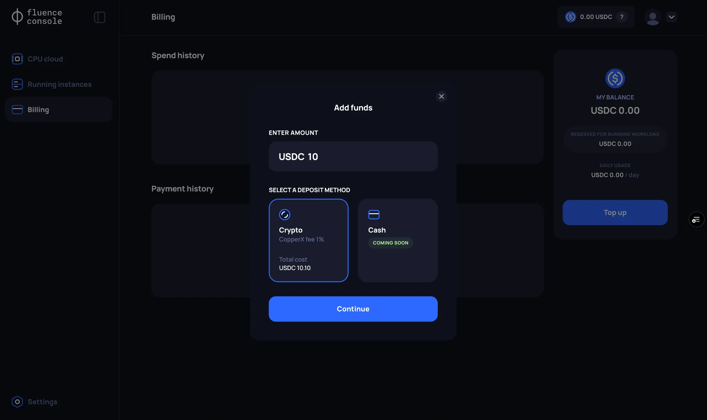
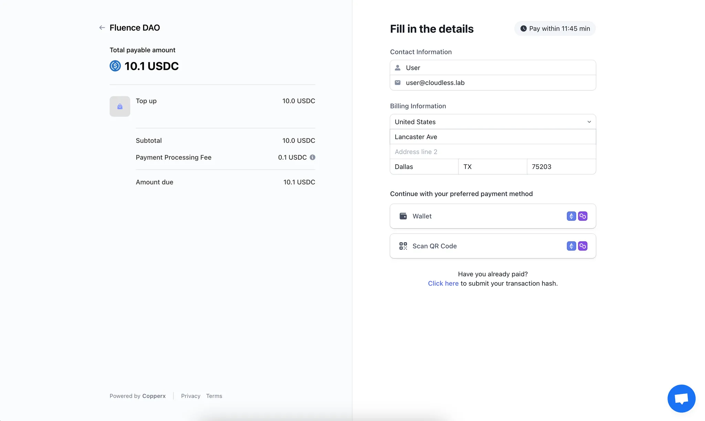
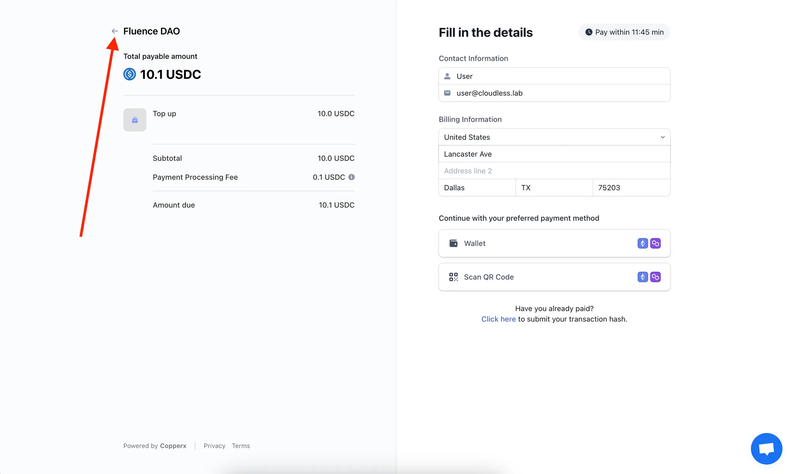
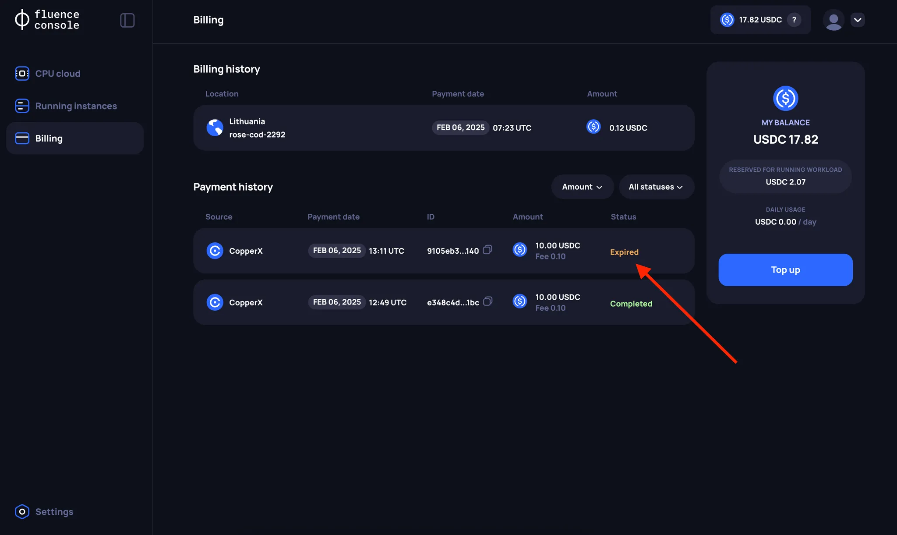
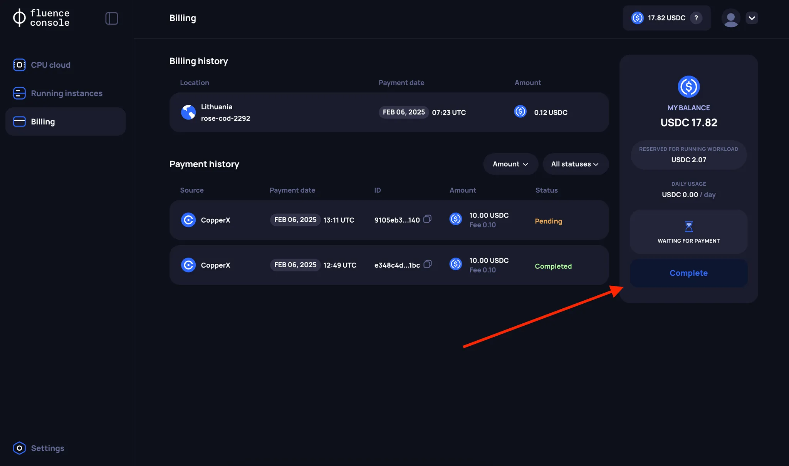
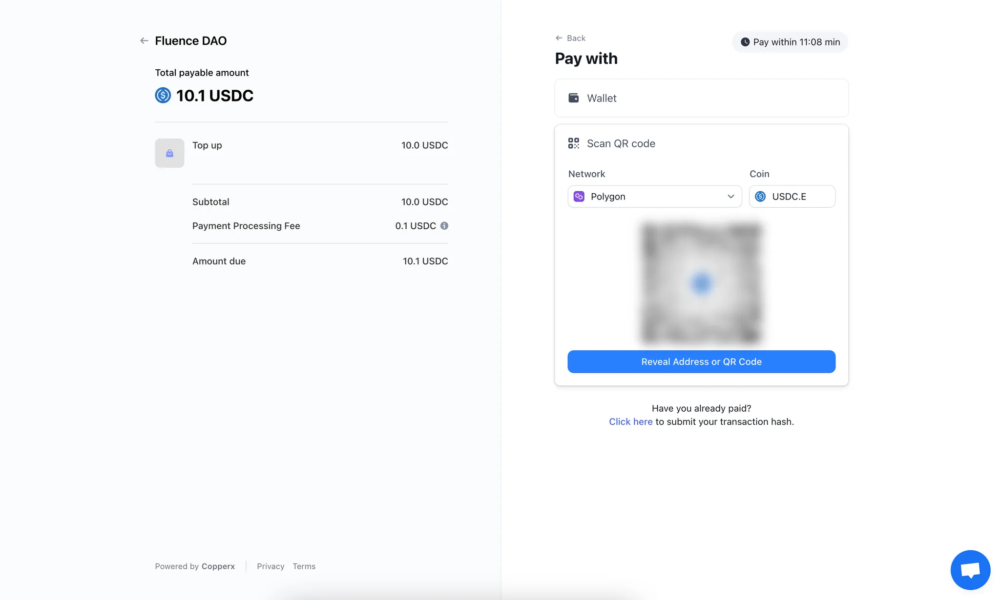

# Balance top up

## Features of Balance Management on the Fluence Platform

After registering through Fluence Console, a new Self-Custodial Wallet is created for each user using Web3Auth. However, in this case, interacting with smart contracts in the Fluence network still requires signing blockchain transactions each time.

Fluence Console simplifies interacting with the blockchain by using [account abstraction](https://web3auth.io/docs/features/account-abstraction) to manage user balances. Hence, topping up your balance is reflected as a transaction in the secure [Balance smart contract](https://blockscout.mainnet.fluence.dev/address/0xF0C308C622eeBA94aeEc2E3Fd67F34619f86761B) and not the Web3Auth wallet created during registration.

:::danger
The balance top upped through Fluence Console can only be used to rent resources from the Fluence network. To interact with other protocols, such as Fluence Staking.
:::

:::info
Fluence Console users cannot top up their Balance from addresses created through Web3Auth or through any other EOA. This restriction is related to AML (Anti-Money Laundering) limitations. Also, Fluence Console users cannot directly withdraw funds from the Balance contract. If a refund is needed, please contact the Fluence team.
:::

## Steps to top up Balance on the Fluence Platform

:::info
Participants in the Alpha VM testing program receive 256 USDC in their balance credits after the registration process is completed.
:::

Currently, you fund your Balance using the payment provider CopperX, which offers payment options for Ethereum (USDC) and Polygon (USDC.e). The Fluence Console integrates CopperX payment and event monitoring. Once your CopperX payment is successfully executed, the Balance smart contract reflects the transaction.

To top up your balance wih CopperX, follow these steps:

### 1. Click the Top Up button

Go to the **Billing page** and click the **“Top Up”** button.

:::info
You can check for pending payment sessions on the **Billing page**, in the **Payments History** section. Pending payment sessions have the status `Pending`.
:::

### 2. Enter the amount you want to top up your Balance with

:::info
Currently, the minimum top up amount is **USDC 10.00** while your total balance cannot exceed **USDC 5000.00**.
:::

### 3. Enter your details

You will be redirected to the CopperX payment page.

#### Cancel payment
:::info
To cancel a payment, use the corresponding option in the CopperX interface. If a payment is not completed within 15 minutes, the payment will be automatically cancelled.
:::

:::info
If you accidentally close the CopperX payment page, go back to the Fluence Console payment page.
:::

### 4. Choose one of the payment methods and complete the payment

:::info
If you encounter issues with the “Wallet” payment option, we recommend using the “Scan QR code” option.
:::

### 5. Back to Fluence Console

After a successful payment, you will be redirected back to the **Fluence Console** page. The payment will be in the `Pending` status for a bit.

:::info
At this time, you cannot have multiple pending Balance top-up operations. If you cannot complete a CopperX payment and don't want to wait 15 minutes, you need to [cancel to the payment](#cancel-payment). 
:::

### 6. Wait for "Completed" payment status

Once the on-chain transactions are processed, the Balance smart contract will reflect your payment and the FLuence Console payment status updates to `Completed`.
