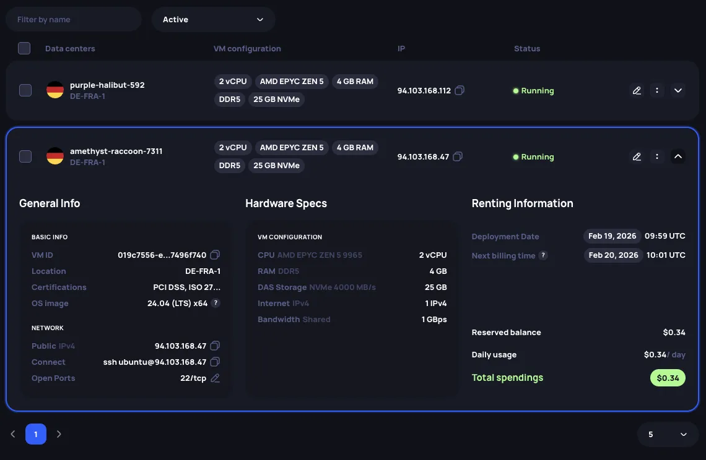
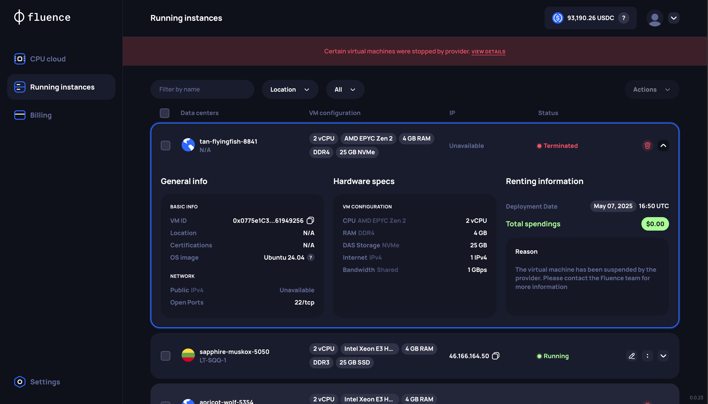

# Instance info and management

After deploying an instance, all the relevant information is accessible on the **Running Instances** page.

## Instance information

For each instance, a corresponding card will appear on the **Running Instances** page, which can be expanded. More detailed information can be found in the `Hardware Specs` section. Note that extended server parameters are only visible if the specific infrastructure provider has provided the underlying information.



The card also shows the next billing time (`Next billing time`) set at **5:55 PM UTC**.

## Instance management

Currently, the only operation available for a running instance is **Terminate**, which stops the instance and ends the rental agreement. Unused reserved balance is returned to your account — see [billing model](./overview.md#billing-model).


## Billing history

The history of your charges can be found on the **Billing page** in the **Billing History** section.


## Handling provider-terminated instances

When a compute provider terminates an instance that you are actively using, the instance is moved to `Terminated` status.
Terminated instances are no longer accessible, and data stored on them is lost.
Even though a provider has terminated your instance, its record will still appear in your list with its balance reserved. You need to perform a final step to remove this record, which releases the funds back to your main balance.

### Reasons for termination

The Fluence compute marketplace sources from established compute providers with high standards of security and reliability supported by Tier 3 and 4 certifications. Termination is a last resort for providers when handling exceptions and usually results from adverse user behavior such as:

- Not paying for the instance (reserved balance reached 0)
- Violating the terms of service
- Using the instance for illegal activities or running malicious workloads

### Identification of terminated instances

Status updates about instance termination are available in the Fluence Console on the **Running Instances** page, or via the API when you request your active instances using the [list instances](../api/cpu_cloud.md#manage-vms) endpoint.

#### Fluence Console

**Banner notification.** You will see an informational banner on the Running Instances page with the message: _"Certain virtual machines were stopped by the provider. View details"_. Click **View details** to see the list of terminated instances.

**Status display.** The instance will be clearly marked with a `Terminated` status.



**Filtering.** You can use the status filter on the Running Instances page and select `Terminated` to view only these instances.


#### API

In the response from the list instances endpoint, the `status` field for the affected instance will be `"Terminated"`. The `publicIp` field will be `null`, and location information within the `datacenter` object may be absent.

```json
{
  "id": "0x68bd60079721AE2A04759d00Fc516148aCF479e4",
  "vmName": "apricot-wolf-5354",
  "status": "Terminated",
  "pricePerEpoch": "0.30697",
  "resources": [ ... ],
  "osImage": "...",
  "datacenter": null,
  "publicIp": null,
  "ports": [
    {
      "port": 22,
      "protocol": "tcp"
    }
  ],
  "reservedBalance": ".30697",
  "totalSpent": "2.45576",
  "createdAt": "2025-05-07T16:20:43Z"
}
```

### Finalization and reserved funds release

After identifying instances terminated by a provider, you need to finalize the termination to release the reserved funds:

#### Fluence Console

Click **Terminate** on the instance with `Terminated` status to remove its record and release its reserved funds. See [instance management](#instance-management) for details.

#### API

Use the [delete endpoint](../api/cpu_cloud.md#delete-vms) with the instance ID to remove its record and release its reserved funds.
