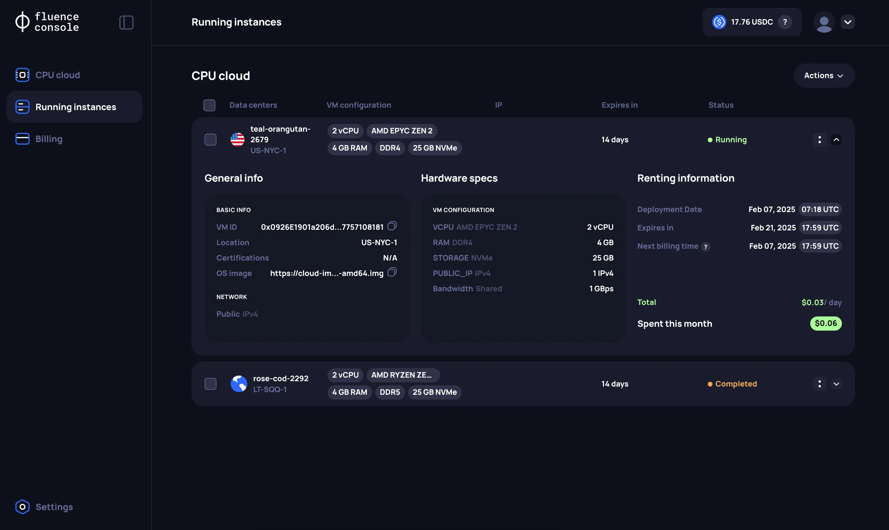
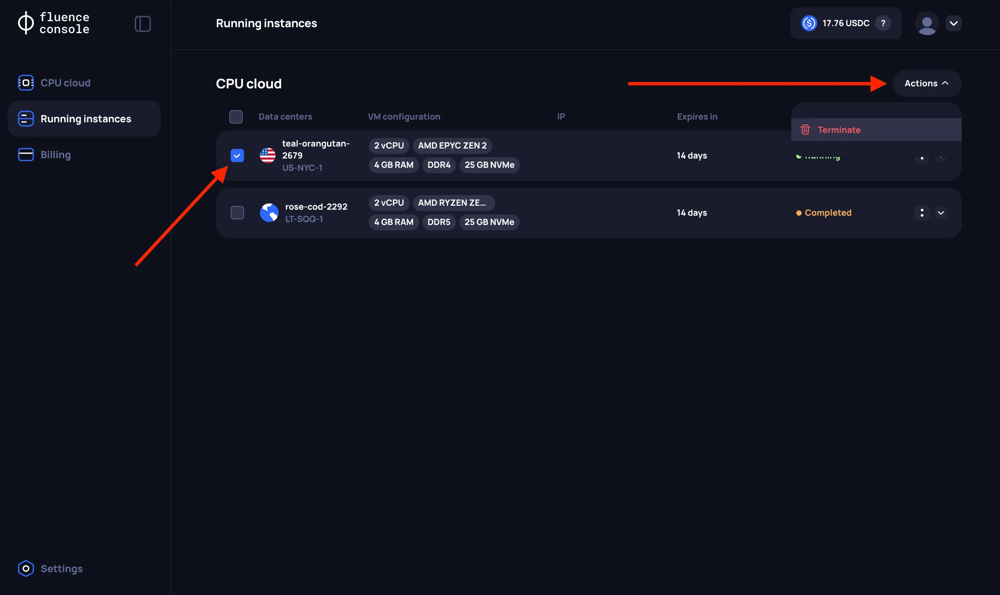
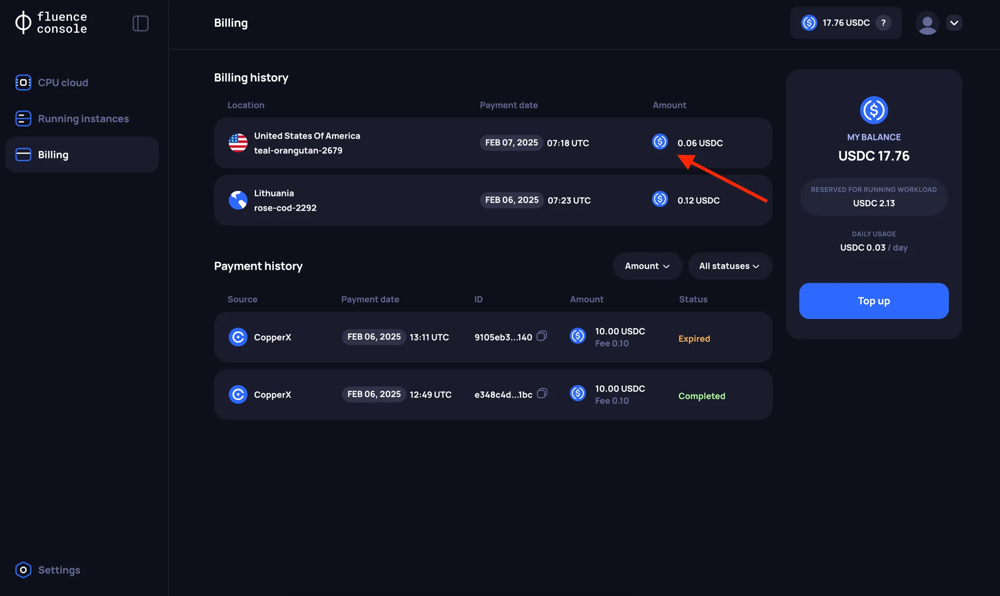

# Instance info and management

After deploying an instance, you can view and manage it from the **Running Instances** page. Use the search bar to filter instances by name or the status dropdown to narrow the list.

## Instance information

Each instance appears as a card with its name, location, hardware summary, IP address, and status. Click the expand arrow to reveal full details — general info, hardware specs, connection details, and billing.

## Instance management

Click the three-dot menu on an instance card to access the available actions:

- **Edit name** — rename the instance.
- **Reboot** — restart the instance. Restart is required to apply certain changes, such as attaching a new storage or Public Ip. Rebooting does not affect the reserved balance or billing.
- **Remove** — stop the instance and end the rental agreement. Any unused reserved balance is returned to your account.

## Billing history

The history of your charges can be found on the **Billing page** in form of downloadable CSV files. 

 