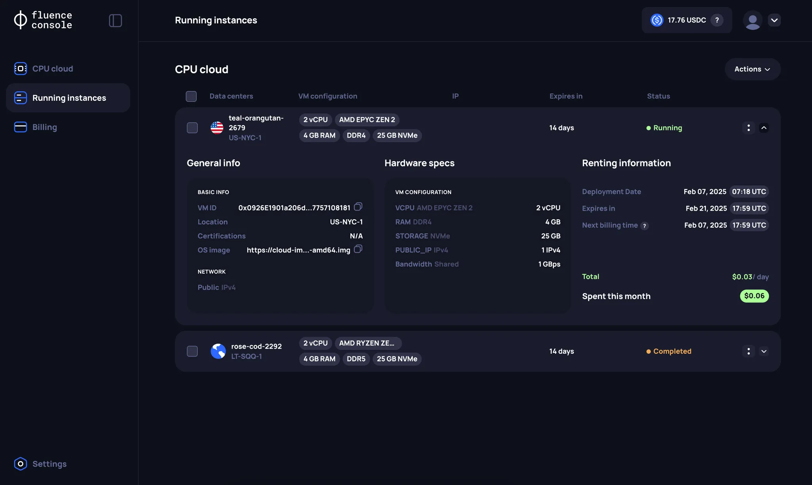
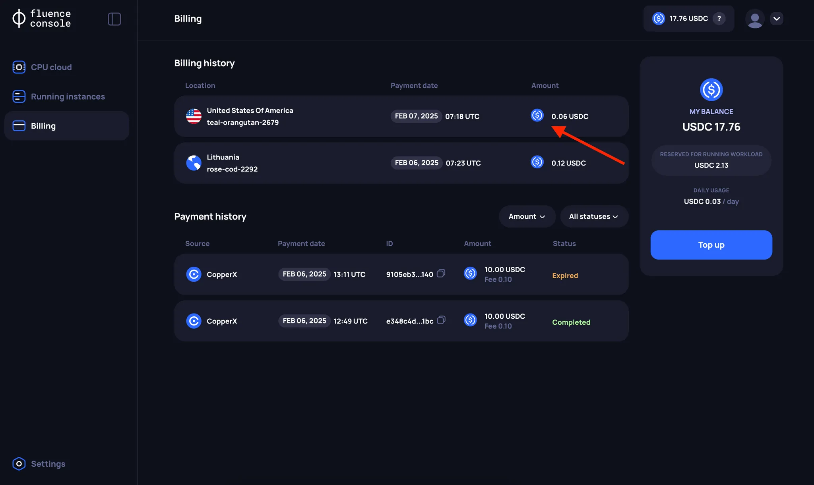

# Instance info and management

After deploying an instance, all the relevant information is accessible on the **Running Instances** page.

## Instance information

For each instance, a corresponding card will appear on the **Running Instances** page, which can be expanded. More detailed information can be found in the `Hardware Specs` section. Note that extended server parameters are only visible if the specific infrastructure provider has provided the underlying information.

The card also shows the next billing time (`Next billing time`) set at **5:55 PM UTC**.

## Instance management

Currently, the only operation available for a running instance is **Terminate**, which stops the instance and ends the rental agreement. Unused reserved balance is returned to your account — see [billing model](../overview/overview.md#billing-model).

## Billing history

The history of your charges can be found on the **Billing page** in the **Billing History** section.

