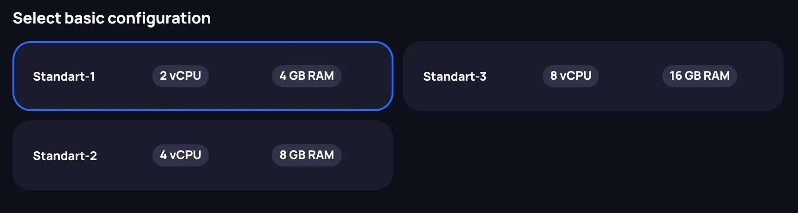
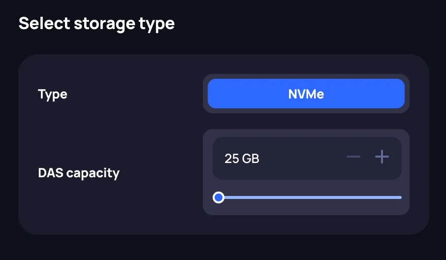
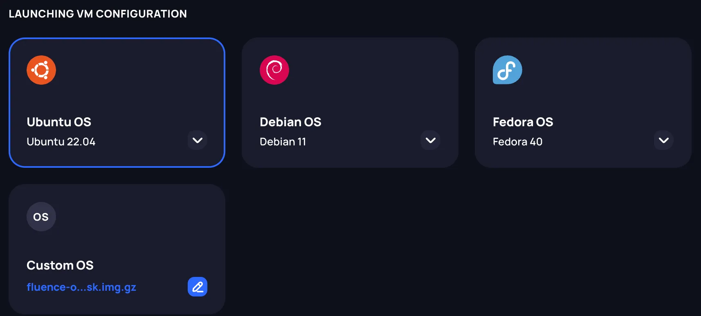
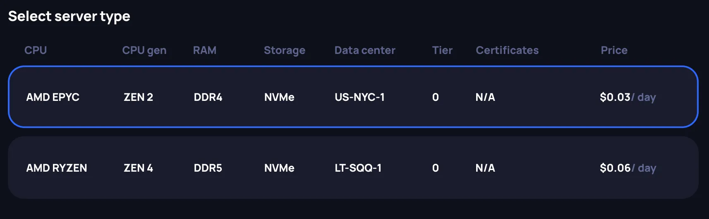
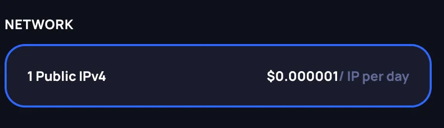
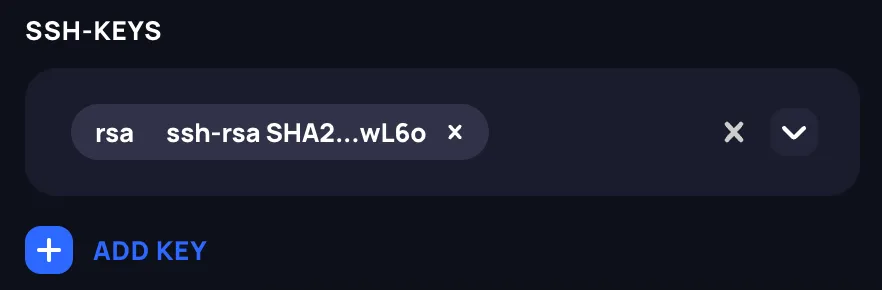
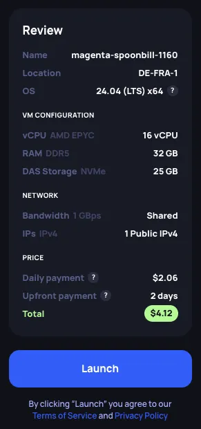

# Renting an instance

This guide walks you through deploying a virtual machine instance on CPU Cloud. For background on cpu cloud concepts, instance lifecycle, and how billing works, see the [CPU Cloud concepts](./overview.md).

When you deploy, the system reserves a rent for one hour of work from your account balance. Make sure your balance has enough funds before starting. See [billing model](./overview.md#billing-model) for details.

## Steps to configure an instance

### 1. Specify the instance name

Choose a **name** for your instance. The name must be unique within your account.

### 2. Choose a location

Choose one of the available data center locations.

### 3. Choose a configuration

Choose your instance's configuration from the available options..

### 4. Setup book disk 

Setup book disk, choosing either an existing one or creating a new one. 

 
Choose an **OS image** for your instance. You can pick a pre-defined image or provide a link to a **custom image**. Custom images must be publicly downloadable and configured for remote instances — look for images tagged `Generic Cloud` or `Cloud`. See [supported formats](./overview.md#os-images).

### 5. Setup an optional additional storage

Setup additional storage.

### 6. Choose the server type

Review the available servers for your chosen configuration. Hardware varies within and across data centers, so pay attention to the specifications and price. The console also shows each data center's location at the city level and details such as DC tier.

### 7. Rent a public IPv4 address

A public IPv4 address is allocated to the instance at deployment. Currently, this is the only way to access your instance via SSH.

### 8. Provide the public SSH key

Provide at least one SSH public key to connect to your instance. Supported formats: RSA, ECDSA, and ED25519.

### 9. Review the summary

Review the instance summary and price in the Review section before launching.

### 10. Launch the instance

Click **Launch** to deploy. You'll be redirected to the **Compute** page.
