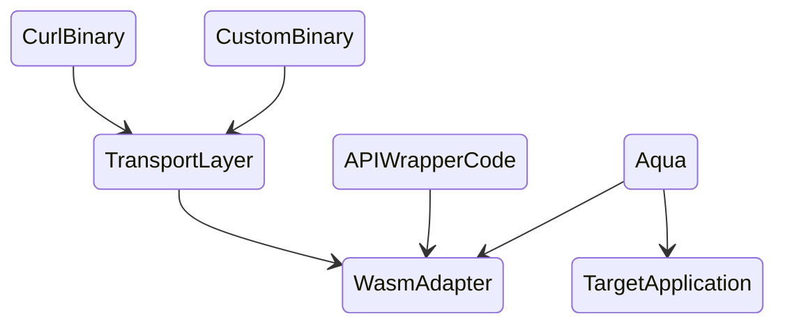

# Data Acquisition

Your compute services may need real time price pairs from a DeFi exchange, want to index NFTs or  generate analytics over real time steaming windows. Regardless of the purpose, chances are you need to interact with one or more provider solutions outside the Fluence network by accessing their API. In Fluence you do that by writing one or more Wasm module to wrap the API functions, thereby allowing you to use capabilities outside the Fluence network across the entire web * chasm.

Keep in mind, the point of writing such adapter services is to be able to use applications outside the Fluence network in your Aqua choreography and service composition!

### Anatomy Of A Wasm API Adapter

There are essentially two ways of interacting with with arbitrary applications outside the Fluence network:

- access the application API via HTTP, e.g., REST or JSON-RPC, using the host peer's curl binary or
- access the application via a cli-type binary hosted on, or run as a sidecar, by Fluence peer(s)

The main difference between the two approaches is that, for the most part, peers provide curl as a standard resource offering, whereas the second, custom binary option requires additional interaction with, and work by, a peer. From an implementation perspective, however, the API "wrapping" logic can be decoupled from the "transport" choice.

mermaid

to be completed

### **Securing services**

While the current, testnet implementation of the Fluence protocol provides for end-to-end encryption between peers, e.g., the client peer you use with Fluence CLI and the peer hosting the service, the decryption occurs at the peer not the service. Hence, there is a trust gap between a peer and its hosted services.

At the service deployment side, client peers .. with secret key

If you are using Fluence CLI …

### **~~Connecting external binaries~~**

~~In previous sections, we have seen how services may be allowed to access host resources including the file system and curl. In addition, we can run ??? , aka binaries, as sidecars to the Fluence peer.~~

~~IPFS~~

### **Debugging**

### **Logs**