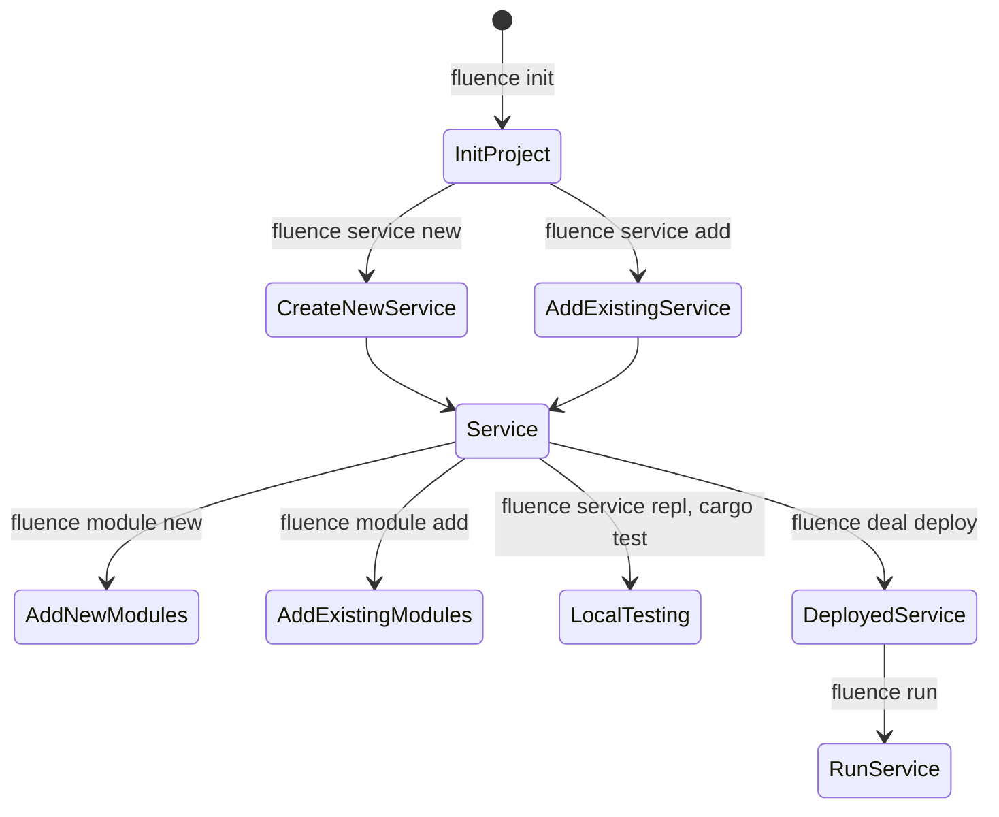
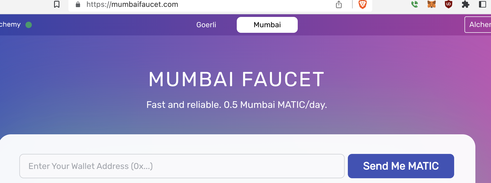
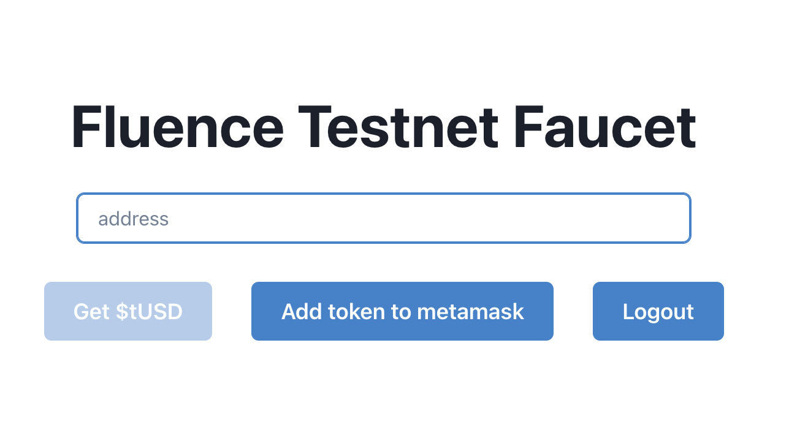
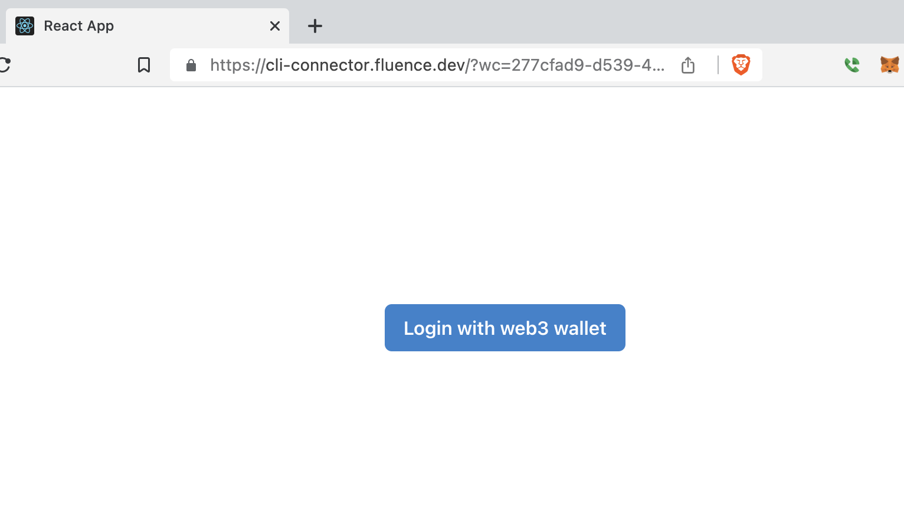

# Get started (with CLI)

[Fluence CLI](https://github.com/fluencelabs/fluence-cli) is your one-stop command line interface (CLI) shop to creating, deploying, paying, running, monitoring and removing distributed services to and from the Fluence peer-to-peer network.

> 👉 Note that Fluence CLI is currently only available for *nix* systems including OSX and Windows Subsystem for Linux (WSL). Moreover, Fluence CLI installs all the required dependencies not already installed on your system including Rust.

From scaffolding your project, services and modules to [Deal](/docs/build/glossary.md#deal) creation and service deployment, Fluence CLI has you covered. Moreover, Fluence CLI can scaffold JS projects using [js-client](/docs/build/js-client/1-js-client.md) allowing you integrate Fluence CLI projects in the browser or node app. See Figure 1 for a quick overview of workflows managed by Fluence CLI and the associated commands. If you have Fluence CLI installed, use *fluence --help* to get a more complete overview of topics and commands.

Figure 1: Stylized Project Creation And Deployment Workflow With Fluence CLI

mermaid


Fluence CLI uses multiple yaml config files and you can find their schemas in the *.fluence/schemas* directory. Note that Fluence CLI creates config files lazily, i.e., as needed, and at project initialization time not all config files exist. For more information, see the [Fluence CLI Readme](https://github.com/fluencelabs/fluence-cli).

## Install Fluence CLI

[Fluence CLI](https://github.com/fluencelabs/fluence-cli) is available as a *npm* package requiring node and npm to be available on your device. See [nvm](https://github.com/nvm-sh/nvm#installing-and-updating), for example, for installation instructions. With npm readily available, we can install the Fluence CLI:

```
npm -g install @fluencelabs/cli@latest
```

> 👉 At the time of this writing, you need to set your node version to 16 LTS (16.19.0).

We can check our installation success (note that your cli and node versions might be different):

```
fluence --version
@fluencelabs/cli/x.y.z darwin-x64 node-v16.19.0
```

### Install Other Prerequisites

In addition to Fluence CLI, you need a [WalletConnect](https://walletconnect.com/) compatible wallet, such as [MetaMask](https://metamask.io/) to be able to fund the hosting and execution of your distributed services with (testnet) USDC.

The on-chain testnet is Polygon Mumbai:

Mumbai Chainlist RPC: [https://chainlist.org/?testnets=true&search=mumbai](https://chainlist.org/?testnets=true&search=mumbai)

MATIC Faucet: [https://mumbaifaucet.com/](https://mumbaifaucet.com/) or [https://faucet.polygon.technology/](https://faucet.polygon.technology/)

Mumbai Explorer: [https://mumbai.polygonscan.com/](https://mumbai.polygonscan.com/)

Fluence testnet USDC Faucet: [https://faucet.fluence.dev/](https://faucet.fluence.dev/)

In your wallet, you may want to create a new account, e.g., Fluence Account, or use an existing one. If not set already, add Polygon Mumbai as a network by clicking on the Networks button in the upper right corner and then the Add Network button and provide the following info:

Figure 1:


With your account and network setups in good shape, head over to one of the Mumbai faucets listed above, e.g., [https://mumbaifaucet.com/](https://mumbaifaucet.com/), with your account address ready:

Figure 2:



Follow the instructions and eventually, you’ll have 0.5 (testnet) MATIC in your wallet.

Finally, head over to the [Fluence faucet](https://faucet.fluence.dev/):

Figure 3:



which not only allows you to request testnet USDC (tUSDC) but also provides a convenience function to add the testnet USDC token to your MetaMask wallet. Copy your account address into the form, click the Get button and you should have 16 FakeUSDC in your account!  To see the transaction data info for both MATIC and tUSDC transfers into your account, head over to the [explorer](https://mumbai.polygonscan.com/).

And that concludes the installation section!

---

> Consider reading: [Keys management with Fluence CLI](cli-keys-management.md)

---


## Start a new project

As mentioned at the outset, Fluence CLI is your Swiss army knife to handle all things Fluence. To keep things familiar, let’s start with the obligatory *Hello World* example to introduce Fluence and Fluence CLI.

We scaffold a new project with `fluence init` , which gives us a couple scaffolding choices:

```
fluence init
? Select template (Use arrow keys)
❯ minimal
  ts
  js
```

Press return to select the default *minimal* scaffolding option and enter *hello_world* as the project path when prompted:

```bash
? Enter project path or press enter to init in the current directory: hello-world
Successfully initialized Fluence project template at ~/localdev/hello-world
```

Change into your new *hello-world* directory and have a look around:

```bash
tree -L 2 -a

.
├── .fluence             # this is where Fluence CLI internals are kept including schemas and project secrets
│   ├── aqua
│   └── schemas
├── .gitignore
├── .vscode
│   ├── extensions.json
│   └── settings.json
├── fluence.yaml         # this is where the project metadata, including service references, are kept
└── src                  # this is where the Aqua distributed service choreography and composition scripts reside
    └── aqua
```

A this point, you see various config (yaml) files and a *src/aqua* dir with a *main.aqua* file that contains a variety of Aqua code examples and the most common dependency imports:

```aqua
aqua Main

import "@fluencelabs/aqua-lib/builtin.aqua"
import "@fluencelabs/registry/subnetwork.aqua"
import Registry from "@fluencelabs/registry/registry-service.aqua"
import "@fluencelabs/spell/spell_service.aqua"

import "workers.aqua"
import "services.aqua"

-- import App from "deployed.app.aqua"
-- export App, addOne


-- IMPORTANT: Add exports for all functions that you want to run
export helloWorld, helloWorldRemote, getInfo, getInfos, getInfosInParallel

-- DOCUMENTATION:
-- https://fluence.dev


-- export status

-- service Console("run-console"):
    -- print(any: ⊤)

-- -- example of running a service deployed using 'fluence deal deploy'
-- -- with worker 'defaultWorker' which has service 'MyService' with method 'greeting'

-- func status():
    -- workersInfo <- getWorkersInfo()
    -- dealId = workersInfo.deals.defaultWorker.dealId
    -- print = (answer: string, peer: string):
      -- Console.print([answer, peer])

    -- answers: *string
    -- on HOST_PEER_ID:
        -- workers <- resolveSubnetwork(dealId)
        -- for w <- workers! par:
            -- on w.metadata.peer_id via w.metadata.relay_id:
                -- answer <- MyService.greeting("fluence")
                -- answers <<- answer
                -- print(answer, w.metadata.peer_id)

    -- Console.print("getting answers...")
    -- join answers[workers!.length - 1]
    -- par Peer.timeout(PARTICLE_TTL / 2, "TIMED OUT")
    -- Console.print("done")


-- func addOne(x: u64) -> u64:
    -- services <- App.services()
    -- on services.adder.default!.peerId:
        -- Adder services.adder.default!.serviceId
        -- res <- Adder.add_one(x)
    -- <- res


-- local
func helloWorld(name: string) -> string:
    <- Op.concat_strings("Hello, ", name)

-- remote
func helloWorldRemote(name: string) -> string:
    on HOST_PEER_ID:
        hello_msg <- helloWorld(name)
        from_msg <- Op.concat_strings(hello_msg, "! From ")
        from_peer_msg <- Op.concat_strings(from_msg, HOST_PEER_ID)
    <- from_peer_msg

-- request response
func getInfo() -> Info, PeerId:
    on HOST_PEER_ID:
        info <- Peer.identify()
    <- info, HOST_PEER_ID

-- iterate through several peers
func getInfos(peers: []PeerId) -> []Info:
    infos: *Info
    for p <- peers:
        on p:
            infos <- Peer.identify()
    <- infos

-- parallel computation
func getInfosInParallel(peers: []PeerId) -> []Info:
    infos: *Info
    for p <- peers par:
        on p:
            infos <- Peer.identify()

    join infos[Op.array_length(peers) - 1] -- "-1" because it's 0-based
    par Peer.timeout(PARTICLE_TTL / 2, "")

    <- infos
```

For more information about all things Aqua, see the [Aqua book](/docs/aqua-book/introduction.md).

**Scaffolding Options

Instead of the *minimal* scaffold chosen at the outset of this section, we can opt for an extended project setup for either Typescript or Javascript. Before we go exploring, a quick review of how Fluence and Aqua work might be in order: All communication with distributed services is over libp2p. Hence, you need a (p2p) client peer, rather than an HTTP client, to interact with the peers hosting your service(s). Choosing the *minimal* scaffolding setup provides you with a setup suitable to utilize a one-shot client-peer builtin to Fluence CLI. The TS/JS, setup, on the other hand, provides you with the scaffolding to create a client peer with [Fluence js-client](https://github.com/fluencelabs/js-client) that can run in the browser or as a node app. See Table 1.

Table 1: Client peer options from scaffolding

| | Client Type | Client Provider |
|:---|:---:|---:|
| minimal | one-shot | Fluence CLI |
| TS/JS | one-shot | Browser |
| TS/JS | long running | Node App |

### Write code

We set up our project and are left with creating our *hello_world* function, which we implement in Rust:

```rust
// hello_fluence.rs
use marine_rs_sdk::marine;             // 1

pub fn main() {}                       // 2

#[marine]                              // 3
pub fn hello_world() -> String {       // 4
    format!("Hello, Fluence!")
}
```

Before we do anything, (1) we need to import the [Marine Rust SDK](/docs/marine-book/marine-rust-sdk/marine-rust-sdk.md), 
which allows us to compile Rust code to wasm32-wasi module compatible with Fluence’s Marine runtime. The `#[marine]` macro, (3), is part of the *marine-rust-sdk* and exports marked types as publicly visible and callable functions and structs. In (4) we implement our business logic, which ain’t much this time around.

In (2), we implement a main function which is not marked with the *#[marine]* procedural macro. 
We discuss modules and module configuration further below. Also note that WASM IT has type limits, 
which are explained in detail in the [Marine book](/docs/marine-book/marine-runtime/i-value-and-i-type). 
The short version is: you got strings, ints, floats, bytes, arrays and records at your disposal,
but you do not have generics, lifetimes, etc.

Now that we know what our code looks like, let’s use Fluence CLI to scaffold our Rust (sub-)project with the `fluence service new` command. Let’s unbundle this command before we follow the prompts: As discussed earlier, you write your business logic in Rust and compile it to one or more Wasm modules. You then “package” these modules, with help of Fluence CLI, into a *service*. Eventually you deploy this service to one or more peers and use Aqua to interact with the deployed service(s).  If your business logic results in only a single module, like our *hello_world* code, then this module is also the service.

Now we follow the prompts to `fluence service new` and complete the setup:

```bash
fluence service new
? Enter service path service
? Do you want to use service as the name of your new service? No
? Enter service name (must start with a lowercase letter and contain only letters, numbers, and underscores)
hello_world
Successfully generated template for new service at service
# Making sure all services are downloaded...
# Making sure all services are built...
    Updating crates.io index
   Compiling proc-macro2 v1.0.52
   <...>
Compiling hello_world v0.1.0 (/Users/bebo/localdev/hello-world-3/service/modules/hello_world)
    Finished release [optimized] target(s) in 24.40s
Added hello_world to fluence.yaml
? Do you want to add service hello_world to a default worker defaultWorker Yes
Added hello_world to defaultWorker
```

So what just happened?
We instructed the CLI to create a path *service* in which we want our *hello_world* module to live. Moreover, we chose to add this information to the project’s main configuration file *fluence.yaml*, which allows Fluence CLI to find what it needs to fulfill command requirements:

```bash
# fluence.yaml
# yaml-language-server: $schema=.fluence/schemas/fluence.yaml.json

# Defines Fluence Project, most importantly - what exactly you want to deploy and how. You can use `fluence init` command to generate a template for new Fluence project

# Documentation: https://github.com/fluencelabs/fluence-cli/tree/main/docs/configs/fluence.md

version: 2
aquaInputPath: src/aqua/main.aqua
dependencies:                                #
  npm:
    "@fluencelabs/aqua": 0.10.3
    "@fluencelabs/aqua-lib": 0.6.0
    "@fluencelabs/spell": 0.5.4
    "@fluencelabs/registry": 0.8.2
  cargo:
    marine: 0.14.0
    mrepl: 0.21.0
workers:
  defaultWorker:
    services: [ hello_world ]
deals:
  defaultWorker:
    minWorkers: 1
    targetWorkers: 3
hosts:
  defaultWorker:
    peerIds:
      - 12D3KooWHLxVhUQyAuZe6AHMB29P7wkvTNMn7eDMcsqimJYLKREf
relays: kras
services:
  hello_world:
    get: service
```

Using this information, the CLI scaffolded our Rust (sub-)project:

```bash
tree hello-world -L 4 -a
hello-world
├── modules
│   └── hello_world
│       ├── Cargo.toml
│       ├── module.yaml
│       └── src
│           └── main.rs
└── service.yaml
```

Recall, a service is comprised of one or more Wasm modules and associated configuration and each module,
such as *hello_world*, has its own *module.yaml* which contains all the info necessary to identify
the module as well as any host resource dependencies. *service.yaml* contains  the service name and a list of 
the modules comprising the service including is the entry, aka [facade](/docs/build/glossary.md#facade-module), 
module into the service.

Looking at the *main.rs* file, you see that it is populated with a greeting example. 
Replace that code with our code from above so that:

```bash
// main.rs
use marine_rs_sdk::marine;

pub fn main() {}

#[marine]
pub fn hello_fluence() -> String {
    format!("Hello, Fluence")
}
```

With our code in place, let’s finally build our project, i.e. compile our code to a wasm32-wasi module. 
In your project root directory:

```rust
fluence build
Making sure all services are downloaded... done
<...>
Making sure all modules are downloaded and built... done
```

Depending on your setup, this may take a while as Fluence CLI will attempt to install any missing dependencies
including Rust. In the end, you can locate our much anticipated Wasm module in the Rust *target* compile directory:

```bash
ls target/wasm32-wasi/release|grep hello_world.wasm
hello_world.wasm
```

### Test our code

Before we deploy our code to the network, we may wan to run some tests. 
One way to interact with our Wasm module is to use the 
[Marine Repl](/docs/marine-book/marine-tooling-reference/marine-repl#run-repl),
which is a tool to run our Wasm modules locally as if they were deployed to the network. 
Again, depending on your setup, this may take a while as Fluence CLI may need to install missing dependencies:

```bash
fluence service repl
? Enter service name from fluence.yaml, path to a service or url to .tar.gz archive hello-world
Making sure service and modules are downloaded and built... ⣻
Making sure service and modules are downloaded and built... done

^^^^^^^^^^^^^^^^^^^^^^^^^^^^^^^^^^^^^^^^^^^^^^^^^^^^^^^^^^^^^^^^^^^^^^^^^^^^^^^^

Execute help inside repl to see available commands.
Current service <module_name> is: hello_world
Call hello_world service functions in repl like this:

call hello_world <function_name> [<arg1>, <arg2>]

^^^^^^^^^^^^^^^^^^^^^^^^^^^^^^^^^^^^^^^^^^^^^^^^^^^^^^^^^^^^^^^^^^^^^^^^^^^^^^^^

Welcome to the Marine REPL (version 0.19.1)
Minimal supported versions
  sdk: 0.6.0
  interface-types: 0.20.0

app service was created with service id = 053dee68-160a-4278-b327-59673ac8067a
elapsed time 34.081026ms

1>
```

Note that we provided the name of the *path* to our service and thanks to the information in the *fluence.yaml,
service.yaml and module.yaml* files, the CLI is able to resolve our input and load the REPL with the
correct configuration.  For help with the REPL, just type *help* and to list public structs and functions, type *i* :

```bash
1> i
Loaded modules interface:
exported data types (combined from all modules):
<no exported data types>

exported functions:
hello_world:
  func hello_fluence() -> string
```

As expected, our only public function is the *hello_fluence* function in the *hello_world* namespace. 
In order to run *hello_fluence*  we use the cll command follow by the namespace, 
the function and the function arguments:

```bash
> call hello_world hello_fluence []
result: "Hello, Fluence"
 elapsed time: 90.655µs
```

Well done!

An alternative to interactively test a module in the REPL, is to write unit and integration tests for our code. 
Rust comes with a very nice [testing framework](https://doc.rust-lang.org/cargo/commands/cargo-test.html) widely used 
to unit and integration test Rust code. However, we don’t necessarily want to test our Rust code but our Wasm modules. 
With the [marine rust test dsk](https://crates.io/crates/marine-rs-sdk-test), you can do that!

Let’s add the testing code for our *hello-world* module in our *main.rs* file:

```rust
//  main.rs
// <...>
#[cfg(test)]
mod tests {
    use marine_rs_sdk_test::marine_test;    // 1

    #[marine_test( //2
        config_path = "<your path>/hello-world/.fluence/tmp/Config.toml",
        modules_dir = "<your path>/localdev/hello-world/target/wasm32-wasi/release"
    )]
    fn test_hello_fluence(hw: marine_test_env::hello_world::ModuleInterface) { //3
        let greeting = hw.hello_fluence();
        assert_eq!(greeting, "Hello, Fluence".to_string());
    }
}
```

Marine tests fundamentally follows [cargo test](https://doc.rust-lang.org/cargo/commands/cargo-test.html) with
the exception that you are testing the Wasm modules not the code to be compiled to a Wasm module. 
In order to make that work, you need to use the [marine-rs-sdk](https://crates.io/crates/marine-rs-sdk-test) (1). 
Moreover, we need to provide the paths  to Config.tom and the Wasm module (2). 
Finally, we need to tap into the Wasm module namespace to be able to call the desired method (3).

Once the test code is in place. you are ready to run *cargo test* :

```bash
cargo test --workspace
   Compiling hello_world v0.1.0 (/Users/bebo/localdev/hello-world/hello-world/modules/hello_world)
    Finished test [unoptimized + debuginfo] target(s) in 1.67s
     Running unittests src/main.rs (target/debug/deps/hello_world-8c35826dfb97c180)

running 1 test
test tests::test_hello_fluence ... ok

test result: ok. 1 passed; 0 failed; 0 ignored; 0 measured; 0 filtered out; finished in 1.45s
```

All is well with our module!

If you change the assert statement to  `assert_eq!(greeting, "Hello, Fluence".to_string());` 
and add the corresponding *!* the *hello_fluence* function: `format!("Hello, Fluence!")` and run cargo test again:

```bash
cargo test --workspace
   Compiling hello_world v0.1.0 (/Users/bebo/localdev/hello-world/hello-world/modules/hello_world)
    Finished test [unoptimized + debuginfo] target(s) in 1.71s
     Running unittests src/main.rs (target/debug/deps/hello_world-8c35826dfb97c180)

running 1 test
test tests::test_hello_fluence ... FAILED

failures:

---- tests::test_hello_fluence stdout ----
thread 'tests::test_hello_fluence' panicked at 'assertion failed: `(left == right)`
  left: `"Hello, Fluence"`,
 right: `"Hello, Fluence!"`', hello-world/modules/hello_world/src/main.rs:20:9
note: run with `RUST_BACKTRACE=1` environment variable to display a backtrace

failures:
    tests::test_hello_fluence

test result: FAILED. 0 passed; 1 failed; 0 ignored; 0 measured; 0 filtered out; finished in 1.46s

error: test failed, to rerun pass `--bin hello_world`
```

We added matching *!* to both the test and the code. What gives? Right, we are testing the Wasm module and 
need to recompile the changed code for the tests to have the most recent module(s). 
Run `fluence build` and now re-run `cargo test --workspace` and voila, all is well again!

### Deploy service

There a basically two types of host for your services: public or private peer. 
Deploying to the public network requires the deployment of your service(s) to be tightly coupled with 
the on-chain marketplace.

**Deploying to the public network**

Paying for services

- hardcoded parmas:
    - epoch: 5 minutes
    - Price per epoch 0.083 USDC == 1 USDC/per hour ??

Fluence CLI makes it rather easy to deploy with

```bash
fluence deal deploy
    Finished release [optimized] target(s) in 0.10s

Creating deal for worker defaultWorker

To approve transactions with your to your wallet using metamask, open the following url:

https://cli-connector.fluence.dev/?wc=277cfad9-d539-450b-87a9-fe55b2602352%401&bridge=https%3A%2F%2F0.bridge.walletconnect.org&key=22960ca923d833e08483a96a01d92dd9c524814cde1573fcd95362c4188c63a3

or go to https://cli-connector.fluence.dev and enter the following connection string there:

wc:277cfad9-d539-450b-87a9-fe55b2602352@1?bridge=https%3A%2F%2F0.bridge.walletconnect.org&key=22960ca923d833e08483a96a01d92dd9c524814cde1573fcd95362c4188c63a3
```



…


Which, when successful, closes the CLI client.

> 🆘 Metamask sometimes misses the first API call, so you might need to click Disconnect and then click Connect again.

**Deploying to a private peer or network**

coming soon with worker deploy

### Use deployed services

#### From command line

First of all lets test if your deployment worked correctly and the service workers were populated. In order to do that you can lauch the status() function, which was scaffolded with the example.

Let's open `src/aqua/main.aqua`...

From node app

### Manage deployments

soon
