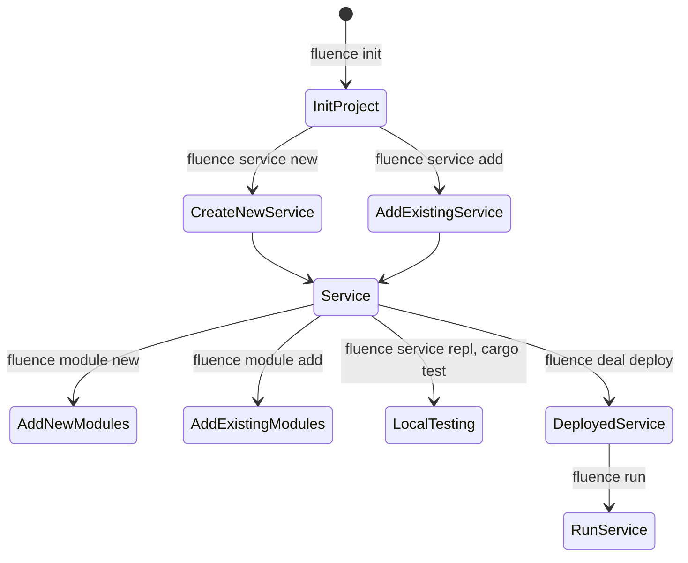

import Tabs from '@theme/Tabs';
import TabItem from '@theme/TabItem';

# Get started (with CLI)

[Fluence CLI](https://github.com/fluencelabs/fluence-cli) is your one-stop command line interface (CLI) shop to creating, deploying, paying, running, monitoring and removing distributed services to and from the Fluence peer-to-peer network.

> 👉 Note that Fluence CLI is currently only available for *nix* systems including OSX and Windows Subsystem for Linux (WSL). Moreover, Fluence CLI installs all the required dependencies not already installed on your system including Rust.

From scaffolding your project, services and modules to [Deal](/docs/build/glossary.md#deal) creation and service deployment, Fluence CLI has you covered. Moreover, Fluence CLI can scaffold JS projects using [js-client](/docs/build/js-client/1-js-client.md) allowing you integrate Fluence CLI projects in the browser or node app. See Figure 1 for a quick overview of workflows managed by Fluence CLI and the associated commands. If you have Fluence CLI installed, use *fluence --help* to get a more complete overview of topics and commands.

Figure 1: Stylized Project Creation And Deployment Workflow With Fluence CLI

mermaid


Fluence CLI uses multiple yaml config files and you can find their schemas in the *.fluence/schemas* directory. Note that Fluence CLI creates config files lazily, i.e., as needed, and at project initialization time not all config files exist. For more information, see the [Fluence CLI Readme](https://github.com/fluencelabs/fluence-cli).

## Install Fluence CLI

[Fluence CLI](https://github.com/fluencelabs/fluence-cli) is available as a package providing it's own copy of NodeJS and NPM for better portability.

Preferred installation method is through the <code>Installation Script</code>. It will install a self-suficient fcli package that won't depend nor touch your system NodeJS toolchain.

<Tabs>
<TabItem value="sh" label="Script: default">
The easiest and least error-prone way:

    curl -qL https://raw.githubusercontent.com/fluencelabs/cli/main/install.sh | bash

</TabItem>
<TabItem value="npm" label="NPM: advanced">
Alternative and more advanced option is to install via NPM. NodeJS must be >= 18.

    npm -g install @fluencelabs/cli@latest

</TabItem>
</Tabs>


We can check our installation success (note that your cli and node versions might be different):

```
% fluence --version
@fluencelabs/cli/x.y.z darwin-arm64 node-v18.18.0
```

## Prepare your Environment

In addition to Fluence CLI, you need a [WalletConnect](https://walletconnect.com/) compatible wallet, such as [MetaMask](https://metamask.io/), to be able to fund the hosting and execution of your distributed services with (testnet) USDC.

Resources:

- [Mumbai Chainlist RPC](https://chainlist.org/?testnets=true&search=mumbai)
- [Mumbai Faucet](https://faucet.polygon.technology)
- [Mumbai Explorer](https://mumbai.polygonscan.com)
- Fluence [USDC & FLT faucet](https://faucet-kras.fluence.dev)

### Adding Mumbai Testnet to MetaMask

#### 1. Open MetaMask and click on the network menu at the top and select "Add Network".

> The Mumbai network that automatically pops up in the list of networks is mainnet; we'll be adding the Mumbai testnet.

<div style={{ textAlign: "center" }}>
    
    <p>Figure 1: Add Network on MetaMask</p>
</div>

#### 2. Scroll down and click on "Add a network manually"

<div style={{ textAlign: "center" }}>
    
    <p>Figure 2: Add Manual Network on MetaMask</p>
</div>

#### 3. Fill in the following information and click "Save"

- **Network Name**: Mumbai Testnet
- **New RPC URL**: https://polygon-mumbai-bor.publicnode.com
- **Chain ID**: 80001
- **Symbol**: MATIC
- **Block Explorer URL**: https://mumbai.polygonscan.com

<div style={{ textAlign: "center" }}>
  
  <p>Figure 3: Populate Mumbai Testnet Information on MetaMask</p>
</div>

### Requesting MATIC Tokens from Polygon Testnet Faucet

#### 1. Head over to the [Mumbai Faucet](https://faucet.polygon.technology)
#### 2. Connect through Dicsord and paste your wallet address

<div style={{ textAlign: "center" }}>
  
  <p>Figure 4: Request Mumbai Matic tokens from Polygon Testnet Faucet</p>
</div>

#### 3. Check your account to confirm that you have received the requested tokens

<div style={{ textAlign: "center" }}>
  
  <p>Figure 5: MetaMask wallet with MATIC balance</p>
</div>

Finally, head over to the Fluence faucet, located [here](https://faucet-kras.fluence.dev).

### Fluence Faucet

#### 1. Head over to the [Fluence faucet](https://faucet-kras.fluence.dev)
#### 2. Click the "Login" button at the centre of the page

<div style={{ textAlign: "center" }}>
  
  <p>Figure 6: Login into the Fluence Interface</p>
</div>

<div style={{ textAlign: "center" }}>
  
  <p>Figure 7: Create an account or Login</p>
</div>

#### 3. After logging in, click on the "Add tUSDC to metamask" button

<div style={{ textAlign: "center" }}>
  
  <p>Figure 8: Fluence Interface for Adding tUSDC to Account</p>
</div>

MetaMask will automatically populate the token symbol and decimals of precision fields.

<div style={{ textAlign: "center" }}>
  
  <p>Figure 9: Adding Suggested tUSDC Token on MetaMask</p>
</div>

#### 4. Verify that you've successfully added tUSDC to your account

<div style={{ textAlign: "center" }}>
  
  <p>Figure 10: Verify Addition of tUSDC on MetaMask</p>
</div>

<div style={{ textAlign: "center" }}>
  
  <p>Figure 11: Confirm tUSDC Addition to Account</p>
</div>

#### 5. Navigate back to the Fluence Faucet. In the "Token Contract Address" field, enter your account address and click "Get tUSDC"

<div style={{ textAlign: "center" }}>
  
  <p>Figure 12: Request tUSDC using Account Address</p>
</div>

The faucet will confirm the transfer with the following information:

<div style={{ textAlign: "center" }}>
  
  <p>Figure 13: Metadata for tUSDC Faucet Transfer</p>
</div>

#### 6. Confirm the tUSDC tokens were received.

<div style={{ textAlign: "center" }}>
  
  <p>Figure 14: Check tUSDC Account Balance</p>
</div>

#### 7. To see the transaction data info for both MATIC and tUSDC transfers into your account, head over to the [explorer](https://mumbai.polygonscan.com).

<div style={{ textAlign: "center" }}>
  
  <p>Figure 15: Inspect Transfers via Aurora Faucet</p>
</div>

---

> Consider reading: [Keys management with Fluence CLI](cli-keys-management.md)

---

## Start a new project

As mentioned at the outset, Fluence CLI is your Swiss army knife to handle all things Fluence. To keep things familiar, let’s start with the obligatory *Hello World* example to introduce Fluence and Fluence CLI.

We scaffold a new project with `fluence init` , which gives us a couple scaffolding choices:

```
fluence init
? Select template (Use arrow keys)
  quickstart
❯ minimal
  ts
  js
```

Choose the *minimal* scaffolding option, and press return. When prompted, enter *hello_world* as the project path.

```bash
? Enter project path or press enter to init in the current directory: hello-world
Successfully initialized Fluence project template at ~/localdev/hello-world
```

Change into your new *hello-world* directory and have a look around:

```bash
tree -L 2 -a

.
├── .fluence              # Fluence CLI internals, including schemas and project secrets
│   ├── aqua              # Generated Aqua code, including Service APIs and deployment info
│   ├── schemas           # Schemas for config files supporting your editors linter
│   ├── env.yaml          # Specifies which network environment to use
│   └── workers.yaml      # Deployment information about legacy "direct" deploy
├── .gitignore
├── .vscode               # Settings for VSCode to support Aqua development
│   ├── extensions.json
│   └── settings.json
├── README.md
├── fluence.yaml          # Project metadata: definitions for deals, services and spells, build configuration
└── src                   # All project source code
    └── aqua              # Distributed service choreography and composition scripts
```

A this point, you see various config (yaml) files and a *src/aqua* dir with a *main.aqua* file that contains a variety of Aqua code examples and the most common dependency imports.

It defines several important functions:

- `showSubnet` – a function that resolves subnet participants by DealID stored in `.fluence`, and shows a list of workers.
- `runDeployedServices` – a function that resolves subnet, and then calls `MyService.greeting` on every worker that participates in your subnet.

`runDeployedServices` is going to be commented out in `minimal` template, and uncommented in `quickstart` template. It serves as an example of how to call functions on a subnet with multiple workers.

For more information about all things Aqua, see the [Aqua book](/docs/aqua-book/introduction.md).

**Scaffolding Options**

Instead of the *minimal* scaffold chosen at the outset of this section, we can opt for an extended project setup for either Typescript, Javascript or a `quickstart`.

The TS/JS, setup, on the other hand, provides you with the scaffolding to create a client peer with [Fluence js-client](https://github.com/fluencelabs/js-client) that can run in the browser or as a node app. See Table 1.

Table 1: Client peer options from scaffolding

|             | Use-case                                                        | Client Provider |
|:---         |:---:                                                            |---:             |
| minimal     | Start from scratch, call functions from terminal                | Fluence CLI     |
| quickstart  | Start with a pre-defined service, call functions from terminal  | Fluence CLI     |
| TS          | Build TypeScript front-end application                          | Browser         |
| JS          | Build JavaScript front-end application                          | Node App        |

### Write code

After project initialization, it's time to write some code!

Let's create a simple `hello_world` function, which will look like this:

```rust
use marine_rs_sdk::marine;

#[marine]
pub struct Hello {
  pub response: String
}

pub fn main() {}

#[marine]
pub fn hello_world() -> Hello {
    let response = format!("Hello, Fluence!");
    Hello { response }
}
```

But we don't yet have a place to put that code. For that, we need to create a Service by using command `fluence service new`.

#### Create a new service

Let’s unbundle this command before we follow the prompts: As discussed earlier, you write your business logic in Rust and compile it to one or more Wasm modules. You then “package” these modules, with help of Fluence CLI, into a *service*. Eventually you deploy this service to one or more providers and use Aqua to interact with the deployed service(s).

If your business logic results in only a single module, like our *hello_world* code, then you will have a service with a single module.

Now let’s use Fluence CLI to scaffold our Rust service.

Follow the prompts and complete the setup:

```bash
fluence service new hello_world

Successfully generated template for new service at /tmp/hello-world/src/services/hello_world
# Making sure all services are downloaded...
# Making sure all services are built...
    Updating crates.io index
   Compiling proc-macro2 v1.0.52
   <...>
Compiling hello_world v0.1.0 (/tmp/hello-world/service/modules/hello_world)
    Finished release [optimized] target(s) in 24.40s
Added hello_world to /tmp/hello-world/fluence.yaml
? Do you want to add service hello_world to a default worker defaultWorker (Y/n) Yes
Added hello_world to defaultWorker
```

So what just happened?

We instructed the CLI to create a service *hello-world* in which we want our *hello_world* module to live. Moreover, we chose to add this information to the project’s main configuration file *fluence.yaml*.

Here's how `fluence.yml` looks now.

```yaml
# Documentation: https://github.com/fluencelabs/cli/tree/main/docs/configs/fluence.md

version: 2

relays: kras

aquaInputPath: src/aqua/main.aqua

services:
  hello_world:
    get: src/services/hello_world     # (1)

workers:
  defaultWorker:
    services: [ hello_world ]         # (2)
    spells: []

deals:
  defaultWorker:                      # (3)
    minWorkers: 1
    targetWorkers: 3

```

```yaml
# Documentation: https://github.com/fluencelabs/cli/tree/main/docs/configs/fluence.md

version: 5

aquaInputPath: src/aqua/main.aqua

services:
  hello_world:
    get: src/services/hello_world     # (1)

deals:
  dealName:                           # (2)
    minWorkers: 1
    targetWorkers: 3
    services: [ hello_world ]         # (3)
    spells: []

```

Let's see what this means for our `hello_world` service.

1. The service is configured to be at `src/services/hello_world`. Path is relative to `fluence.yml`.
2. A Deal with name `dealName` is defined
3. The service `hello_world` is included in the Deal `dealName`

As a result, when you `fluence deal deploy`, it will deploy `hello_world` as a part of the `dealName` Deal. We will go into the details of `deal deploy` in the next part of this tutorial.


Let's take a look at the directory structure to see how Fluence CLI scaffolded our Rust (sub-)project:

```bash
tree src -L 5 -a

src
├── aqua
│   └── main.aqua
└── services
    └── hello_world
        ├── modules
        │   └── hello_world
        │       ├── Cargo.toml
        │       ├── module.yaml
        │       └── src
        └── service.yaml
```

Recall, a service is comprised of one or more Wasm modules and associated configuration and each module,
such as *hello_world*, has its own *module.yaml* which contains all the info necessary to identify
the module as well as any host resource dependencies. *service.yaml* contains the service name and a list of
the modules comprising the service including the entry, aka [facade](/docs/build/glossary.md#facade-module),
module into the service.

Now, lets open `main.rs` file, and replace it's code with the following:

```rust
// main.rs
use marine_rs_sdk::marine;             // 1

#[marine]                              // 2
pub struct Hello {
  pub response: String
}

pub fn main() {}                       // 3

#[marine]                              // 4
pub fn hello_world() -> Hello {        // 5
    let response = format!("Hello, Fluence!");
    Hello { response }
}
```

#### Code review

Let's review the code.

1. Before anything, we need to import the [Marine Rust SDK](/docs/marine-book/marine-rust-sdk/marine-rust-sdk.md), which allows us to compile Rust code to wasm32-wasi module compatible with Fluence’s Marine runtime.

2. Defines a `Hello` structure that will hold our greeting message. We could also use just `-> String` but that wouldn't have allowed us to introduce the marine struct concept: `#[marine]` macro marks a struct as publicly visible, and handles serialization/deserialization for you. It is part of the *marine-rust-sdk*.

3. Implements the `main` function which is responsible for the initialization logic of the module. It is called automatically at service instantiation.

4. `#[marine]` marks `hello_world` as publicly visible, so it can be called from Aqua.

5.  The `hello_world` body implements our business logic.

We discuss modules and module configuration further below. Also note that WASM IT has type limits,
which are explained in detail in the [Marine book](/docs/marine-book/marine-runtime/i-value-and-i-type).
The short version is: you got strings, ints, floats, bytes, arrays and records at your disposal,
but you do not have generics, lifetimes, etc.

### Build project

With our code in place, let’s finally build our project, i.e. compile our code to a wasm32-wasi module.
In your project root directory:

```shell
fluence build
Making sure all services are downloaded... done
<...>
Making sure all modules are downloaded and built... done
```

Depending on your setup, this may take a while as Fluence CLI will attempt to install missing dependencies, including Rust.

In the end, you can locate our much anticipated Wasm module in the Rust *target* compile directory:

```bash
file target/wasm32-wasi/release/hello_world.wasm

target/wasm32-wasi/release/hello_world.wasm: WebAssembly (wasm) binary module version 0x1 (MVP)
```

### Test our code

Before we deploy our code to the network, we may want to run some tests.

One way to interact with our Wasm module is to use the [Marine Repl](/docs/marine-book/marine-tooling-reference/marine-repl#run-repl), which is a tool to run our Wasm modules locally as if they were deployed to the network.

Again, depending on your setup, this may take a while as Fluence CLI may need to install missing dependencies:

```bash
fluence service repl
? Enter service name from fluence.yaml, path to a service or url to .tar.gz archive hello_world
Making sure service and modules are downloaded and built... ⣻
Making sure service and modules are downloaded and built... done

^^^^^^^^^^^^^^^^^^^^^^^^^^^^^^^^^^^^^^^^^^^^^^^^^^^^^^^^^^^^^^^^^^^^^^^^^^^^^^^^

Execute help inside repl to see available commands.
Current service <module_name> is: hello_world
Call hello_world service functions in repl like this:

call hello_world <function_name> [<arg1>, <arg2>]

^^^^^^^^^^^^^^^^^^^^^^^^^^^^^^^^^^^^^^^^^^^^^^^^^^^^^^^^^^^^^^^^^^^^^^^^^^^^^^^^

Welcome to the Marine REPL (version 0.19.1)
Minimal supported versions
  sdk: 0.6.0
  interface-types: 0.20.0

app service was created with service id = 053dee68-160a-4278-b327-59673ac8067a
elapsed time 34.081026ms

1>
```

Note that we provided the name of the *path* to our service and thanks to the information in the *fluence.yaml,
service.yaml and module.yaml* files, the CLI is able to resolve our input and load the REPL with the
correct configuration.  For help with the REPL, just type *help* and to list public structs and functions, type *i* :

```bash
1> i
Loaded modules interface:
exported data types (combined from all modules):
<no exported data types>

exported functions:
hello_world:
  func hello_world() -> string
```

As expected, our only public function is the *hello_world* function in the *hello_world* namespace.
In order to run *hello_world*  we use the cll command follow by the namespace,
the function and the function arguments:

```bash
> call hello_world hello_world []
result: "Hello, Fluence"
 elapsed time: 90.655µs
```

Well done!

An alternative to interactively test a module in the REPL, is to write unit and integration tests for our code.
Rust comes with a very nice [testing framework](https://doc.rust-lang.org/cargo/commands/cargo-test.html) widely used
to unit and integration test Rust code. However, we don’t necessarily want to test our Rust code but our Wasm modules.
With the [marine rust test dsk](https://crates.io/crates/marine-rs-sdk-test), you can do that!

To exit Marine REPL, enter `q` and hit Enter.

#### Unit tests

Let’s add the testing code for our *hello-world* module in our *main.rs* file:

```rust
//  main.rs
// <...>
#[cfg(test)]
mod tests {
    use marine_rs_sdk_test::marine_test;                                        // 1

    #[marine_test(config_path = "../../../../../../.fluence/tmp/Config.toml")]  // 2
    fn test_hello_world(hw: marine_test_env::hello_world::ModuleInterface) {    // 3
        let greeting = hw.hello_world();
        assert_eq!(greeting.response, "Hello, Fluence!".to_string());
    }
}
```

Marine tests fundamentally follows [cargo test](https://doc.rust-lang.org/cargo/commands/cargo-test.html) with
the exception that you are testing the Wasm modules not the code to be compiled to a Wasm module.

1. In order to make that work, you need to use the [marine-rs-sdk](https://crates.io/crates/marine-rs-sdk-test) (1).
2. Then, we need to provide the path to Config.toml (2).
3. Finally, we need to tap into the Wasm module namespace to be able to call the desired method (3).

Once the test code is in place. you are ready to run *cargo test* :

```bash
cargo test --workspace
   Compiling hello_world v0.1.0 (/tmp/hello-world/src/services/hello_world/modules/hello_world)
    Finished test [unoptimized + debuginfo] target(s) in 1.79s
     Running unittests src/main.rs (target/debug/deps/hello_world-cd07bdcb4767b2a3)

running 1 test
test tests::test_hello_world ... ok

test result: ok. 1 passed; 0 failed; 0 ignored; 0 measured; 0 filtered out; finished in 0.46s
```

All is well with our module!

Now it's time to break the test to see if it will catch a bug. Let's intentionally change the expected value to a different one:

```
assert_eq!(greeting.response, "Buenas días, Fluence!".to_string());
```

Now, run cargo test again:

```bash
cargo test --workspace
   Compiling hello_world v0.1.0 (/tmp/hello-world/src/services/hello_world/modules/hello_world)
    Finished test [unoptimized + debuginfo] target(s) in 1.53s
     Running unittests src/main.rs (target/debug/deps/hello_world-cd07bdcb4767b2a3)

running 1 test
test tests::test_hello_world ... FAILED

failures:

---- tests::test_hello_world stdout ----
thread 'tests::test_hello_world' panicked at 'assertion failed: `(left == right)`
  left: `"Hello, Fluence!"`,
 right: `"Buenas días, Fluence!"`', src/services/hello_world/modules/hello_world/src/main.rs:24:9
note: run with `RUST_BACKTRACE=1` environment variable to display a backtrace


failures:
    tests::test_hello_world

test result: FAILED. 0 passed; 1 failed; 0 ignored; 0 measured; 0 filtered out; finished in 0.42s

error: test failed, to rerun pass `--bin hello_world`
```

Now, let's say our test is correct, but our WASM/Rust implementation is wrong. Let's fix the code!

Change the response in `hello_world` function like this:
```rust
let response = format!("Buenas días, Fluence!");
```

And run `fluence build` to rebuild the WASM modules. Without an explicit rebuild, tests will use old WASM modules, because `cargo` doesn't know anything about Fluence CLI and its setup.

After `fluence build`, re-run `cargo test --workspace` and voila, all is well again!

Now, we're ready to talk about Deal deployment and Compute Marketplace.

## Compute Marketplace: Glossary & Background

Fluence is a decentralized, permissionless peer-to-peer protocol that makes a Decentralized Cloud where developers can deploy their WebAssembly functions and pay with tokens for their execution. Payments go to Providers, who host these functions.

While the execution of business logic is off-chain, the market-making and associated settlement is on-chain. Specifically, a set of smart contracts handles the agreement over things like payment and collateral between a Developer and one or more Providers that would host and execute specified functions.

### What are deals

Deal represents a request from Developer to host a set of WebAssembly functions for a specified price. Providers are able to join these deals in order to host functions and receive tokens for that.

In essence, Deal specifies what to deploy, and how much to pay for that.

Among parameters described above, each Deal specifies an `AppCID`. `AppCID` is an IPFS CID that points to the `Worker Definition` data structure stored on IPFS.


#### Where `Worker Definition` comes from

As we will see in [`step-by-step`](#deployment-step-by-step) section below, there's a certain structure to the Fluence Projects. That structure is defined by [`fluence`](https://github.com/fluencelabs/cli) cli tool, which provides means to initialize and maintain Fluence Projects.

Fluence Project can hold any number of Rust and WebAssembly -based functions and timer-based recurrent [Aqua](https://github.com/fluencelabs/aqua) scripts.

A set of functions defined by a single Rust project or a set of linked WebAssembly modules is called a `service`.

A timer-based recurrent Aqua scripts are called Spells. It's like a cron, but for distributed choreography.

Developers can group Services and Spells to Deals, and then deploy each deal via [`fluence deal deploy`](https://github.com/fluencelabs/cli/blob/main/docs/commands/README.md#fluence-deal-deploy-worker-names) command in `fluence cli`. Before Deal is registered on Chain, its settings and artifacts are uploaded to IPFS to produce `Worker Definition`, which is again stored on IPFS to produce `AppCID`.

#### How deals are matched

In order for a Deal to be deployed, there should be Providers willing to host it. That process is governed by the `Matcher` smart contract.

Optionally, Deal can specify Providers on which to deploy. However, by default, Providers are chosen automatically.

It's important that Matcher makes it possible for a single Deal to be deployed on several hosts to provide High Availability.

A Deal specifies different parameters, like `price per epoch`, `minimum collateral`, `effectors` and `target number of workers`.

These parameters are matched against Providers' Market Offers, which specify `minimum price per epoch`, `maximum collateral` and `available effectors`.

Providers register their Market Offers on chain in a contract called `Matcher`, and each `deal deploy` calls that contract to find Offers compatible with that Deal. It should match the price, collateral and available `effectors`.

Each match should find at least `target number of workers` Providers whose offers are compatible with a given Deal.

After match happened, Providers receive an event from Chain that commands them to deploy Deal to their chosen Compute Peer.

### What are Compute Peers

In order to actually host Services and Spells from Deals, Provider have to run instances of a Fluence-developer Peer implementations.

At the moment, there are two Peer implementations: [one in JS](https://github.com/fluencelabs/js-client), another in Rust. The latter one is called [Nox](https://github.com/fluencelabs/nox), and it plays the role of a Compute Peer.

While Provider is a rather ephemeral entity, defined only by its Wallet keys, the Compute Peers are the actual instances of Nox that host Deals.

Compute peer host Services and Spells from assigned Deals. Services and Spells of the same Deal are grouped into a Worker, thus completely separating business logic of different Deals, allowing them to safely co-exist on a single Compute Peer.

### What are workers

When Deal is matched against Market Offers, it gets deployed to a number of Compute Peers.

For every deal, a Compute Peer creates a secure namespace to isolate functions of that Deal from other Deals. That secure namespace is called a Worker. After successful deployment, a Worker holds all Services and Spells.

Since Workers are isolated from each other, Service and Spells names and aliases will never have a collision with Services and Spells in other Workers.

In order to reach these Services and Spells and call functions on them, it's required to know two things: Compute Peer ID and Worker ID.

For purposes of this document, it's enough to know that a Worker is what holds a set of Services and Spells for a single Deal.

### What are subnets

Subnet is a set of Workers each hosting Services and Spells from the same Deal.

It's important to diversify where Deal is hosted to provide High Availability. So Workers of a single Deal will always be on different Compute Peers, and most likely these Compute Peers will come from different Providers.

So, Subnet unites one or more Compute Peers of one or more Providers. A single Subnet corresponds to a single Deal, so each Compute Peer of a Subnet hosts a Worker which contains all the Services and Spells defined by the Deal's `AppCID`.

Information about Subnet participants is stored on Chain. So it's a public information that's easy to retrieve from Chain knowing a Deal ID. Clients use that information to resolve Subnets to a list of Workers, and access Services and Spells inside these Workers.

## Deployment to the on-chain marketplace

### Deal deploy

`fluence deal deploy` will deploy all deals defined in `fluence.yml`.

See `fluence deal deploy --help` for information on more settings to `deal deploy` command.

As deployment happens through blockchain, you will be prompted to open a URL to sign Transaction with your Metamask wallet. You will have to do that twice.

First, you will see this message in your terminal:
```
To approve transactions to your wallet using metamask, open the following url:

https://cli-connector.fluence.dev/?wc=000000000000000000000%402&relay-protocol=irn&symKey=000000000000000
```

Open it, and connect Metamask. After a short while, you will see a Metamask prompt to sign Transaction.

<div style={{ textAlign: "center" }}>
    
    <p>Confirm TX with MetaMask</p>
</div>


After you have approved the tx, a similar message will appear, and you have to do open second address, and repeat same actions with metamask as before.

After a short while, you will see a message like this one:

```
## Waiting for transaction to be mined......

Success!

created deals:
  defaultWorker:
    deal: https://mumbai.polygonscan.com/address/0x00000000000000000000000000000000
    worker definition: bafkreigu3u3swrzq4tingjbp77ozozacbcsujm3wnnr7x4xbeliwr5zkvi
    timestamp: 2023-08-31T18:07:01.122Z
```

That means your Deal was deployed successfully. After a short while, Providers will catch up and deploy it.

### Call a function over the subnet

In your project, there's a file `src/aqua/main.aqua` which contains the function `runDeployedServices` which resolves a Subnet and calls a function on each of the Workers in the Subnet.

However, since we have started with a `minimal` template, this function is commented.

Uncomment it, and then change the service function call that's written to `answer` variable.

Change these two lines:
```aqua
answer <- MyService.greeting("fluence")
answers <<- Answer(answer=?[answer], worker=w)
```

To this
```aqua
answer <- HelloWorld.hello_world()
answers <<- Answer(answer=?[answer.response], worker=w)
```

Let's go through the two changes:
1. _Type name_ of the service was changed from `MyService` to `HelloWorld`. Service types are imported from `.fluence/services.aqua`, which is generated by Fluence CLI on `fluence build` and `fluence deal deploy`.
2. Instead of `?[answer]`, it is now `?[answer.response]`. That's because `hello_world()` function returns not just a `string`, but a data structure `Hello`, which contains field `response`. Alternatively, you could change the definition of `Answer` data structure to hold `Hello` instead of `string`.

Now, to run the updated Aqua function, simply run the following command:
```bash
fluence run -f 'runDeployedServices()'
```

You will see a list which may not contain any data and the associated `worker_id` is null. That means that this specific Compute Peer has not deployed the Deal ... yet!  Wait a bit, where bit = blocktime + some additional patience stressor, and re-run the command.

### Inspect a deployed deal

The `main.aqua` file contains another commented function, called `showSubnet`. Just uncomment it, and you're good to go.

```bash
fluence run -f 'showSubnet()'
```

```json
[
    {
        "services": [
            "hello_world",
            "worker-spell"
        ],
        "worker_id": "12D3KooLANJSDNdoandjqlwkDNIBNnnao12nWNj0uaJIKSALn"
    },
    {
        "services": [
            "hello_world",
            "worker-spell"
        ],
        "worker_id": "12D3KooWKGU8FFyw5Ek7wWREX2KKEs2AjxnaojsndoJOWNSJd"
    },
    {
        "services": [
            "hello_world",
            "worker-spell"
        ],
        "worker_id": "12D3KoonONmakW291NlajwyrnbLSAMNpqNAO21NQJWJSnsnwo"
    }
]
```

### Update deal

Now, if you want to change something in one of your Services or Spells, you can do that, and simply call `deal deploy` again will update existing Deal in place.

Try it: modify code in `src/services/hello_world/modules/hello_world/src/main.rs` and execute `deal deploy` again.

### Current limitations

Right now, there's no way to remove a Deal once it is deployed. It will be possible shortly!

Also, there's no billing yet, so you won't be charged any tokens and Deals will remain deployed forever. That will be fixed soon, as well.
