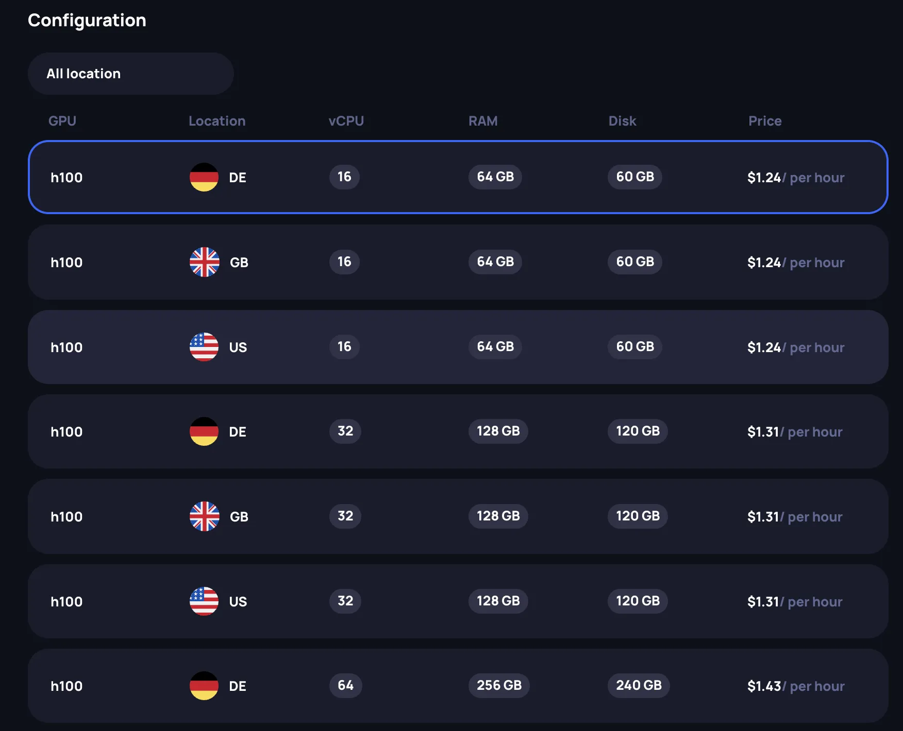
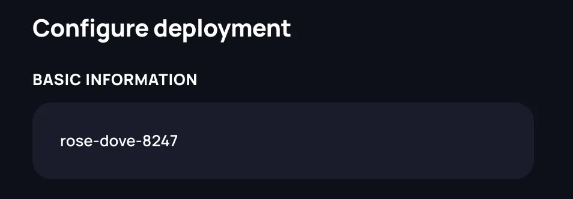
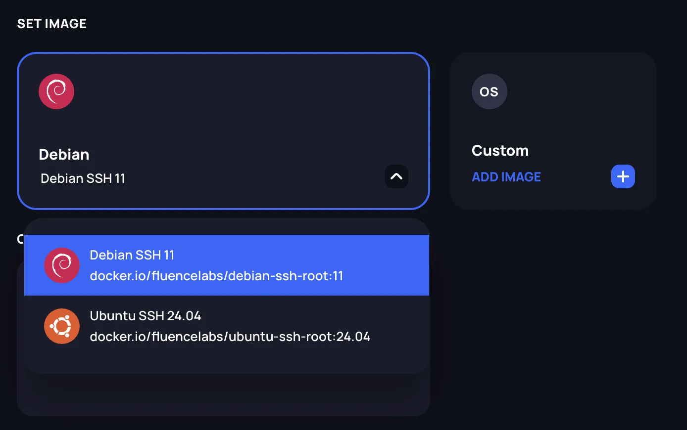
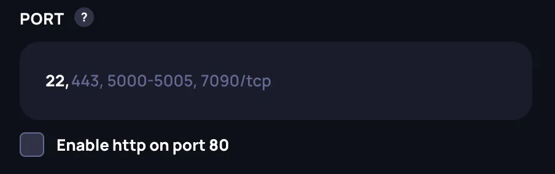
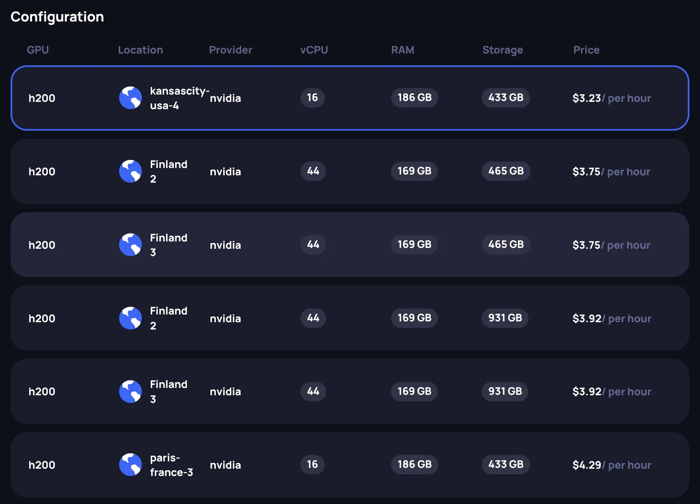
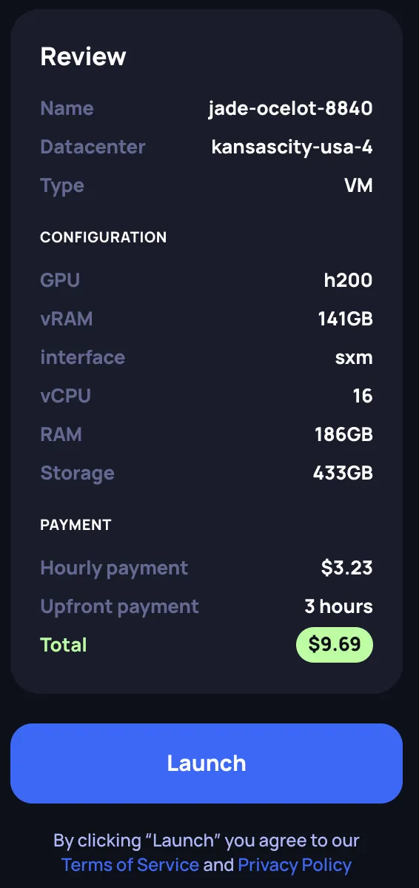

# Renting an instance

The Fluence marketplace is a decentralized broker of GPU compute supply and demand that facilitates the renting process of GPU instances and management of your instances in datacenters located around the world.
The GPU marketplace offers three kinds of GPU workload for deployments: containers, VMs and bare metal instances. This document is focused on showing how to choose and configure and deploy an instance of any available kind.

## Billing model

GPU instances are billed hourly on a pre-paid model. Each instance has its own dedicated balance that covers ongoing rent.

Billing periods are fixed hourly intervals (e.g., 15:00–16:00, 16:00–17:00 UTC) regardless of when the instance was started. At each billing period, one hour of rent is charged from the instance's balance.

**Deployment charge.** When you deploy an instance, an amount equivalent to 3 hours of rent is deducted from your account balance and transferred to the instance's balance. The current billing period is charged immediately, and the remaining 2 hours serve as a reserve. If provisioning fails, the full amount is returned to your account balance.

**Automatic top-ups.** The system maintains a reserve of 2 hours of rent on each instance's balance. When the reserve drops below this target — typically after each hourly charge — the system automatically tops it up from your account balance.

**Insufficient funds.** If your account balance cannot cover a top-up, the system will keep retrying. Your instance runs through any billing period that has already been paid for. Termination occurs when the system cannot charge for the next billing period due to insufficient funds on the instance's balance — the instance is then automatically deleted.

**Funds after termination.** When an instance stops — whether terminated by you or the system — all unused funds remaining on the instance's balance are returned to your account balance.

You can check the amounts reserved for your running instances on the **Billing** page in the Fluence Console.

## GPU container

GPU containers are lightweight deployments that run containerized workloads with full GPU access. They are ideal for running ML inference, training jobs, or any GPU-accelerated application packaged as a container image.

### 1. Select the GPU model

Choose the GPU model that fits your workload requirements. Each GPU card displays key specifications:

- **vRAM**: GPU memory available
- **Interface**: Connection type (PCIe or SXM — SXM offers higher memory bandwidth for multi-GPU workloads)
- **Price**: Minimum hourly rate in USD across all available configurations for this GPU model

### 2. Select a configuration

After selecting a GPU model, choose a specific configuration from the available offerings. You can filter by location using the dropdown. Each configuration has following attributes:

- **GPU**: The GPU model
- **Location**: Data center location (US, GB, DE, etc.)
- **vCPU**: Number of virtual CPU cores allocated
- **RAM**: System memory allocated
- **Disk**: Storage space allocated
- **Price**: Hourly rate

Select the row that matches your requirements. The **Review** panel on the right updates to reflect your selection.

### 3. Specify the instance name

In the **Configure deployment** section, provide a name for your instance in the **Basic Information** field. A random name is generated by default (e.g., "rose-dove-8247"), but you can customize it.

### 4. Set the container image

Choose the container image for your deployment. You have two options:

**Predefined images**: Select from available pre-configured images (e.g., Debian SSH 11) using the dropdown.

**Custom images**: Click **Add Image** to specify your own container image from a registry.

#### Using a custom image

When adding a custom image, a dialog appears with the following options:

- **Image**: Enter the full image reference (e.g., `myorg/myimage:latest`)
- **Private Mode**: Enable this toggle to access private repositories. When enabled, additional fields appear:
  - **Host**: Select the container registry (GitHub Container Registry or Docker Hub)
  - **Username**: Your registry username
  - **Password**: Your registry password or access token

Click **Set image** to confirm your selection.

### 5. Set the container start command

In the **Container Start Command** field, enter the script that will be executed as the entrypoint when the container starts. The script should be written as a bash script. Leave empty to use the default entrypoint defined in the container image.

### 6. Configure ports

Specify which ports should be accessible on your container. Enter port numbers separated by commas. Supported formats:

- Port number only: `22, 443` (defaults to TCP)
- Port with protocol: `8080/tcp`, `53/udp`
- Port ranges: `5000-5005`

Port 22 is included by default for SSH access. Check **Enable http on port 80** to expose HTTP traffic on port 80.

### 7. Set environment variables

Add environment variables that will be available inside your container. Click **Add Variable** and provide:

- **Name**: The variable name (e.g., `MODEL_PATH`)
- **Value**: The variable value (e.g., `/models/llama`)

You can add multiple variables as needed. Click the **X** button to remove a variable.

### 8. Select SSH keys

Choose which SSH keys should have access to the container. Your registered keys are displayed, and you can select or deselect them. Click **Add New Key** to register a new SSH key if needed.

:::warning
When using a predefined OS image, the environment variable `SSH_PUBKEY` is reserved by the system for injecting your selected SSH keys into the container. Defining an environment variable with this name will cause the deployment request to fail.
:::

### 9. Review and launch

Review your configuration in the **Review** panel on the right side. Verify:

- Instance name and location
- Selected image
- Hardware configuration (GPU, vRAM, interface, vCPU, RAM, Disk)
- Payment details (hourly rate, upfront payment of 3 hours, total)

Click **Launch** to deploy your GPU container. You will be redirected to the **Instances** page where you can monitor the deployment status.

## VM and Bare Metal

GPU VMs and bare metal instances provide full OS-level access with GPU passthrough. VMs run on a hypervisor, while bare metal gives you a dedicated physical server with no virtualization overhead. Both types share the same creation flow — the only difference is the tab you select at the top of the page (**VM** or **Bare Metal**).

:::info
The steps below apply to both VM and bare metal deployments. The screenshots show the VM tab, but the bare metal flow is identical.
:::

### 1. Select the GPU model

At the top of the page, select the **VM** or **Bare Metal** tab. Then choose the GPU model that fits your workload requirements. Each GPU card displays key specifications:

- **vRAM**: GPU memory available. Some GPU models offer multiple vRAM options — use the dropdown on the card to select the desired variant.
- **Interface**: Connection type (PCIe or SXM). Some GPU models support both — use the dropdown to choose. SXM offers higher memory bandwidth and is typically used for multi-GPU training workloads.
- **Price**: Minimum hourly rate in USD across all available configurations for this GPU model

### 2. Select the GPU count

Choose how many GPUs you need for your instance. Available options range from a **Single GPU (x1)** to **Multiple GPU** configurations. Each card shows:

- **Providers**: Number of providers with this GPU count available
- **Regions**: Number of regions where this configuration is offered
- **Data centers**: Number of data centers with availability
- **Price**: Hourly rate for the selected GPU count

Multi-GPU configurations are useful for distributed training, large model inference, or other workloads that benefit from parallel GPU compute.

### 3. Select a configuration

After selecting the GPU model and count, choose a specific configuration from the available offerings. Each row in the configuration table shows:

- **GPU**: The GPU model
- **Location**: Data center location
- **Provider**: The compute provider
- **vCPU**: Number of virtual CPU cores allocated
- **RAM**: System memory allocated
- **Storage**: Disk space allocated
- **Price**: Hourly rate

Select the row that matches your requirements. The **Review** panel on the right updates to reflect your selection.

### 4. Specify the instance name

In the **Configure deployment** section, provide a name for your instance in the **Basic Information** field. A random name is generated by default (e.g., "jade-ocelot-8840"), but you can customize it.

### 5. Set the OS image

Choose the OS image for your instance using the **Set Image** dropdown. Available images come pre-configured with CUDA drivers and GPU support. Select the image that matches your software requirements.

### 6. Select SSH keys

Choose which SSH keys should have access to the instance. Your registered keys are listed with their name and fingerprint. Use the **X** button to remove a key from the selection, or click the dropdown chevron to expand key details. Click **Add New Key** to register a new SSH key if needed.

:::info
You need at least one SSH key registered to access your instance. SSH keys can be managed in [Settings](../../settings/settings.md).
:::

### 7. Review and launch

Review your configuration in the **Review** panel on the right side. Verify:

- **Name** and **Datacenter** location
- **Type**: VM or Bare Metal
- **Configuration**: GPU model, vRAM, interface, vCPU, RAM, Storage
- **Payment**: Hourly payment rate, upfront payment (3 hours), and total amount to be deducted

Click **Launch** to deploy your instance. You will be redirected to the **Instances** page where you can monitor the deployment status.

