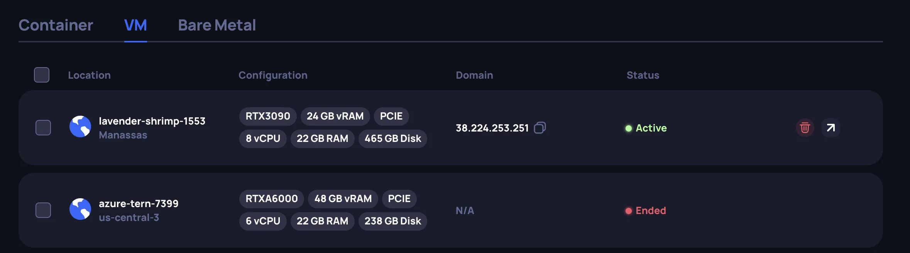
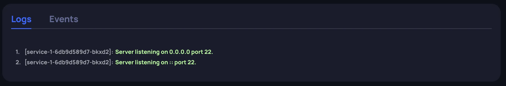

# GPU Instance Info and Management

After renting a GPU instance, you can view and manage it on the **Running Instances — GPU cloud** page. Instances are organized by type with separate tabs: **Container**, **VM**, and **Bare Metal**.

## Instances list

The instances list displays your GPU instances. Each instance card shows:

- **Location** — data center location
- **Configuration** — hardware summary: GPU model, vRAM, interface type, vCPU, RAM, and Disk
- **Domain** — the domain name or IP address assigned to the instance
- **Status** — current state of the instance:
  - **Initiated** — the instance is being provisioned
  - **Active** — the instance is running
  - **Failed** — the instance failed to be provisioned
  - **Ended** — the instance was terminated by the user or the system

Active instances have action icons: edit name (pencil), terminate (trash), and open details (arrow).

## GPU container

### Instance details

Open an instance card to view its details. The details page provides:

- **Configuration** — the hardware allocated to the instance: GPU model, vRAM, interface, vCPU, RAM, and Disk
- **Network** — connectivity information:
  - **Domain** — the domain name or IP address assigned to the container
  - **Forwarded ports** — your specified ports are mapped to externally accessible ports by the cluster (e.g., your port `22` may be forwarded to `30694`). Use the forwarded port together with the domain to connect.
  - **URI** — the HTTP address, available when port 80 was enabled during creation
- **Renting information** — deployment date, next billing time, hourly rate, and total spendings
- **Container image** — the image currently running on the instance

### Logs and Events

At the bottom of the details page, two tabs provide runtime information:

- **Logs** — container output (stdout/stderr)

- **Events** — cluster-level events for the instance lifecycle: scheduling, image pulling, container creation, and startup

### Updating a container deployment

You can update a running container by clicking **Update deployment** on the details page. The following can be changed:

- Container image (predefined or custom)
- Container start command
- Environment variables
- SSH keys

The update page works the same way as the [instance creation flow](../instance_rent/instance_rent.md#set-the-container-image). After making your changes, click **Redeploy** to restart the container with the updated configuration.

## VM and Bare Metal

### Instance details

Open an instance card to view its details. The details page provides:

- **Configuration** — the hardware allocated to the instance: GPU model, vRAM, interface, vCPU, RAM, and Disk
- **Network** — connectivity information:
  - **Domain** — the domain name or IP address assigned to the instance
  - **SSH key** — the key associated with the instance
  - **SSH command** — a ready-to-use command to connect to the instance via SSH
- **Renting information** — deployment date, next billing time, hourly rate, and total spendings
- **OS image** — the image used for the instance

:::info
Updating a running VM or bare metal instance is not currently supported. To change the configuration, terminate the instance and create a new one.
:::

## Billing

The history of your charges can be found on the **Billing page** under the **GPU cloud** tab. The page shows your monthly spending with a daily breakdown chart, filterable by instance type. The **Billing history** table lists each charge with the instance name, instance ID, payment date, and amount.

