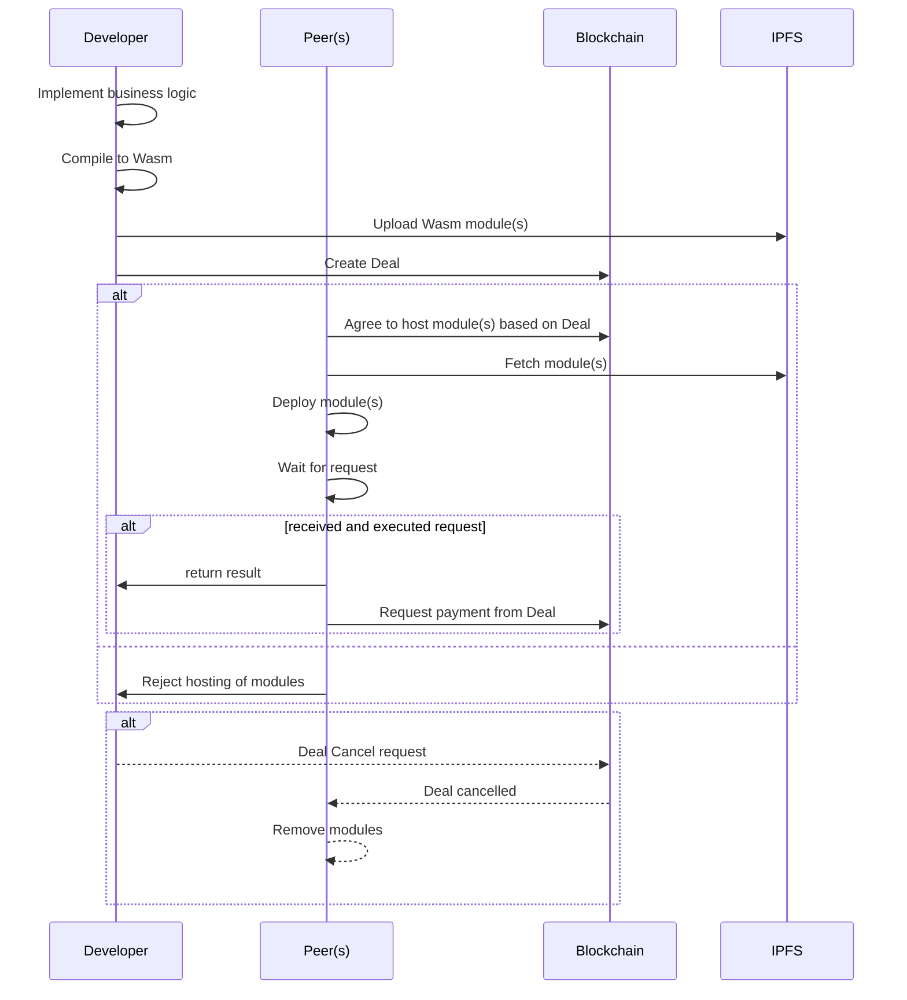

# Introduction

Fluence's decentralized serverless protocol, marketplace and solution stack allows developers to quickly create decentralized protocols and applications by distributing services across a peer-to-peer network. The Fluence protocol is implemented as an open, permissionless peer-to-peer network with global reach allowing developers to distribute their business logic in form of Wasm modules to one or more peers for execution. Fluence's distributed choregraphy and composition engine [Aqua](/docs/build/glossary.md#aqua) allows developers to use and re-use their distributed services into powerful decentralized protocols and applications. An on-chain marketplace efficiently matches developers wanting to host their services with peers interested to host services by creating [Deal](/docs/build/glossary.md#deal)s.

Let’s get a bird’s eye view of the anatomy of decentralized serverless built on the [Fluence protocol](/docs/build/glossary.md#fluence-protocol):  Business logic is implemented in Rust, and soon Python and Javascript, and compiled to Wasm. The resulting Wasm module(s) with associated linking and host resource access request specifications are deployed to one or more peers willing to host said service(s). Note that we call the linked modules a [service](/docs/build/glossary.md#service). If all goes as planned, you now have your business logic distributed across the peer-to-peer network and ready for execution. See Figure 1.

mermaid

Now that your services are deployed and ready to be put to work, you are ready to implement your application workflow with Aqua.With the help of a client-peer, such as provided by [Fluence CLI](https://github.com/fluencelabs/fluence-cli) or [js-client](https://github.com/fluencelabs/js-client), you can initiate the execution of your Aqua workflow by connecting to any publicly accessible peer, aka [relay peer](/docs/build/glossary.md#relay), in the network.

With the overview out of the way, let's get started with Fluence CLI.
