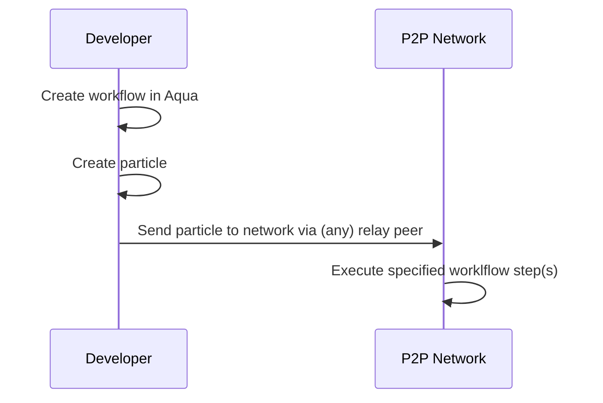
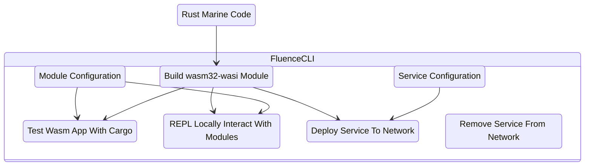

# Introduction

Fluence decentralized FaaS is a Web3 alternative to FaaS provided by centralized cloud providers 
such as AWS Lambda or Google Cloud Functions.
Fluence decentralized FaaS allows developers to benefit not only from verifiable service execution, 
high availability and easily portable code but also highly competitive pricing.

Fluence decentralized FaaS, aka services, are implemented as Webassembly Interface Types (Wasm IT) modules 
and executed by hardware providers, aka peers, in a public, permissionless peer-to-peer network with global reach.
Your code, i.e., Wasm [modules](/docs/build/glossary.md#marine-module), and peer(s) are linked by an on-chain 
marketplace that allows you, the developer, 
to specify your willingness to pay in stablecoin, such as USDC, and for peers to decide which payloads 
to host and execute based on their economic rationale.

Before we dive in, let’s get a bird’s eye view of the anatomy of decentralized serverless built on the [Fluence protocol](/docs/build/glossary.md#fluence-protocol).

Business logic is implemented in Rust and compiled to Wasm.
The resulting Wasm module(s) with associated linking and host resource access request specifications
are deployed to one or more peers willing to host said modules.
***Note that we call the linked modules a [service](/docs/build/glossary.md#service)***. 
If all goes as planned, you now have your business logic distributed to the peer-to-per network and available to be called.
See Figure 1.

Now that we have our business logic deployed to one or more peers of the Fluence peer-to-peer network,
we need to implement our application workflow with [Aqua](/docs/build/glossary.md#aqua).
[Aqua](https://github.com/fluencelabs/aqua), as you may recall,
is your distributed choreography and composition tool necessary since your distributed services 
are not callable by REST or JSON-RPC but over the networks peer-to-peer layer.
Once you implemented your workflow and service composition, 
tooling is available to create the previously discussed [particle](/docs/build/glossary.md#particle), i.e., compiled Aqua, data and metadata,
and deploy it to the network. Note that the entry point of your workflow program can be any publicly accessible peer,
aka [relay peer](/docs/build/glossary.md#relay), in the network. See Figure 2.

Your go-to tool for accomplishing almost all tasks except for coding business logic is Fluence CLI. See Figure 3.

