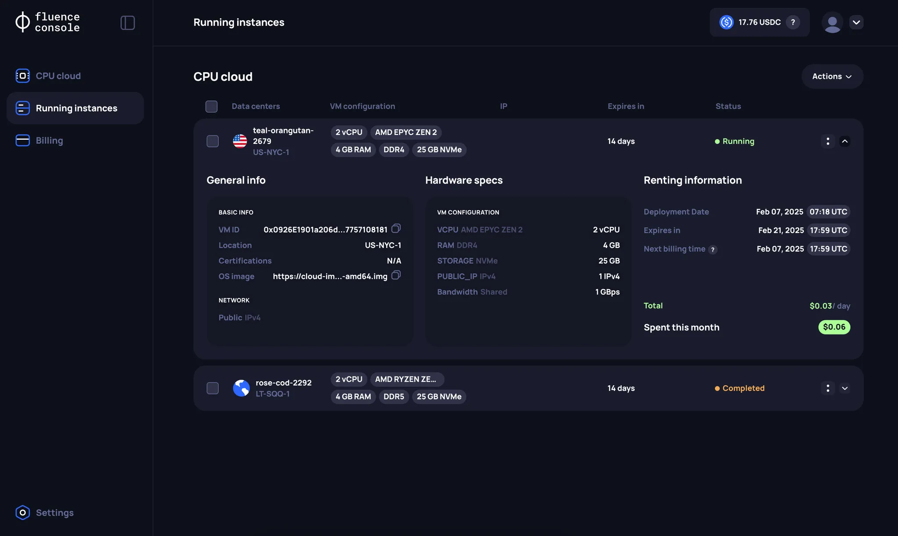
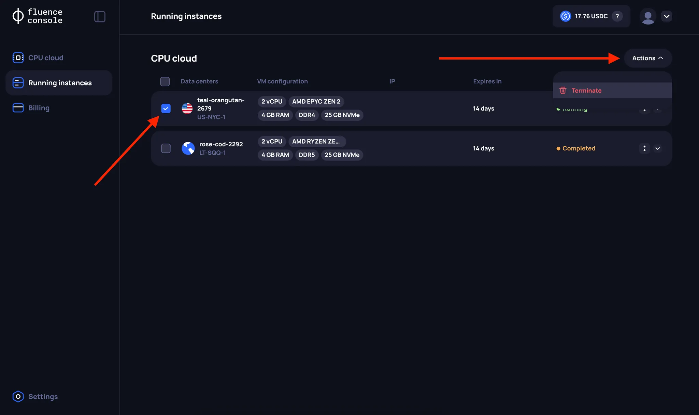
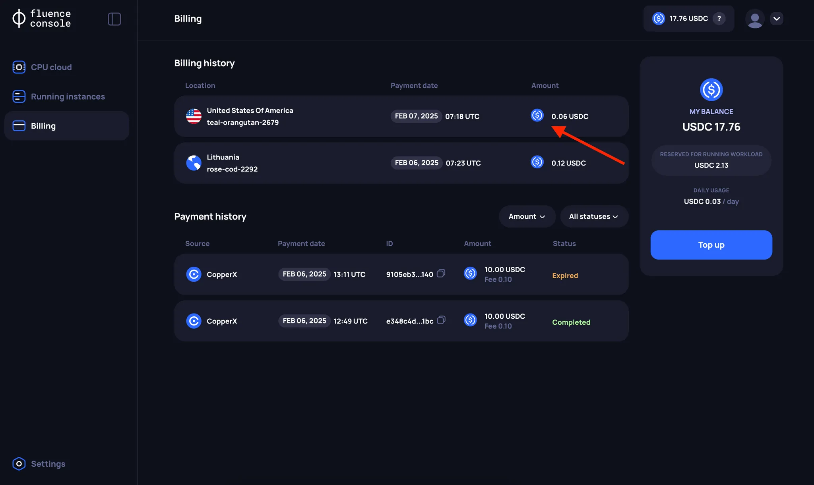

# CPU VM Info and Management

After renting a VM, all the relevant information is accessible on the **Running Instances** page.

## VM Information

For each VM, a corresponding card will appear on the **Running Instances** page, which can be expanded. More detailed information can be found in the `Hardware Specs` section. Note that extended server parameters are only visible if the specific infrastructure provider has provided the underlying information.

The user can also see information about the next billing time (`Next billing time`) set at **5:55 PM UTC**.

## VM Management

Currently, the only operation available for a (running) VM is `Delete`, which terminates the VM and the rental agreement. The ability to Reboot, Reset and Rebuild from the Fluence Console will be added soon.

## Billing History

The history of your charges can be found on the **Billing page** in the **Billing History** section.

