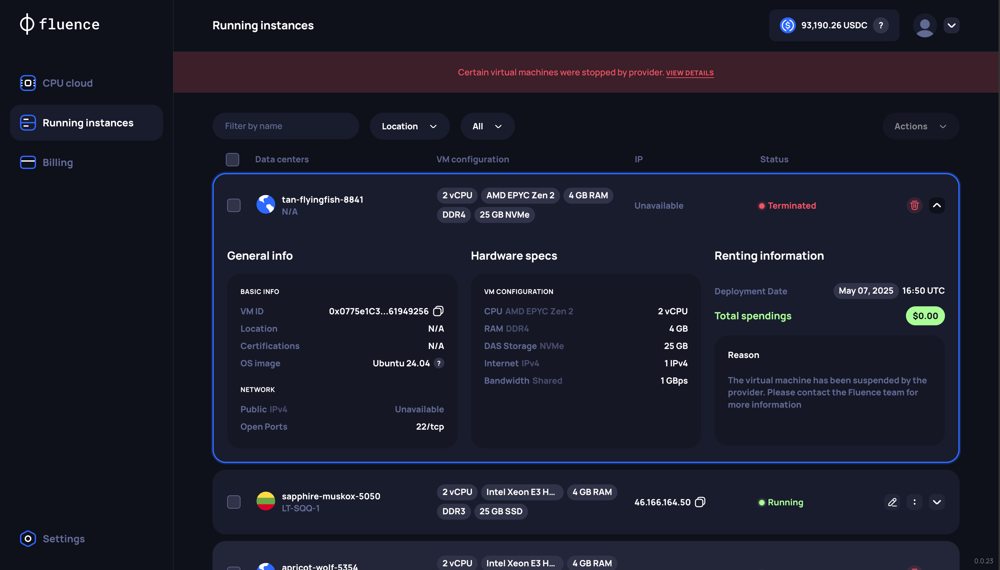
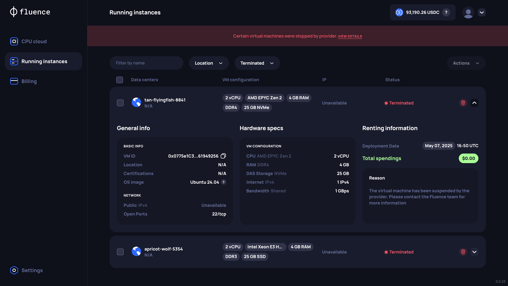

# Handling Provider-Terminated VMs

When a compute provider decides to stop running a VM that you are actively using, the VM is moved to a "Terminated" status.
Terminated VMs are no longer accessible, and data stored on the terminated VM is lost.

In this document, you'll learn:

1. Reasons for VM termination
2. Notifications and identification of terminated VMs
3. Managing terminated VMs in the Fluence Console (UI) or via the API

## Reasons for Termination

The Fluence compute marketplace unites established compute providers with high standards of security and reliability, proven by Tier certifications. Termination is the last resort for providers when handling issues and usually happens due to the user's actions, such as:

- The user not paying for the VM (VM balance reached 0)
- The user violating the terms of service
- The user using the VM for illegal activities or running malicious workloads

## Notifications and Identification

Currently, notifications about VM termination are only available in the Fluence Console (UI) on the "Running Instances" page or via the API when you request your active VM info using the [View your active VMs](../api/manage_vms/manage_vms.md#view-your-active-vms) endpoint.

### For Fluence Console (UI) Users

**Banner Notification.** You will see an informational banner on the "Running Instances" page with the message: _"Certain virtual machines were stopped by the provider. View details"_. You can click the "View details" button on the banner to see the list of terminated VMs.

**Status Display.** The VM will be clearly marked with a "Terminated" status.



**Filtering.** You can use the status filter on the "Running Instances" page and select "Terminated" to view only these VMs.



### For API Users

- **Status Field**: In the response from the [View your active VMs](../api/manage_vms/manage_vms.md#view-your-active-vms) endpoint, the `status` field for the affected VM will be `"Terminated"`.
- **Missing Information**:

  - The `publicIp` field will be `null`.
  - Location information within the `datacenter` object might be absent or marked as unavailable.

  Example snippet from the endpoint response for a terminated VM:

  ```json
  {
    "id": "0x68bd60079721AE2A04759d00Fc516148aCF479e4",
    "vmName": "apricot-wolf-5354",
    "status": "Terminated",
    "pricePerEpoch": "0.30697",
    "resources": [
        ...
    ],
    "osImage": "...",
    "datacenter": null,
    "publicIp": null,
    "ports": [
      {
        "port": 22,
        "protocol": "tcp"
      }
    ],
    "reservedBalance": ".30697",
    "totalSpent": "2.45576",
    "createdAt": "2025-05-07T16:20:43Z"
  }
  ```

## Managing Terminated VMs

Once a VM is terminated by a provider, it cannot be recovered. After you acknowledge the termination:

- Contact Fluence support for further investigation.
- Remove the VM record from your list by deleting it to release your reserved balance from the VM.

### Fluence Console (UI) Users

You can complete the initiated termination of the VM on the "Running Instances" page by clicking the "Terminate" button for the selected VMs, as shown in the [VM Management section](./manage_vm.md#vm-management).

### API Users

To remove a provider-terminated VM from your records via the API, use the [Delete your VM](../api/manage_vms/manage_vms.md#delete-your-vm) endpoint, providing the `vmId` of the terminated VM(s).
