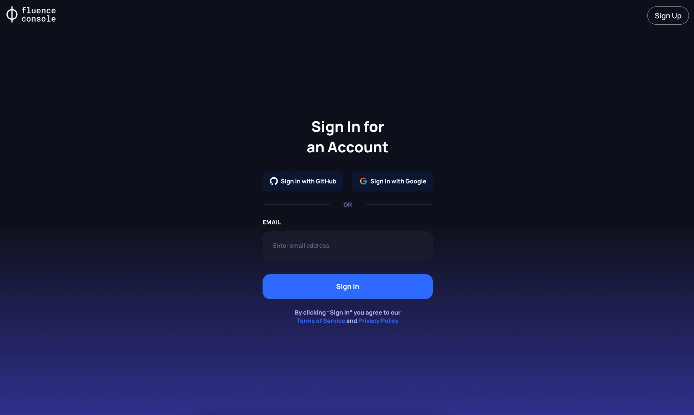

# Registration

## Self-Custodial Wallet

Since smart contracts are used to manage and rent resources from the Fluence network, any user interacting with the Fluence network needs to use a Web3 Blockchain wallet. However, managing a regular EOA (Externally Owned Account) address comes with certain risks and inconveniences.

To address this, our system uses a unique Self-Custodial Wallet based on a [solution from Web3Auth](https://web3auth.io/docs/how-web3auth-works), which operates on the [MPC](https://web3auth.io/docs/features/mpc) (Multi-Party Computation) protocol, instead of a standard EOA address. Thus, after a user registers through **Fluence Console**, a unique address is generated for them, and only the user has access to the private key. The private key is securely stored in parts within the distributed Web3Auth network and is protected by the MPC protocol. In turn, the Fluence protocol only has access to the user’s public address.

## Registration Process

:::warning
Please note that during registration, you must use the email address you provided in your Alpha VM testing program application.
:::

If you are using the Fluence Console for the first time, you need to register using one of the following methods:
1. Email Passwordless
1. via Google account
1. via GitHub account

:::warning
If you register with the same email through Google and Email Passwordless, two different accounts will be created for you.
:::

After successful registration, participants in the Alpha VM testing program will gain access to the full functionality of Fluence Console.
