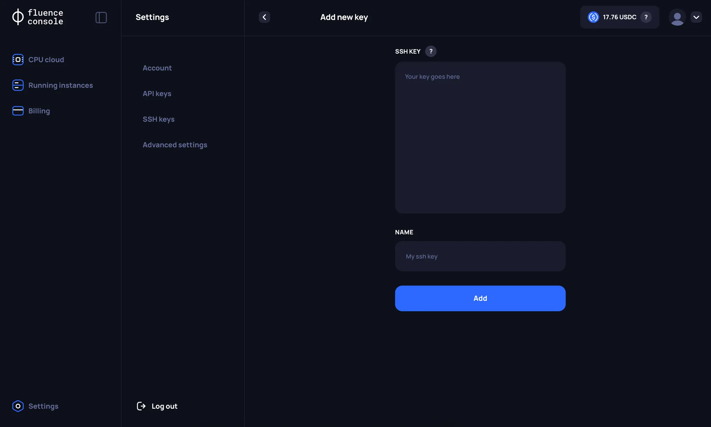
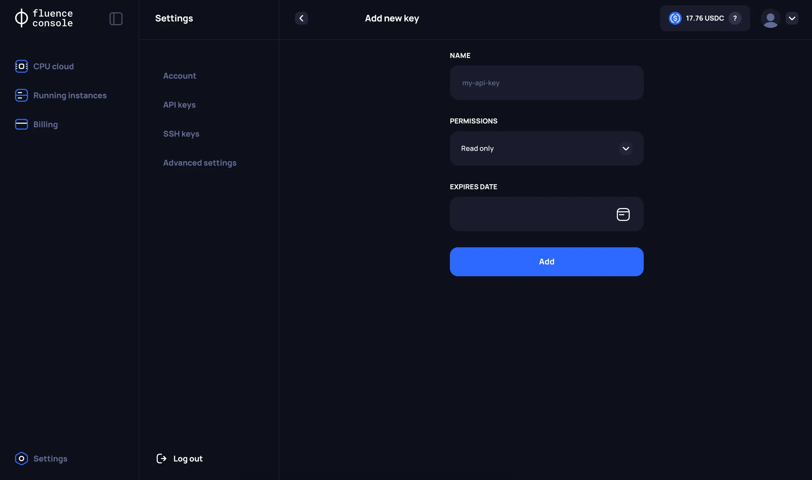

# Fluence console settings

Use the **Settings** page to manage your account profile, SSH keys and API keys.

## Account

On the **Account** page, you can view your email and edit your profile: name, last name, job role and company.

## SSH Keys

On the **SSH keys** page, you can:
1. Create a new key of any of the RSA, ECDSA or ED25519 format.
2. Delete existing keys.

## API Keys

Instead of using the **Fluence Console**, you can manage your resources also through our [Public API](./api/overview.md).

On the API Keys page, users can:
1. Create a new API key. Currently, it is possible to specify `Permissions` and `Expiration time` separately.
2. Delete an API key.

