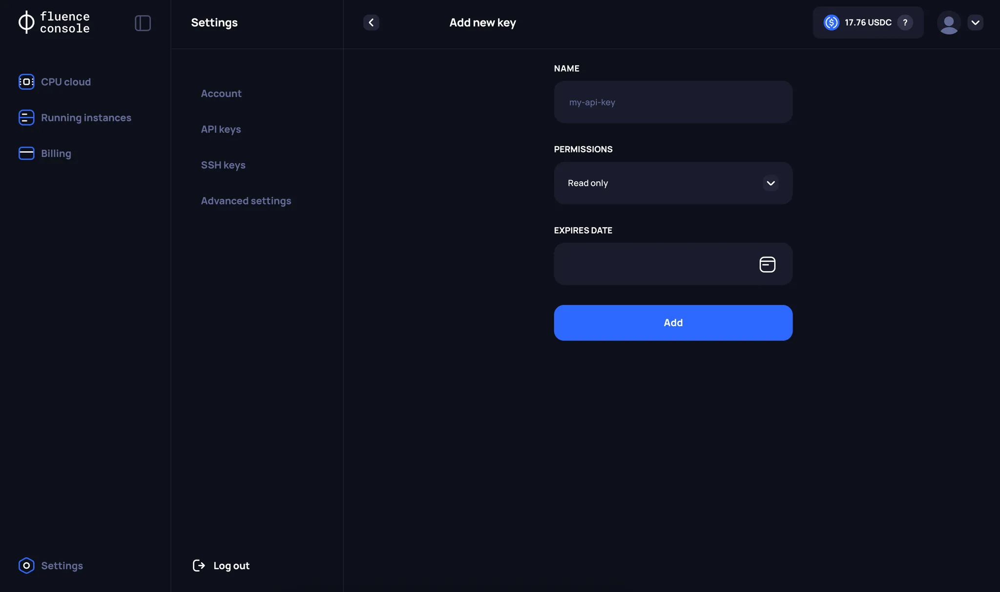

# Fluence Console Settings

Use the **Settings** page to manage your SSH and API keys and more.

## SSH Keys

On **SSH keys** page, you can:
1. Creating a new key. Currently, the following SSH key formats are supported: RSA, ECDSA, and ED25519.
2. Deleting existing keys.

## API Keys

Instead of using the **Fluence Console**, yo cna manage your resources also through the **Public API**.

:::info
In the first stage of the **Alpha VM testing**, you will not have access to the **Public API**. The Fluence team will  notify you when this functionality becomes available.
:::

On the API Keys page, users can:
1. Create a new API key. Currently, it is possible to specify `Permissions` and `Expiration time` separately.
2. Delete an API key.

## Advanced Settings

On the **Advanced Settings** page, users can get information about:
1. The **public address** of the wallet created through Web3Auth at the time of registration
2. The **address of the Balance smart contract** needed to track your Balance transactions

