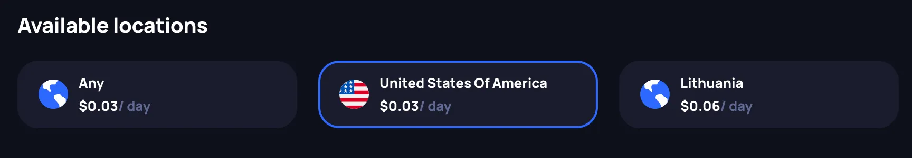
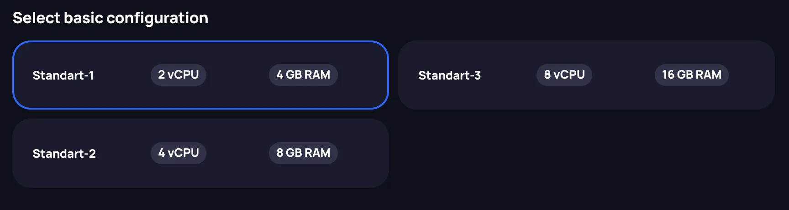
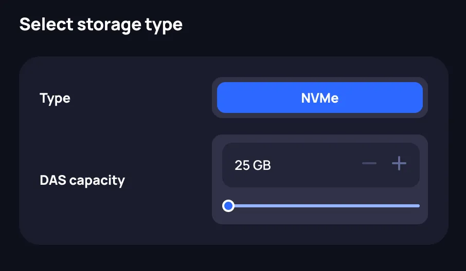
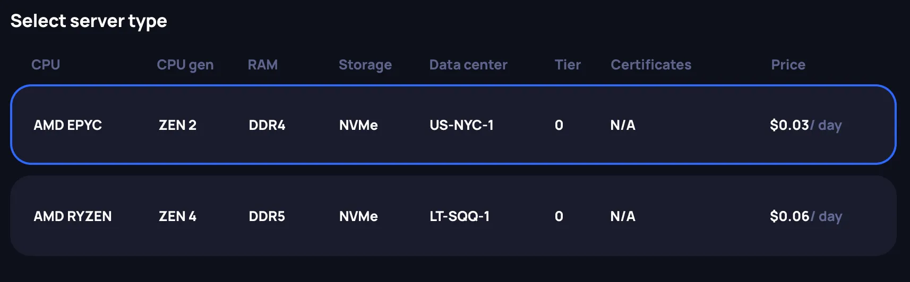
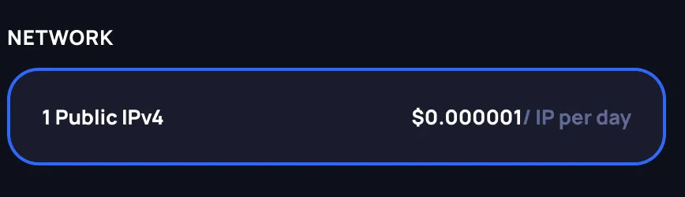
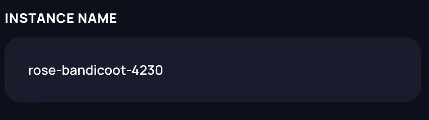
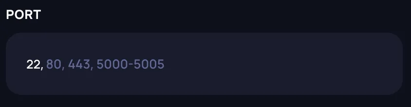
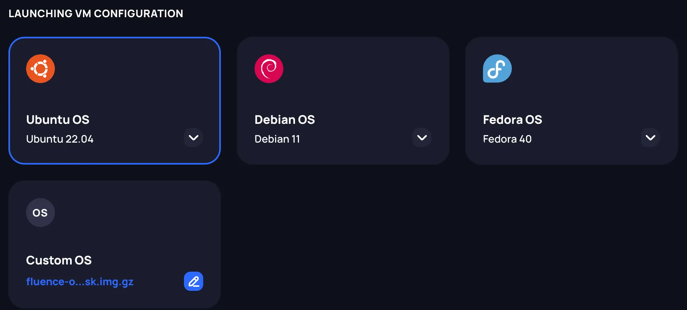
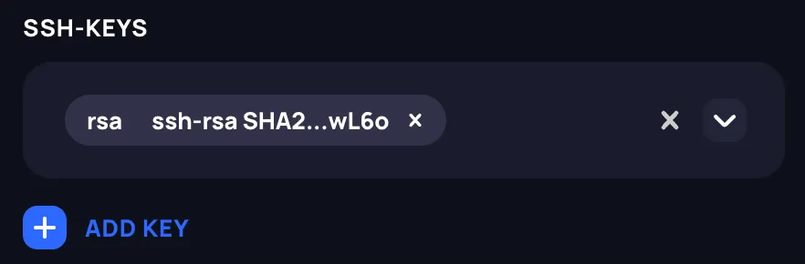
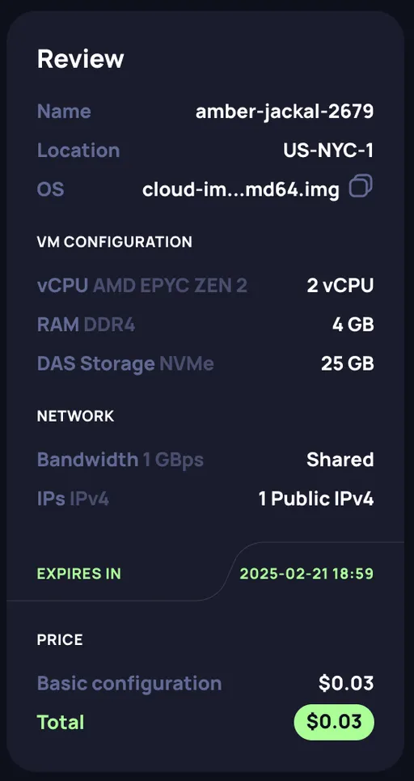

# Renting a VM

The Fluence marketplace is a decentralized broker of compute supply and demand governed by a set of smart contracts. To this end, the Fluence marketplace not only facilitates the renting process of VMs between you and the participating compute provider(s) but also the configuration and management of your VMs.

Currently, there are a couple of limitations with respect renting VMs:

1. A VM can only be rented for a limited period of time. This limitation is due to the implementation specifics of the verification, i.e., capacity commitment, and security, i.e., staking, protocols. The exact maximum rental period for a VM can be seen in the Fluence Console.

2. When renting a VM, a prepayment amount equivalent to one day’s rent is deducted from your Balance to cover the next day’s rent. This amount is refunded to your Balance when the rental period ends, unless your available Balance amount is too low in which case the prepaid amount is used to cover that day's rent. You can check the amount of your Balance reserved as a “prepayment” on the **Billing** page in the Fluence Console.

:::warning
If your Balance does not have enough funds to pay for the next day's rent, the previously deducted prepayment will be used to cover the rent. After the reserved funds are exhausted and you fail to top up o Balance in time, the VM's rental agreement will be terminated and the VM will be automatically deleted.
:::

## Steps to Configure a VM

The Fluence marketplace aggregates enterprise-grade compute resources from predominantly Tier-3 and Tier-4 data centers around the world. To rent a VM:

### 1. Choose a location

Choose one of the available data center locations.

### 2. Choose a configuration

Choose your VM's configuration from the available options. Currently, compute resources can only be rented in multiples of a compute unit, which is 2 vCPUs and 4 GB of RAM. In the future, this limitation will be removed and compute resources can be added in a fine-grained manner for both vCPUs and RAM.

### 3. Choose storage

Choose the type and amount of storage desired. Currently, the minimum storage size for a VM is 25 GB. At this point, only DAS storage is available, which ensures better performance than shared network solutions, like NAS, but does not allow for dynamic resizing.

### 4. Choose the server type

Specify the server type for the VM. Since hardware within and across data centers may vary, pay close attention to the provided hardware specifications and price. Moreover, Fluence Console allows you to view a data center's geo location at the city level and other important details such as available certifications and you are encourage to utilize these resources.

### 5. Rent a Public IPv4 address

Currently, you can only access yor VM via SSH over the public IPv4 allocated to the VM at instantiation. In the future, this requirement will be removed.

You are now ready to configure your VM.

### 6. Specify the VM name

Specify a **name for the VM**. Currently, the VM name must be unique within a your (user) account.

### 7. Specify the open ports

By default, all ports except **port 22** are closed but you can assign up to 50 open ports for your VM and all open ports support **TCP** and **UDP**.

### 8. Choose the OS image

Choose the **OS image** for your VM. You can either choose a pre-defined OS image or provide a link to a **custom OS image**. Only use custom OS images available for download from a publicly accessible link and configured to run on remote instances. The Fluence team recommends choosing (custom) images with the `Generic Cloud` or `Cloud` tags.

### 9. Provide the public SSH key

Provide the public SSH key you want to use to connect to your VM. You need to provide at least one SSH key in either RSA, ECDSA or ED25519 format.

### 10. Review the summary

After selecting all the VM parameters, check and review the instance summary and price in the Review section.

### 11. Launch the VM

Click the “Launch” button to rent the VM after which you will be redirected to the **Running Instances** page.

:::info
Please note payment for VMs occurs every day at **`5:55 PM UTC`** and is currently only possible for full days regardless of the rental start time. Thus, if you rent a VM at `5:45 PM UTC`, you will pay for a **FULL** day for the ten minutes of use. At `5:55 PM UTC`, the next full payment is due. This limitation is expected to be remedied in the very near future.
:::
