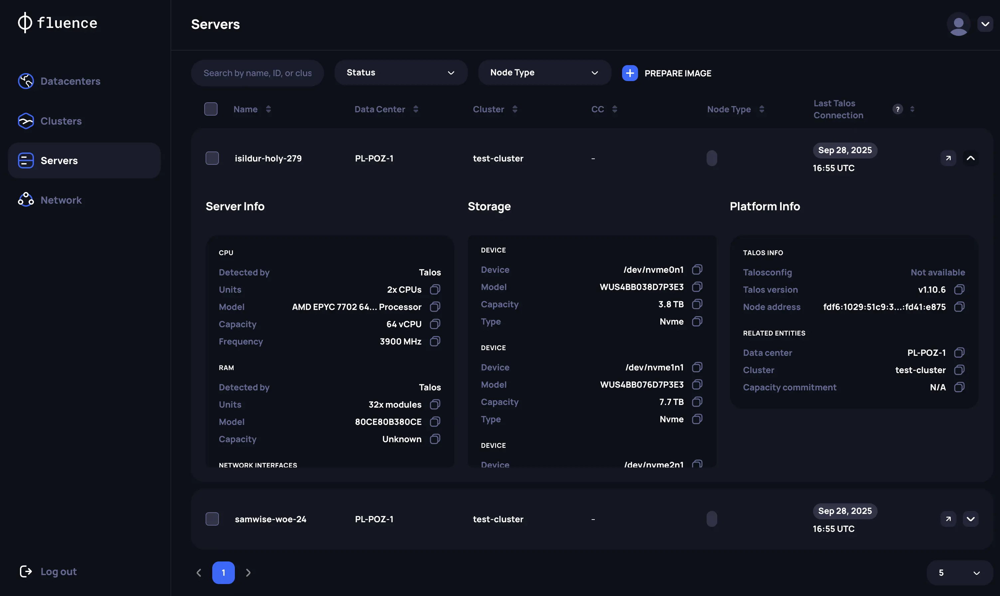

# Hardware Management

## Adding Servers Into Provider Application

The main OS supported by Fluence team is Talos Linux, which provides native support of the [SideroLink protocol](https://www.talos.dev/v1.11/talos-guides/network/siderolink/) , which allows to securely manage Talos OS and Clusters via Talos API. This is the core  technology for Provider Application, which allows it to remotely manage server infrastructure.

To connect a server to the Provider Application, navigate to the  Servers tab and generate a new Talos Linux Image specifying the following parameters:

1. *System extensions* - can be considered  OS drivers that allow to extend basic Talos OS functionality and, for example, can be used for network or storage setup.
To achieve maximum server performance, please use the `amd-ucode` or `intel-ucode` extension.
2. *Extra kernel command line arguments* - additional functionality that is necessary to be setup if you don’t have aDHCP server launched in the private network that will be used for Talos API and the Kubernetes API management. Reed more about private networking [here](../overview.md#network-requirements).
:::danger **Attention**

If you don’t have DHCP server setup, you will need to specify network parameters within kernel arguments. Here you can find [official Talos documentation](https://www.talos.dev/v1.10/reference/kernel/#ip) with examples to for network configuration.
:::
3. *Image extension* - select image extension type preferable for Bare metal installation. See for [more details about PXE booting option](https://www.talos.dev/v1.11/talos-guides/install/bare-metal-platforms/pxe/), which is highly recommended if you are able to use the same Talos image (same system extensions and kernel arguments) for majority of the servers.

:::info **Note**

Please use only Talos images generated by Fluence  for your servers to be compliant with Provider Application requirements
:::

After installing Talos Linux on your servers, and assuming the private network is configured correctly, you will see the following:

- *Via Provider Application*: on the `Servers` page new machines detected by Fluence software. After a couple of minutes Application will collect data about our hardware detected by Talos Linux.
**Note**: To monitor servers status, see the `Last Talos Connection` parameter. It represents the time of the last connection of Provider Application to the server, which is happening automatically every 2 min.

- *Via IPMI*: Talos and SideroLink status with extended info about server and logs.

:::danger **Attention**

You will be able to rename new servers unlimited times before adding them to the cluster. After adding servers to the cluster, you will no longer be able to rename the servers.
:::
