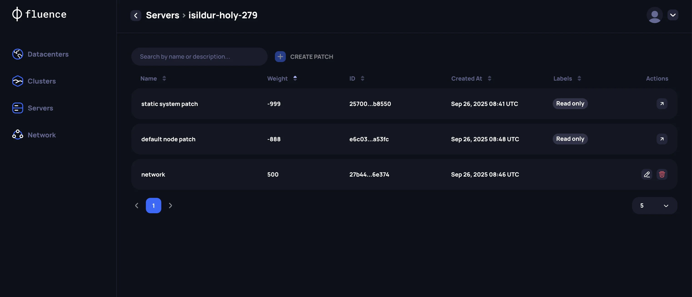

# Kubernetes Clusters Management

## Creating new Kubernetes cluster

After launching servers with Talos Linux image generated by the Fluence Application, they will be staying in Maintenance mode. On this stage Talos is still waiting to be properly configured to host Kubernetes workload.

To configure Talos Linux and launch K8s cluster, please navigate to the  Clusters tab and create your first cluster selecting the following  parameters:

1. *Data center* -  Fluence software supports easily configurable cluster provisioning and management for servers located in a single physical data 
2. *VLAN ID for private networking* - optional parameter that should be set if you have additional networking logic for internal traffic used  for Talos API and K8s API.
3. *Kubernetes roles* - for each individual server, specify its [K8s role](https://kubernetes.io/docs/concepts/architecture/nodes/). The Fluence team recommends to follow default Kubernetes recommendation and support an odd number of Control plane nodes. To increase the stability of the Cluster, we recommend to have a minimum of  three (3) Control plane nodes and place them in different racks / cabinets within the Data center.
:::danger **Attention**

You should always keep a minimum of two (2) healthy Control plane nodes to support cluster integrity. If all control plane nodes will be unavailable (due to the private networking or hardware issues) Kubernetes Cluster will be broken and won’t be able to restore his state.
:::
4. *Workload interface* - for each individual server, select the network interface that should be used for running workload from Fluence customers. This interface should be minimum 10Gb and 100Gb recommended.
5. *Talos disk* - for each server specify a disk for the installation of  Talos Linux. Fluence recommends to use SSD or NVMe drives with at least 100GB free space and RAID1 as the system disk.
6. *Workload disks* - for each servers select DAS disks that will be used for Fluence’s customers workload running. Talos disks can be also used for workload launching, but it is not recommended. For Workload disks, RAID technology shouldn’t be used as Fluence will create its own virtual replication system . If you are using a single  disk to host Talos and workloads, please don’t use RAID technology.
7. *Talos Patch* - for each server, a custom [Talos Patch](https://www.talos.dev/v1.11/talos-guides/configuration/patching/) needs to be configured. The Web Application will  automatically create several patches by default to configure disks and some general machine parameters. As Talos Linux doesn’t have access to the data center's network topology, a Provider should manually describe it for each individual network interface allocated to Talos and K8s management following [official Talos documentation](https://www.talos.dev/v1.11/talos-guides/configuration/patching/#machine-network). Also see the [example](#example-of-custom-talos-patch-setup) below.

:::danger **Interfaces configuration**

You should set the `ignore: true` parameter in the custom Patch of all network interfaces allocated to running Fluence’s customers workload  See [example](#example-of-custom-talos-patch-setup) below.
:::

:::danger **Default K8s subnets**

Kubernetes default subnets are using `10.244.0.0/16` and `10.96.0.0/12` as pod/service subnets. Make sure that the Talos management interface doesn’t overlap with these ranges  or  configure these subnets with Talos Patch based on the following [example](#example-of-custom-talos-patch-setup).
:::



After all required parameters have been specified, you can proceed with the Cluster creation. In the Cluster section you can track the setup status. Within the cluster launching process, the Provider Application will do the following:

1. Configure servers based on specified disk and network info
2. Join Talos Linux nodes into a single Cluster and launch Kubernetes
3. Install Fluence services for interacting with theBlockchain, managing customers’ workload and executing servers availability benchmarks.
4. Configure Fluence services with custom configs for securely interaction with Blockchain

### Example of Custom Talos Patch setup

Let’s assume that we have the following networking topology for individual server:



In this case **Talos Patch** for this server should be the following:

```yaml
cluster:
  network:
    podSubnets:
      - 10.210.0.0/16
    serviceSubnets:
      - 10.112.0.0/12
machine:
  network:
    interfaces:
      # management
      - interface: bond0
        dhcp: false
        addresses:
          - 10.2.100.10/24
        routes:
          - network: 0.0.0.0/0
            gateway: 10.2.100.1
        bond:
          mode: 802.3ad
          xmitHashPolicy: layer3+4
          interfaces:
            - enp6s18
            - enp6s19
      
      # workload
      - interface: enp6s20
		ignore: true
```
