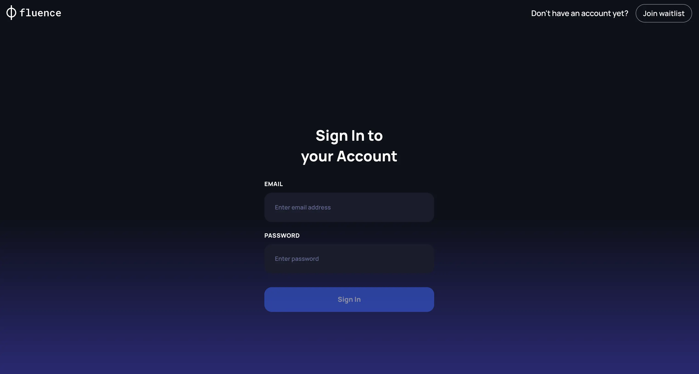

# Login into Provider Application

## Registration

Fluence  currently only cooperates with **whitelisted** Providers with hardware from Tier 4 or Tier 3 certificated data centers. Before joining the Network, Providers need to be approved by the Fluence team and  need to complete  a KYB review .

:::info **Note**

To participate in Fluence Protocol as Hardware Provider please complete [the waitlist form](https://www.fluence.network/become-a-provider) or contact with Fluence team directly via [official channels](https://linktr.ee/fluencenetwork).
:::

## Authorisation

After successfully completing the KYC process, partners are whitelisted and receive the necessary credentials from the Fluence team to be able to access the Provider Web Application.

### Prerequisites

To be able to participate in the Fluence protocol, Fluence Network Providers need to have access to an EVM-compatible Web3 wallet and a blockchain address (Provider address).

[Create first Web3 wallet with Metamask](https://support.metamask.io/start/getting-started-with-metamask/).

### Addresses Types Supported in Provider Application

- *Provider address* - the main  address that has full access to the core Fluence Marketplace smart-contracts in order to manage *Offers*, *Capacity commitments* and *Deals* contracts. Only this address has **exclusive access to the FLT and stablecoins rewards** earned from the Fluence Protocol.
- *Management address* - an additional "hot" wallet securely managed by the Fluence team on behlaf of the provider. It allows Provider application to execute limited scope of smart-contracts operations to automate the process of signing transactions within Fluence Application. The m*anagement address* **never has access to the Providers’ rewards**, that are available only for *Provider address* private key holder.

:::info **Note**

Fully non-custodial smart-contracts interractions  will be supported in the next release
:::
