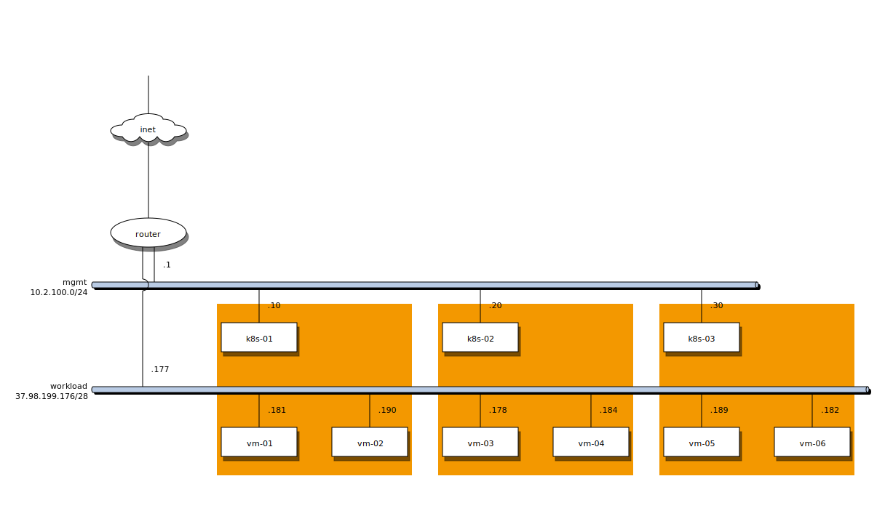

# Overview

**[Fluence Provider Application](https://providers.fluence.network/)** is the primary tool for Providers on the Fluence Network to manage all core operations within the Fluence Protocol: from server-level hardware management to interactions with blockchain smart contracts. It is a centralized application, developed and securely hosted by the Fluence team.

:::info **Note**

**A self-hosted version** of Provider Application will be relized in the neear future
:::

Provider Application contains functionality for managing the following core components for operation in Fluence Network:

- **Infrastructure Management Software**:
    - *Talos Linux operation system*: Launch and manage Talos Linux as the supported main OS
    - *Kubernetes clusters*: Provision and manage Kubernetes (K8s) clusters on servers running Talos Linux.
    - *Custom Fluence Stack*: Provision, configure and automatically update Fluence services running within Kubernetes cluster
- **Hardware Networking**:
    - *Private networking*: Configure network interfaces, VLANs and Private Subnets for Talos OS and K8s functionality
    - *Public IP subnets*: Assign IP subnets for Kubernetes clusters for launching workload for Fluence customers (e.g. Virtual Machines and Containers)
- **Blockchain Smart-contracts (will be supported in early Q4 2025)**:
    - *Offer contracts*: Register and update hardware resources and Data Center on-chain info. Manage prices for server resources in stablecoins.
    - *Capacity commitments contracts*: Enable servers to participate in Fluence network by getting FLT collateral via Staking. Get revenue in FLT token for idle hardware resource.
    - *Deal contracts*: Get revenue in stablecoins from Fluence Cloud customers renting your infrastructure.

## Infrastructure requirements

### Data center requirements

- *Tier*: 3 or 4 certification
- *Additional certificates*: not required but highly desirable to have on of the following certificates: ISO 27001, SOC2 Type 1, SOC2 Type 2

### Hardware requirements

- *Type*: Bare metal servers
- *Server CPU*:
    - AMD EPYC or Ryzen Zen2+
    - Intel Xeon Cascade Lake+
    - Unrestricted Turbo Boost enabled
    - Minimum 32 vCPU per CPU unit
- *Server RAM*:
    - DDR4+ type
    - Minimum 4 GiB per 2 vCPU
- *DAS Storage*:
    - SSD or NVMe types
    - Minimum 25 GiB per 2 vCPU with disabled RAID for hosting customer facing workloads
    - Recommended to use dedicated RAID1 NVMe for Host Operation System with 200+ GiB free space. It is recommended to use different NVMe models in the RAID to reduce the risk of simultaneous failures due to similar disk lifetimes
- *Network interfaces*:
    - 1+ GbE interface for Talos OS and Kubernetes
    - 100+ GbE recommended (10 GbE minimum) interface for customer facing workloads

### Network requirements

- *Management subnet* - management network for Host OS (Talos) and Kubernetes APIs:
    - Allow egress to the Internet
    - Support Bond
    - Can use VLAN
- *Workload subnet* - workload network for Fluence customers’ traffic:
    - Should be isolated from internal networks
    - Should have access only to/from the Internet
    - Cann’t be used as Bond
    - Can use VLAN

Possible network topology within data center. Orange area represents a physical server.
