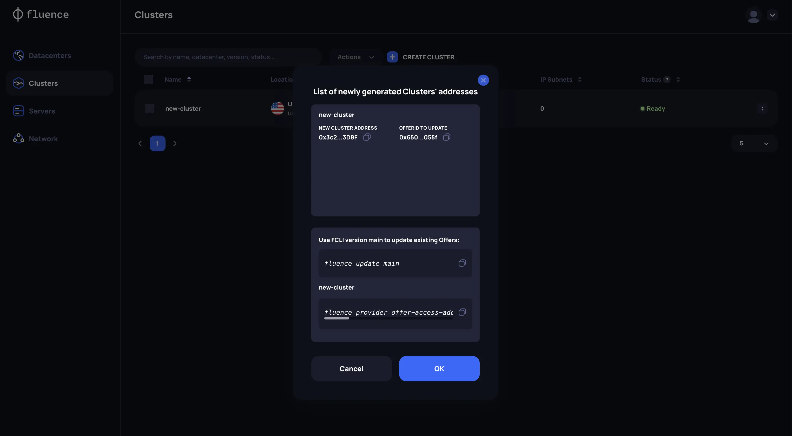

# Fluence Smart-Contract Management

## Offer Update (Migration Only)

In the first release of Provider Application, there will be no support for interacting with Fluence's core smart-contracts. This functionality will be added later.

:::info **Note**

Providers can continue to use the existing Fluence tooling to manage Blockchain operations, for example CC creation and reward withdrawal, until the new functionality will be supported in Provider Application.
:::

For now Providers with hardware resources already registered on-chain should execute a special command via [Fluence CLI](https://github.com/fluencelabs/cli) (FCLI) to support migration of existing offers to the new Kubernetes cluster.

Navigate to the `Clusters` page and retrieve the newly generated Cluster key, which replaces the Peer keys from the old architecture. Next do the following:

1. Update FCLI to the latest version
2. Update existing Offers with the new Cluster key, ensuring there is only one Offer per cluster.
3. Manually top up the FLT tokens for Cluster addresses to cover gas payments in the [Fluence Network](https://chainlist.org/chain/9999999). The MINIMUM recommended amount is 10 FLT per server in the Cluster.

:::info **Note**

This process will be automated in upcoming releases.
:::

