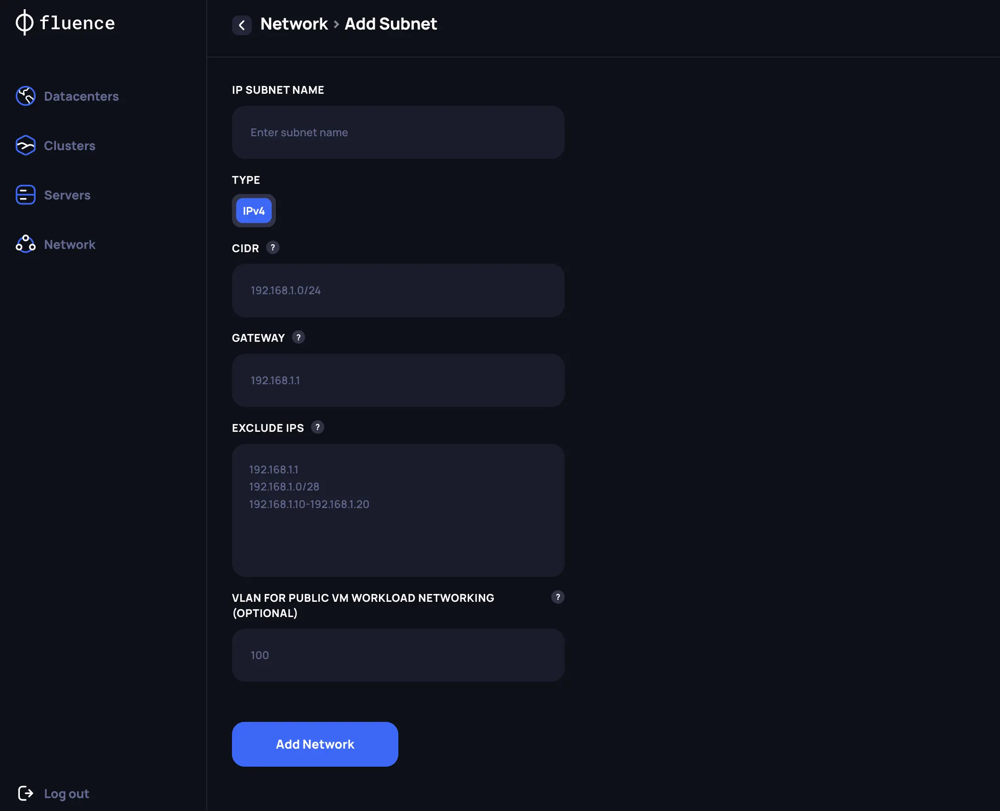

# IP subnets management

## Adding a new subnet for Customer workloads

To host Fluence customers’ workloads within the newly created Kubernetes cluster, at least one public IPv4 subnet must be allocated to the cluster. The Provider is responsible for manually configuring this subnet to ensure it is accessible to all servers within the data center where the subnet will be attached. Afterward, the Fluence software will automatically route IP addresses from the allocated pool to the appropriate servers.

To register a new subnet in the Provider Application, navigate to the Network section and create a new subnet by specifying the following key details:

1. *CIDR* -  Define the range of IP addresses included in the subnet.
2. *Gateway* - Specify gateway address
3. *Exclude IPs* - List IP addresses that should be excluded from allocation for Fluence
4. *VLAN ID for public networking* - Optional parameter to set if there is additional networking logic within the data center for public traffic.

After the subnet has been created, you can select it from the list on the `Network` page and Assign it to the specific Kubernetes cluster.
