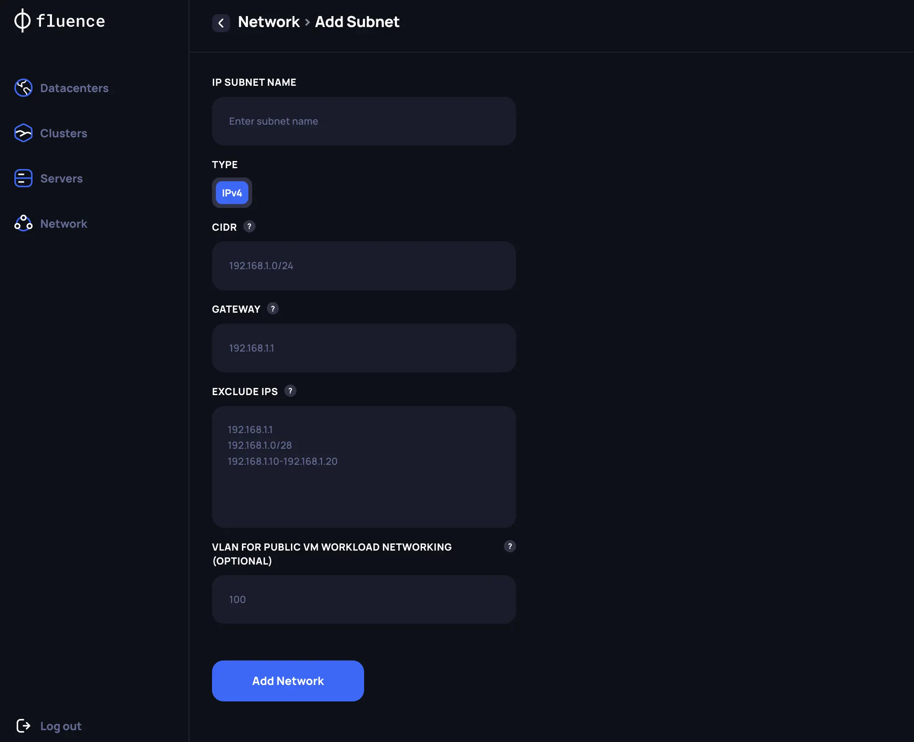

# IP subnets management

## Adding new subnet for Customer workloads

To host Fluence customers’ workload within the newly created K8s cluster,  at least one public IPv4 subnet needs to be allocated to the cluster. The subnet should be configured manually by the Providerto make it available for the all servers from the cluster within the data center where the subnet will be attached. Subsequently, the Fluence software will automatically route IPs from the pool to the correct servers .

To register a new subnet in Provider Application navigate to the Network section and create new subnet specifying the following core data:

1. *CIDR* - describe all IP addresses included into subnet
2. *Gateway* - specify gateway address
3. *Exclude IPs* - describe IP addresses that shouldn’t be available for launching Fluence customers’ workload
4. *VLAN ID for public networking* - optional parameter that needs to  be set if you have additional networking logic within a data center for public traffic 

After the subnet has been created, you can select it from the list on the `Network` page and Assign it to the specific Kubernetes cluster.
