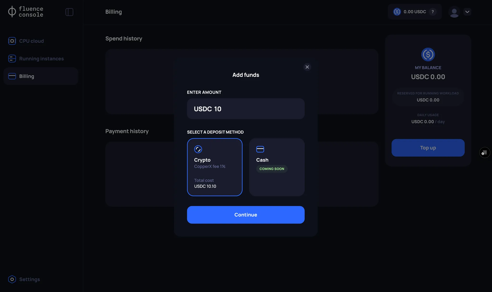
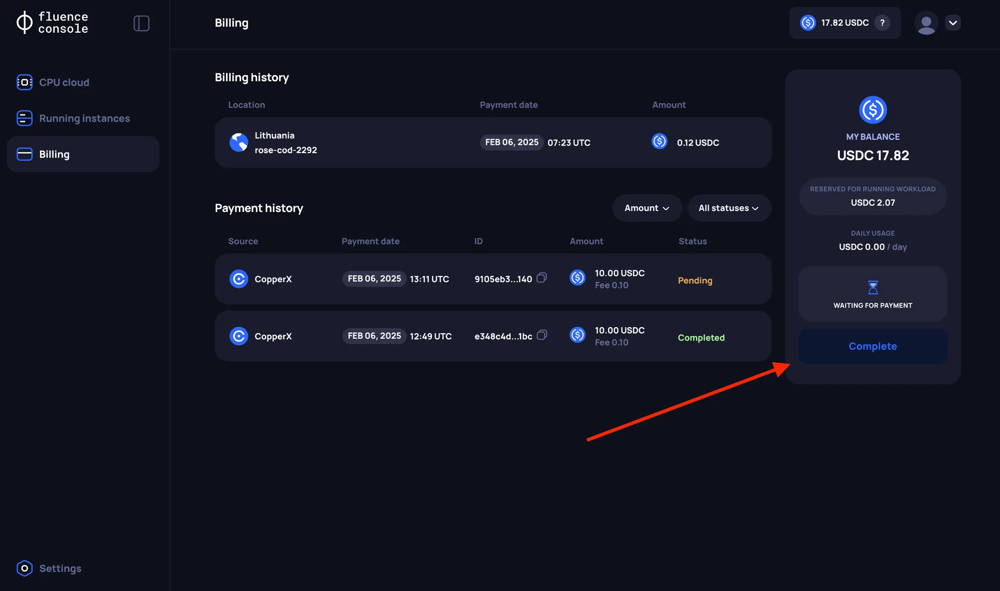

# Balance top

## Features of Balance Management on the Fluence Platform

After registering through Fluence Console, a new Self-Custodial Wallet is created for each user using Web3Auth. However, in this case, interacting with smart contracts in the Fluence network still requires signing blockchain transactions each time.

To simplify the process of interacting with the Blockchain network through Fluence Console, the Fluence uses [account abstraction](https://web3auth.io/docs/features/account-abstraction) to handle user balances. Hence, topping up your balance is reflected in the [Balance smart contract](https://blockscout.mainnet.fluence.dev/address/0xF0C308C622eeBA94aeEc2E3Fd67F34619f86761B). At the same time, the functionality of the Balance smart contract is extremely limited to ensure maximum security of user funds.

Thus, when replenishing your Balance through Fluence Console, user funds are transferred to a special smart contract, not directly to the address created through Web3Auth.

:::danger
The balance top upped through Fluence Console can only be used to rent resources in the Fluence network. To interact with other protocol mechanics, such as Staking, you need to top up the address created through Web3Auth or any other EOA directly, for example, by using a Bridge from Ethereum to Fluence Mainnet network.
:::

:::info
Fluence Console users cannot top up their Balance by themselves on the Fluence platform (stored in Balance smart contract) from addresses created through Web3Auth or through any other third-party EOA. This restriction is related to AML (Anti-Money Laundering) limitations. Also, Fluence Console users cannot independently withdraw funds from their balance on the Fluence platform. If a refund is needed, please contact the Fluence team.
:::

## Steps to top up Balance on the Fluence Platform

:::info
Participants in the Alpha VM testing program will receive 256 USDC in Free Credits on their balance after registering on the Fluence platform.
:::

Currently, replenishing the Balance through Fluence Console is done using the payment provider CopperX.

:::info
Currently, payment is available in the Ethereum (USDC) and Polygon (USDC.e) networks. Please note that after successful payment through CopperX in one of the available networks, your Balance will be automatically top up in the Balance smart contract in the Fluence Mainnet network.
:::

To top up your balance, follow these steps:

### 1. Click the Top Up button

Go to the **Billing page** and click the **“Top Up”** button.

:::info
Please note that at the moment, a user cannot have multiple pending Balance top-up operations. If a user, for any reason, cannot complete the payment, they must [cancel](#cancel-payment) the Balance top-up operation via CopperX. 

You can check for pending payment sessions on the **Billing page**, in the **Payments History** section. Pending payment sessions have the status `Pending`.
:::

### 2. Enter the amount you want to top up your Balance with

:::info
Currently, the **minimum** top up amount is **10 USDC**. At the same time, your balance on the Fluence platform cannot exceed **5000 USDC**.
:::

### 3. Enter your details

You will then be redirected to the CopperX payment page, where you will need to enter your details.

#### Cancel payment
:::info
To cancel a payment, use the corresponding option in the CopperX interface. If the payment is not completed within 15 minutes, the payment session will automatically end.
:::

:::info
If you accidentally close the CopperX payment page, you can always return to the Fluence Console interface and go back to the payment page.
:::

### 4. Choose one of the payment methods and complete the payment

:::info
If you encounter issues with the “Wallet” payment option, we recommend using the “Scan QR code” option.
:::

### 5. Back to Fluence Console

After a successful payment you will be redirected back to the **Fluence Console** page. The payment will be in the Pending status for some time, as the system will need time to top up your Balance in the Fluence Mainnet network.

### 6. Wait for "Completed" payment status

Once the payment status changes to `Completed` your funds will be credited to your Fluence platform Balance.
