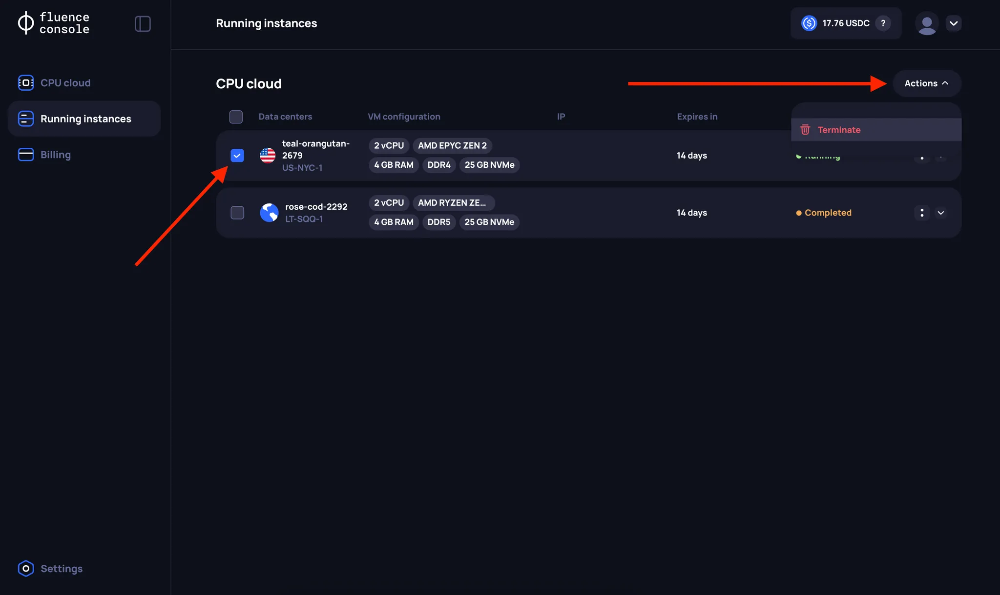

# CPU VM Info and Management

After renting a VM, the user can view all the relevant information about the rented resources on the Running Instances page, as well as manage the rented VM.

## VM Information

After renting a VM, a corresponding card will appear on the **Running Instances** page, which can be expanded to view all the parameters of the rented VM. Please note that the user can now see **more detailed information** about the server hardware in the `Hardware Specs` section, as a specific server has already been allocated at this stage.

:::info
The user will be able to see extended server parameters only if the specific infrastructure provider has provided the necessary information when registering in the Fluence protocol. Since Fluence currently whitelists providers, in most cases, providers provide all the necessary information.
:::

The user can also see the maximum rental period for the VM (`Expires in`) and information about the next billing time (`Next billing time`), which occurs daily at **5:55 PM UTC**.

## VM Management

Currently, the only operation available for a running VM is `Delete`, which terminates the VM and the rental agreement. The ability to Reboot, Reset, and Rebuild will be added soon.

## Billing History

After renting a VM, the user can view the history of charges on the **Billing page** in the **Billing History** section.

:::info
Please note that if your Balance on the Fluence platform does not have enough funds to pay for the next day of VM rental, the funds reserved when creating the VM will be used for payment. After the reserved funds are exhausted, in the next Billing cycle (the next day), the user's rent will be terminated, and the VM will be automatically deleted.
:::

