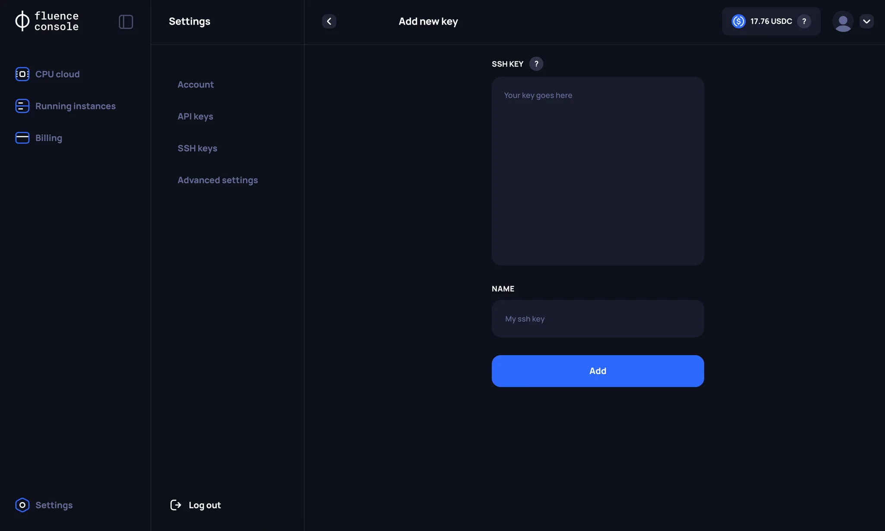
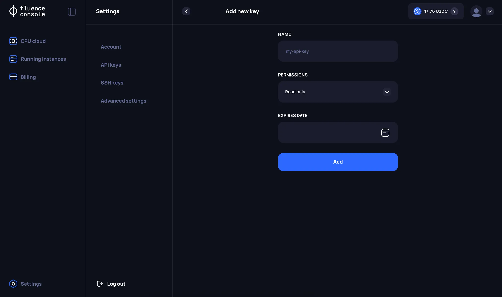

# Fluence Console Settings

On the **Settings** page, users can manage additional features of the Fluence platform.

## SSH Keys

On **SSH keys** page, users have access to the following functionality:
1. Creating a new SSH key. Currently, the following SSH key formats are supported: RSA, ECDSA, and ED25519.
1. Deleting SSH keys.

## API Keys

Users of the Fluence platform have the ability to manage their infrastructure without using **Fluence Console** through the **Public API**.

:::info
In the first stage of the **Alpha VM testing**, users will not have access to the **Public API** functionality. The Fluence team will separately notify and provide the relevant documentation when this functionality becomes available.
:::

On the API Keys page, users can:
1. Create a new API key. Currently, it is possible to specify `Permissions` and `Expiration time` separately.
1. Delete an API key.

## Advanced Settings

For each user, a separate **self-custodial wallet** is created through Web3Auth when registering through Fluence Console. However, the user’s Balances on the Fluence platform are not stored on the created addresses but in a separate **Balance smart contract** in Fluence mainnet network. On the **Advanced Settings** page, users can get information about:
1. The **public address** of the wallet created through Web3Auth.
1. The **address of the Balance smart contract** in the Fluence Mainnet network.

