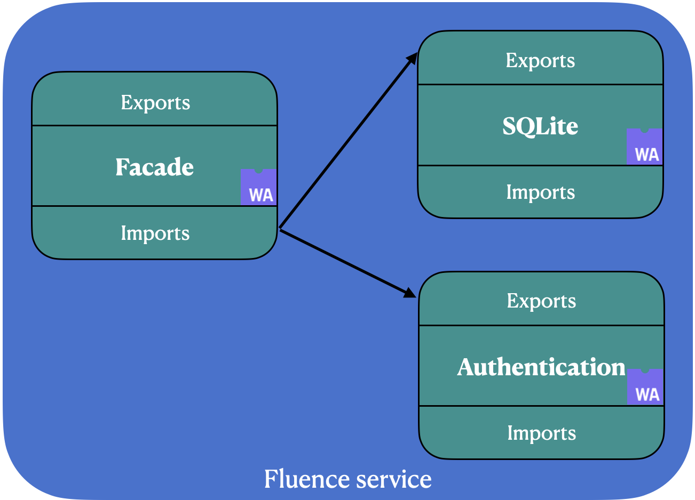

# 🧑🏫 Basic concepts

This chapter describes some basic concepts that are crucial for understanding other parts.

### Wasm Modules

[Wasm module](https://webassembly.github.io/spec/core/syntax/modules.html) is a way how Wasm programs are organized, it's an essential unit of deployment, loading, and compilation.

**Marine Wasm module** (or just a Marine module) is a Wasm module compiled with the [Marine SDK](../marine-rust-sdk/marine-rust-sdk.md). These modules follow some internal conventions allows them to link with other modules (**module-module** scheme) and with a host (**module-host** scheme). You could find more information about the conventions in [this](../marine-rust-sdk/module-abi.md) section.

**Host** is a part that runs a Wasm module, usually, it refers to a runtime or runtime and OS. In the case of Marine host could be either Rust-based or JavaScript-based Marine runtime component.

Each Wasm module could have imports and exports. **Import** is a definition of some external for a module component, which this module could use during its execution. A module could import functions, memories, globals, and tables. An import function is the only possibility for a module way to call external API - Wasm modules are sandboxed by design from this perspective. **Export** is a definition of a module component accessible by a host or other module. Similarly to imports, a module could export functions, memories, globals, and tables.

### Fluence service

Fluence service (or just service) is a group of Marine Wasm modules linked together with the shared-nothing linking scheme with help of interface-types. This scheme allows modules to encapsulate their inner state (such as memory, globals, and tables) and expose only export functions. So, modules are linked together by corresponding exports and imports functions:

In the picture above you could see an example of a Fluence service comprised of three different modules: `facade`, `SQLite`, and `authentication module`. The second and the third are linked to the `facade` module by linking each import to a corresponding export.

Marine is one of a few Wasm runtimes that allows composing several Wasm modules in an easier manner.
