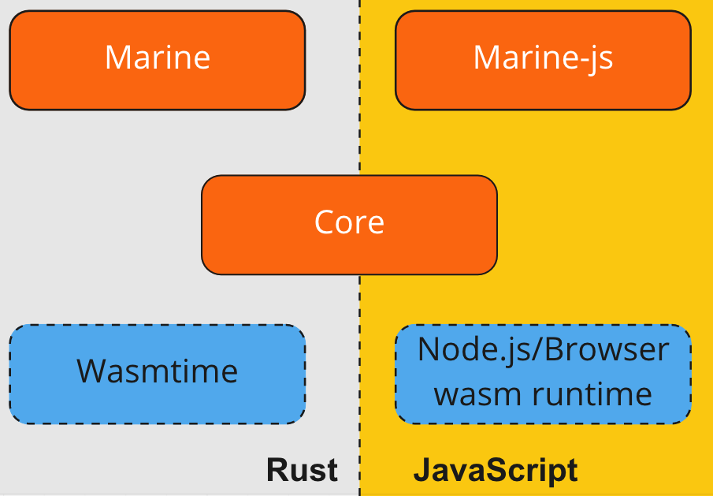

# Architecture

`Marine` follows the layered architecture pattern allowing developers to use components with different abstraction layers to fit their purpose:

In this chapter, we briefly discuss these Marine components.

## [Core](https://github.com/fluencelabs/marine/tree/master/core)

The **Core** is comprised of the lower-level components of `Marine` to expose the [API](../../api/core-api.md) that allows developers to `load`, `unload`, and `call` modules. It can also obtain information concerning their states such as WASI state, module interfaces (all export functions), and heap usage statistics. Internally, it interprets interface-types [instructions](../interface-types-instructions.md) providing module-module and module-host value passing schemes.

The runtime component compiles to Wasm and is used in marine-js as a so-called [control module](../marine-js/marine-js.md) sharing the same code for marine and marine-js targets.

This component is also used in the Rust and Javascript environments as well as Marine and Marine-JS.

## [Marine](https://github.com/fluencelabs/marine/tree/master/marine)

Marine extends the core component with the following features:

- can be called with json-based arguments (`call_with_json` [API](../../api/marine-api.md#calling-a-module))
- provides an internal mechanism for handling [host imports](../../host-exports.md)
- defines three host imports for logging, call parameters, and mounted binary interface

## [Marine-js](https://github.com/fluencelabs/marine/tree/master/marine-js)

Provides the basic Marine functionality for the browser and node.js targets. Marine-js is currently under active development and exposes only a basic core [API](../../api/marine-js-api.md) and supports only single-module service.
