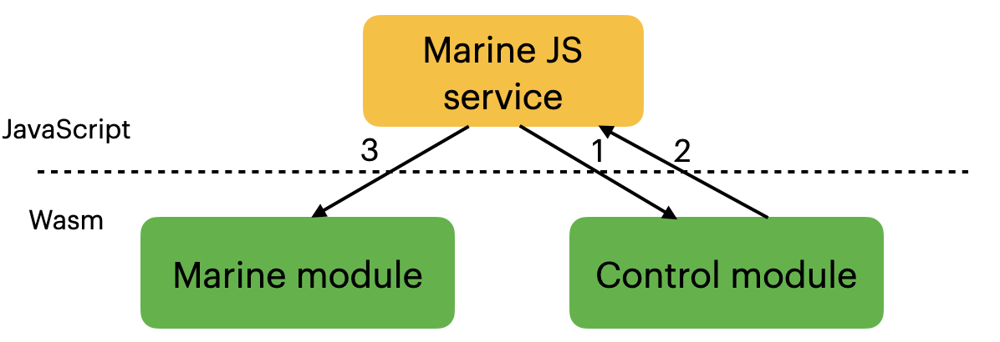
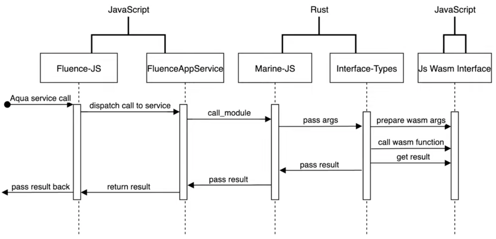

# Marine-JS

Marine-js runs Marine modules in a browser or in a node.js environments. It's based on the `runtime` Marine component to execute Wasm modules with help of interface-types and module linking. This is possible by compiling the [Core](./#core) part of Marine (we'll call it a `control module` then) to Wasm and handle all necessary calls through the JS wrapper.

In the marine web environment, each service includes this control module. It handles all the requests made to any loaded module as well as requests to other modules of this service.

Let's consider the following scheme:

Here when a user calls a function from a Wasm module by [callService](../../api/marine-js-api.md#calling-a-service), the Marine JS Service first (`1`) calls the control module with the parsed interface-types section. The control module then executes the provided interface-types, which could potentially contain calls to other modules in networks, e.g., the further execution of interface-types would require calling `allocate` from the Marine module (consider the lowering string case in step 2 [here](../core/core.md#step-2)). To handle this call the control module calls (`2`) the Marine JS service by Wasm import functions and the service then calls `allocate` from the necessary Marine module returning back results (`3`).

So, from the runtime (on which the control module is based) perspective the process looks as usual: it just executes interface-types instructions but each call and memory access requires passing the control flow to the Marine JS service and calling or accessing an appropriate Marine module.

In the picture below you could see the sequence diagram of passing calls between JavaScript and Rust/Wasm parts:

Marine web is under active development and currently supports only single-module environments without WASI imports. In the near future, marine web will be as capable as the main runtime component.
