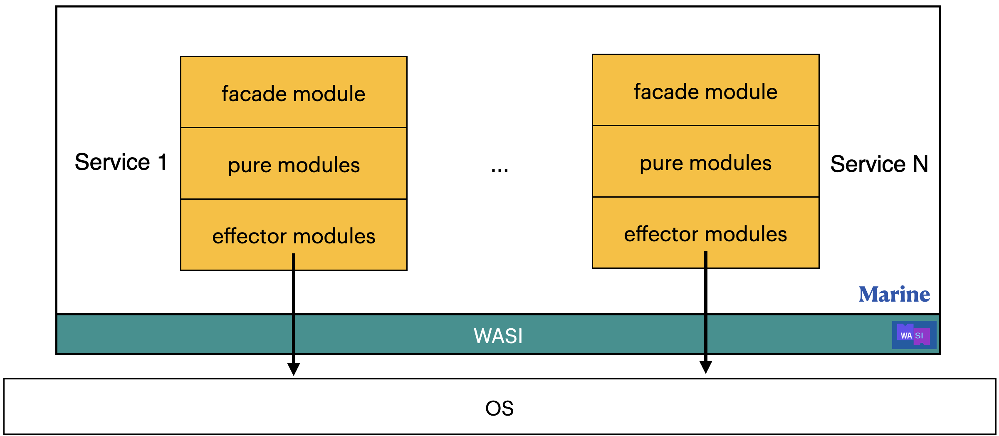

# Module types

There are three module types:

- **facade** modules expose the API of an entire service that is callable from Aqua scripts
- **pure** modules contain pure logic, and they can't access the filesystem or call external binaries
- **effector** modules can access the filesystem through WASI and call external binaries

This distinction between pure and effector modules aims to provide node owners with a better security mechanism. `Pure modules` could be considered harmless, because they can't access any external API, while `effector modules` could potentially do malicious action. And node owner could have a white list of allowed to run effector modules.

Note that this differentiation is only partly implemented at the moment: `Marine` knows only about `facade` and `not facade` modules, but in the future, it'll differentiate modules into these three types and have an appropriate API.

From this point of view, Marine could be considered as an ecosystem that could run several services comprised of different modules:

