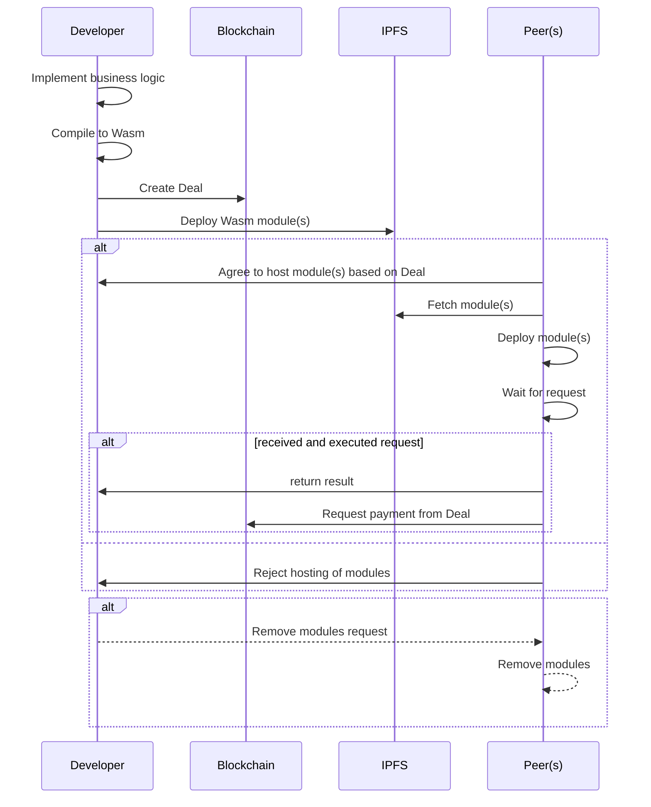
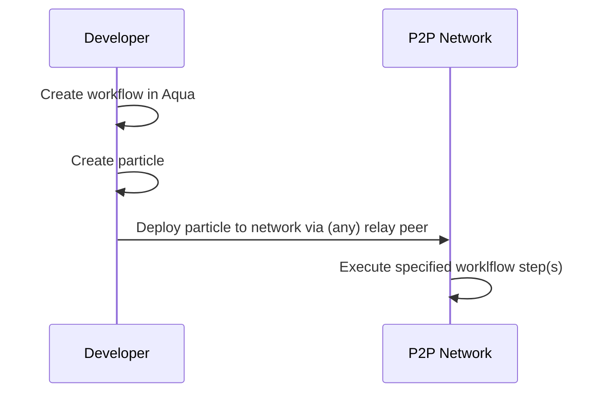
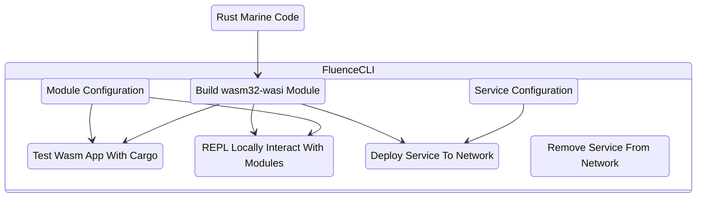
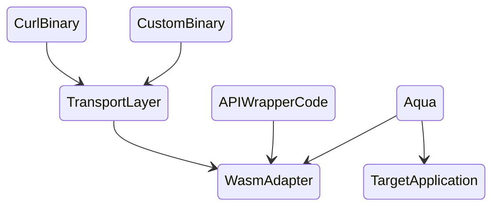

# Fluence Developer Documentation

based on structure outline [https://www.notion.so/fluencenetwork/Developer-Docs-83d1cf23ed9947689feb1cd8578f55fa](https://www.notion.so/Developer-Docs-83d1cf23ed9947689feb1cd8578f55fa)

**WIP**

# **Overview**

Fluence decentralized FaaS is a Web3 alternative to FaaS provided by centralized cloud providers such as AWS Lambda or Google Cloud Functions. Fluence decentralized FaaS allows developers to benefit not only from verifiable service execution, high availability and easily portable code but also highly competitive pricing.

Fluence decentralized FaaS, aka services, are implemented as Webassembly Interface Types (Wasm IT) modules and executed by hardware providers, aka peers, in a public, permissionless peer-to-peer network with global reach. Your code, i.e., Wasm modules, and peer(s) are linked by an on-chain marketplace that allows you, the developer, to specify your willingness to pay in stablecoin, such as USDC, and for peers to decide which payloads to host and execute based on their economic rationale.

Before we dive in, let’s get a bird’s eye view of the anatomy of decentralized serverless built on the Fluence protocol.

Business logic is implemented in Rust and compiled to Wasm. The resulting Wasm module(s) with associated linking and host resource access request specifications are deployed to one or more peers willing to host said modules. ***Note that we call the linked modules a service***. If all goes as planned, you now have your business logic distributed to the peer-to-per network and available to be called. See Figure 1.



Now that we have our business logic deployed to one or more peers of the Fluence peer-to-peer network, we need to implement our application workflow with Aqua. Aqua, as you may recall, is your distributed choreography and composition tool and necessary since your distributed services are not callable by REST or JSON-RPC but over the networks peer-to-peer layer. Once you implemented your workflow and service composition, tooling is available to create the previously discussed particle, i.e., compiled Aqua, data and metadata, and deploy it to the network. Note that the entry point of your workflow program can be any publicly accessible peer, aka relay peer, in the network. See Figure 2.



Your go-to tool for accomplishing almost all tasks except for coding business logic is Fluence CLI. See Figure 3.



## **Get started (with CLI)**

[Fluence CLI](https://github.com/fluencelabs/fluence-cli) is your one-stop command line (CLI) shop to creating, deploying, paying, running, monitoring and removing distributed services to and from the Fluence peer-to-peer network. Moreover, it provides scaffolding that frees you from writing your favorite boilerplate code.

<aside>
👉 Note that Fluence CLI is currently only available for *nix* systems including OSX and Windows Subsystem for Linux (WSL). Moreover, Fluence CLI installs all the required dependencies not already installed on your system including Rust.

</aside>

### **Install Fluence CLI**

[Fluence CLI](https://github.com/fluencelabs/fluence-cli) is available as a *npm* package requiring node and npm to be available on your device. See [nvm](https://github.com/nvm-sh/nvm#installing-and-updating), for example, for installation instructions. With npm readily available, we can install the Fluence CLI:

```
npm -g install @fluencelabs/cli@latest
```

<aside>
👉 At the time of this writing, you need to set your node version to 16 LTS (16.19.0).

</aside>

We can check our installation success (note that your cli and node versions might be different): 

```
fluence --version
@fluencelabs/cli/0.2.46 darwin-x64 node-v16.19.0
```

### Install Other Prerequisites

In addition to Fluence CLI, you need a [WalletConnect]([https://walletconnect.com/](https://walletconnect.com/)) compatible wallet, such as [MetaMask]([https://metamask.io/](https://metamask.io/)) to be able to fund your distributed services with (testnet) USDC.

Our on-chain testnet is Polygon Mumbai: 

RPC: [https://chainlist.org/?testnets=true&search=mumbai](https://chainlist.org/?testnets=true&search=mumbai) 

Faucet: [https://mumbaifaucet.com/](https://mumbaifaucet.com/) or [https://faucet.polygon.technology/](https://faucet.polygon.technology/)

Explorer: [https://mumbai.polygonscan.com/](https://mumbai.polygonscan.com/)

The Fluence testnet USDC Faucet: [https://faucet.fluence.dev/](https://faucet.fluence.dev/)

In your wallet, you may want to create a new account, e.g., Fluence Account, or use an existing one. If not set already, add Polygon Mumbai as a network by clicking on the Networks button in the upper right corner and then the Add Network button and provide the following info:

Figure ?: 


With your account and network setups in good shape, head over to one of the Mumbai faucets listed above, e.g..[https://mumbaifaucet.com/](https://mumbaifaucet.com/) and have your account address ready:

Figure ?:


Follow the instructions and eventually, you’ll have 0.5 (testnet) MATIC in your wallet. 

Finally, head over to the Fluence faucet, [https://faucet.fluence.dev](https://faucet.fluence.dev/) :

Figure ?:


which not only allows you to request testnet USDC but also provides a convenience function to add the testnet USDC token to your MetaMask wallet. Copy your account address into the form, click the Get button and you should see:

Figure ?:


and have 16 FakeUSDC in your account!  To see the transaction data info for both MATIC and FakeUSDC transfers into your account, head over to the [explorer]([https://mumbai.polygonscan.com/](https://mumbai.polygonscan.com/)).

And that concludes the installation section as you are ready!

### **Manage keys**

In order for Fluence CLI to be able to communicate with peers in Fluence’s peer-to-peer network a local, one-shot client peer is created. In order to be able to facilitate secure communication with other peers using end-to-end encryption over libp2p or optionally secure service API functions, a client needs a pair of cryptographic keys just like any other (libp2p) peer. Also note that a peer’s *peer id* is derived from the public key of its key pair.  

Fluence CLI maintains a `users-secret.yaml` file in its global `~/.fluence` directory with a key pair as the default for all your projects:

```bash
cat user-secrets.yaml
# yaml-language-server: $schema=schemas/user-secrets.yaml.json

# Defines user's secret keys that can be used across different Fluence projects. You can manage user's keys using commands from `fluence key` group of commands with `--user` flag

# Documentation: https://github.com/fluencelabs/fluence-cli/tree/main/docs/configs/user-secrets.md

version: 0
keyPairs:
  - peerId: 12D3KooWDJ7XQBqy6rwPseEAQhaRKX6ZWjpLUcDcBoEQ1Lmdbnvb
    secretKey: Rdm8roRWsNqwN/4trrvkHcAhhmv9oaXFIxmhj+Wsa7U=
    publicKey: CAESIDOuw/xI1AD9K/wcqd/92SX2vsAe9+eDdFDTKZnadZpI
    name: auto-generated
defaultKeyPairName: auto-generated
```

If you want or need to, you can create project-specific keys which are stored in the `/<your cli project>/.fluence/project-secrets.yaml`.  In your Fluence CLI project directory:

```bash
fluence key new

? Enter key-pair name to generate at ~/localdev/hello-world/.fluence/project-secrets.yaml
? Enter key-pair name to generate at ~/localdev/hello-world/.fluence/project-secrets.yaml
? Do you want to set  as default key-pair for ~/localdev/hello-world/.fluence/project-secrets.yaml Yes
Key-pair with name  successfully generated and saved to ~/localdev/hello-world/.fluence/project-secrets.yaml
```

Let’s check the config file for the update:

```bash
cat .fluence/project-secrets.yaml
# yaml-language-server: $schema=schemas/project-secrets.yaml.json

# Defines project's secret keys that are used only in the scope of this particular Fluence project. You can manage project's keys using commands from `fluence key` group of commands

# Documentation: https://github.com/fluencelabs/fluence-cli/tree/main/docs/configs/project-secrets.md

version: 0
keyPairs:
  [
    {
        peerId: 12D3KooWDNii7w41s7tULorD5MgeZLK87v92nTvSC8dDNopj56Hx,
        secretKey: gpiGaGhXitP4S0AZEC9E0n09hb87sSSgEX68HvcQZOM=,
        publicKey: CAESIDTc31ZSsdl+iwCX2dbmADhRr23edTGRszDxXWY/K98r,
        name: ""
      }
  ]
defaultKeyPairName: ""
```

Of course, you can also a key pair:

```bash
fluence key remove
 ›   Warning: Key-pair name must be selected
? Do you want to remove ? Yes
Key-pair with name  successfully removed from ~/localdev/hello-world/.fluence/project-secrets.yaml
```

Let’s check:

```bash
cat .fluence/project-secrets.yaml
# yaml-language-server: $schema=schemas/project-secrets.yaml.json

# Defines project's secret keys that are used only in the scope of this particular Fluence project. You can manage project's keys using commands from `fluence key` group of commands

# Documentation: https://github.com/fluencelabs/fluence-cli/tree/main/docs/configs/project-secrets.md

version: 0
keyPairs: []
```

### **Start a new project**

As mentioned at the outset, Fluence CLI is your Swiss army knife to all things Fluence. To keep things familiar, let’s start with the obligatory *Hello World* example to introduce Fluence and Fluence CLI. 

We scaffold a new project with `fluence init` , which gives us a couple scaffolding choices:

```
fluence init
? Select template (Use arrow keys)
❯ minimal
  ts
  js
```

Press return to select the default *minimal* scaffolding option and enter *hello_world* as the project path when prompted:

```rust
? Enter project path or press enter to init in the current directory: hello-world
Successfully initialized Fluence project template at ~/localdev/hello-world
```

Change into your new *hello-world* directory and have a look around:

```bash
tree -L 2 -a
.
├── .fluence             # this is where Fluence CLI internals are kept including project secrets
│   ├── aqua
│   └── schemas
├── .gitignore
├── .vscode
│   ├── extensions.json
│   └── settings.json
├── deals.yaml
├── fluence.yaml         # this is where the project metadata, including service references, are kept
├── src
│   └── aqua             # this is where where distributed servcie choreograpy and composition scripts reside
└── workers.yaml
```

A this point, you see various config (yaml) files and a *src/aqua* dir with a *main.aqua* file that contains a variety of Aqua code examples:

```rust

```

For more information about all things Aqua, see the [Aqua book]([https://fluence.dev/docs/aqua-book/introduction](https://fluence.dev/docs/aqua-book/introduction)).

**Scaffolding Options**

Instead of the *minimal* scaffold chosen at the outset of this section, we can opt for an extended project setup for either Typescript or Javascript. Before we go exploring, a quick review of how Fluence and Aqua work might be in order: All communication with distributed services is over libp2p. That is, you have no use for HTTP clients but need some client peer to interact with the peers hosting your service(s) such as instructing them to execute one of your functions with some parameters. Choosing the *minimal* scaffolding setup provides you with a setup suitable to utilize a one-shot client-peer builtin to Fluence CLI. The TS/JS, setup, on the other hand, provides you with the scaffolding to create a potentially long-running client using [Fluence js-client](https://github.com/fluencelabs/js-client) as well as the TS/JS artifacts.

Table ?: Client peer from scaffolding

|  | Client Type | Client Provider |
| --- | --- | --- |
| minimal | one-shot | Fluence CLI |
| TS/JS | long running | Browser 
Node app |

### Write code

We setup our project and are left with creating our *hello_world* function, which we implement in Rust:

```rust
// hello_fluence.rs
use marine_rs_sdk::marine;             // 1

pub fn main() {}                       // 2

#[marine]                              // 3
pub fn hello_world() -> String {       // 4
    format!("Hello, Fluence!")
}
```

Before we do anything, (1) we need to import the [Marine Rust SDK](https://www.notion.so/Marine-Rust-Runtime-1a48fb4500bf48eb9c5b5ca981169fae), which allows us to compile Rust code to wasm32-wasi compatible with Fluence’s Marine runtime. The `#[marine]` macro, (3), is part of the *marine-rust-sdk*  and exports marked types as publicly visible and callable functions and structs. In (4) we implement our business logic, which ain’t much this time around. 

In (1), we implement a main function which is not marked with the *#[marine]* procedural macro. We discuss modules and module configuration further below. Also note that WASM IT has type limits, which are explained in detail in the [Marine book](https://fluence.dev/docs/marine-book/marine-runtime/i-value-and-i-type). The short version is: you got strings, ints, floats, bytes, arrays and records at your disposal but you do not have generics, traits, etc. Moreover, everything is passed by value and lifetimes are not needed in your Rust code.

Now that we know what our code looks like, let’s use Fluence CLI to scaffold our Rust (sub-)project with the `fluence service new` command. Let’s unbundle this command before we follow the prompts. As discussed earlier, you write your business logic in Rust and compile it to one or more Wasm modules. You then “package” these modules, with help of Fluence CLI, into a *service*. Eventually you deploy this service to one or more peers and use Aqua to interact with them. If your business logic results in only a single module, like our *hello_world* code, then this module is also the service. Hence, we instruct Fluecne CLI to scaffold a new service for our project. 

Now we follow the prompts to complete the setup:

```rust
fluence service new
? Enter service path hello-world
? Do you want to use helloworld as the name of your new service? No
? Enter service name (must start with a lowercase letter and contain only letters, numbers, and
underscores) hello_world
Successfully generated template for new service at hello-world
    Updating crates.io index
   <...>
   Compiling hello_world v0.1.0 (/Users/bebo/localdev/hello-world/hello-world/modules/hello_world)
    Finished release [optimized] target(s) in 17.51s
Added hello_world to fluence.yaml
? Do you want to add service hello_world to a default worker defaultWorker Yes
Added hello_world to defaultWorker
```

So what just happened?  We instructed the CLI to create a path *hello-world* in which we want our *hello_world* module to live. Moreover, we chose to add this information to the project’s main configuration file *fluence.yaml*, which allows Fluence CLI to find what it needs to fulfill command requirements:
**

```bash
# fluence.yaml
version: 2
aquaInputPath: src/aqua/main.aqua
dependencies:
  npm:
    "@fluencelabs/aqua-lib": 0.6.0
  cargo:
    marine: 0.12.6
services:                 # we added these three lines by choosing Y at the prompt
  hello_world:
    get: hello-world
```

 We did the same for *worker.yaml*, which we’ll discuss in detail a little later:

```bash
# workers.yaml
version: 0
workers:
  defaultWorker:
    services: [ hello_world ].  # we added 'hello_world' to the array
```

Using this information, the CLI scaffolded our Rust (sub-)project:

```bash
tree hello-world -L 4 -a
hello-world
├── modules
│   └── hello_world
│       ├── Cargo.toml
│       ├── module.yaml
│       └── src
│           └── main.rs
└── service.yaml
```

Recall, a service is comprised of one or more Wasm modules and associated configuration and each molule, such as *hello_world*, has its own *module.yaml* which contains all the info necessary to identify the module as well as any host resource dependencies. *service.yaml* contains  the service name and a list of the modules comprising the service including is the entry, aka facade, module into the service. 

Looking at the *[main.rs](http://main.rs)* file, you see that it is populated with a greeting example. Replace that code with our code from above so that:

```bash
// main.rs
use marine_rs_sdk::marine;

pub fn main() {}

#[marine]
pub fn hello_fluence() -> String {
    format!("Hello, Fluence")
}
```

With our code in place, let’s finally build our project, i.e. compile our code to a wasm32-wasi module. In your project root directory:

```rust
fluence build
Making sure all services are downloaded... done
<...>
Making sure all modules are downloaded and built... done
```

Depending on your setup, this may take a while as Fluence CLI will attempt to install any missing dependencies including Rust. In the end, you can locate our much anticipated Wasm module in the Rust *target* compile directory:

```bash
ls target/wasm32-wasi/release|grep hello_world.wasm
hello_world.wasm
```

### Test our code

Before we deploy our code to the network, we may wan to run some tests. One way to interact with our Wasm module is to use the [Marine Repl]([https://fluence.dev/docs/marine-book/marine-tooling-reference/marine-repl#run-repl](https://fluence.dev/docs/marine-book/marine-tooling-reference/marine-repl#run-repl)), which is a tool to run our Wasm modules locally as if they were deployed to the network. Again, depending on your setup, this may take a while as Fluence CLI may need to install missing dependencies:

```bash
fluence service repl
? Enter service name from fluence.yaml, path to a service or url to .tar.gz archive hello-world
Making sure service and modules are downloaded and built... ⣻
Making sure service and modules are downloaded and built... done

^^^^^^^^^^^^^^^^^^^^^^^^^^^^^^^^^^^^^^^^^^^^^^^^^^^^^^^^^^^^^^^^^^^^^^^^^^^^^^^^

Execute help inside repl to see available commands.
Current service <module_name> is: hello_world
Call hello_world service functions in repl like this:

call hello_world <function_name> [<arg1>, <arg2>]

^^^^^^^^^^^^^^^^^^^^^^^^^^^^^^^^^^^^^^^^^^^^^^^^^^^^^^^^^^^^^^^^^^^^^^^^^^^^^^^^

Welcome to the Marine REPL (version 0.19.1)
Minimal supported versions
  sdk: 0.6.0
  interface-types: 0.20.0

app service was created with service id = 053dee68-160a-4278-b327-59673ac8067a
elapsed time 34.081026ms

1>
```

Note that we provided the name of the *path* to our service and thanks to the information in the *fluence.yaml, service.yaml and module.yaml* files, the CLI is able to resolve our input and load the REPL with the correct configuration.  For help with the REPL, just type *help* and to list public structs and functions, type *i* :

```bash
1> i
Loaded modules interface:
exported data types (combined from all modules):
<no exported data types>

exported functions:
hello_world:
  func hello_fluence() -> string
```

As expected, our only public function is the *hello_fluence* function in the *hello_world*  namespace. In order to run *hello_fluence*  we use the cll command follow by the namespace, the function and the function arguments:

```bash
> call hello_world hello_fluence []
result: "Hello, Fluence"
 elapsed time: 90.655µs
```

Well done!

An alternative to interactively test a module in the REPL, is to write unit and integration tests for our code. Rust comes with a very nice [testing framework]([https://doc.rust-lang.org/cargo/commands/cargo-test.html](https://doc.rust-lang.org/cargo/commands/cargo-test.html)) widely used to unit and integration test Rust code. However, we don’t necessarily want to test our Rust code but our Wasm modules. With the [marine rust test dsk]([https://crates.io/crates/marine-rs-sdk-test](https://crates.io/crates/marine-rs-sdk-test)), you can do that!

Let’s add the testing code for our *hello-world* module in our *[main.rs](http://main.rs)* file:

```bash
//  main.rs
// <...>
#[cfg(test)]
mod tests {
    use marine_rs_sdk_test::marine_test;    // 1

    #[marine_test( //2
        config_path = "<your path>/hello-world/.fluence/tmp/Config.toml",
        modules_dir = "<your path>/localdev/hello-world/target/wasm32-wasi/release"
    )]
    fn test_hello_fluence(hw: marine_test_env::hello_world::ModuleInterface) { //3
        let greeting = hw.hello_fluence();
        assert_eq!(greeting, "Hello, Fluence".to_string());
    }
}
```

Marine tests fundamentally follows [cargo test]([https://doc.rust-lang.org/cargo/commands/cargo-test.html](https://doc.rust-lang.org/cargo/commands/cargo-test.html)) with the exception that you are testing the Wasm modules not the code to be compiled to a Wasm module. In order to make that work, you need to use the [marine-rs-sdk]([https://crates.io/crates/marine-rs-sdk-test](https://crates.io/crates/marine-rs-sdk-test)) (1). Moreover, we need to provide the paths  to Config.tom and the Wasm module (2). Finally, we need to tap into the Wasm module namespace to be able to call the desired method (3).

Once the test code is in place. you are ready to run *cargo test* :

```bash
cargo test --workspace
   Compiling hello_world v0.1.0 (/Users/bebo/localdev/hello-world/hello-world/modules/hello_world)
    Finished test [unoptimized + debuginfo] target(s) in 1.67s
     Running unittests src/main.rs (target/debug/deps/hello_world-8c35826dfb97c180)

running 1 test
test tests::test_hello_fluence ... ok

test result: ok. 1 passed; 0 failed; 0 ignored; 0 measured; 0 filtered out; finished in 1.45s
```

All is well with our module!

If you change the assert statement to  `assert_eq!(greeting, "Hello, Fluence".to_string());`  and add the corresponding *!* the *hello_fluence* function: `format!("Hello, Fluence!")` and run cargo test again:

```bash
cargo test --workspace
   Compiling hello_world v0.1.0 (/Users/bebo/localdev/hello-world/hello-world/modules/hello_world)
    Finished test [unoptimized + debuginfo] target(s) in 1.71s
     Running unittests src/main.rs (target/debug/deps/hello_world-8c35826dfb97c180)

running 1 test
test tests::test_hello_fluence ... FAILED

failures:

---- tests::test_hello_fluence stdout ----
thread 'tests::test_hello_fluence' panicked at 'assertion failed: `(left == right)`
  left: `"Hello, Fluence"`,
 right: `"Hello, Fluence!"`', hello-world/modules/hello_world/src/main.rs:20:9
note: run with `RUST_BACKTRACE=1` environment variable to display a backtrace

failures:
    tests::test_hello_fluence

test result: FAILED. 0 passed; 1 failed; 0 ignored; 0 measured; 0 filtered out; finished in 1.46s

error: test failed, to rerun pass `--bin hello_world`
```

We added matching *!* to both the test and the code. What gives? Right, we are testing the Wasm module and need to recompile the changed code for the tests to have the most recent module(s). Run `fluence build` and now re-run `cargo test --workspace` and voila, all is well again!

### Deploy service

There a basically two types of host for your services: public or private peer. Deploying to the public network requires the deployment of your service(s) to be tightly coupled with the on-chain marketplace.

**Deploying to the public network**

Paying for services

- hardcoded parmas:
    - epoch: 5 minutes
    - Price per epoch 0.083 USDC == 1 USDC/per hour ??

Fluence CLI makes it rather easy to deploy with 

```bash
fluence deal deploy
    Finished release [optimized] target(s) in 0.10s

Creating deal for worker defaultWorker

To approve transactions with your to your wallet using metamask, open the following url:

https://cli-connector.fluence.dev/?wc=277cfad9-d539-450b-87a9-fe55b2602352%401&bridge=https%3A%2F%2F0.bridge.walletconnect.org&key=22960ca923d833e08483a96a01d92dd9c524814cde1573fcd95362c4188c63a3

or go to https://cli-connector.fluence.dev and enter the following connection string there:

wc:277cfad9-d539-450b-87a9-fe55b2602352@1?bridge=https%3A%2F%2F0.bridge.walletconnect.org&key=22960ca923d833e08483a96a01d92dd9c524814cde1573fcd95362c4188c63a3
```


…


Which, when successful, closes the CLI client.

**Deploying to a private peer or network**

coming soon with worker deploy

### Use deployed services

 

From the command line

From node app

### Manage deployments

soon

## Quickstarts

Fluence CLI allows you to add ready to use Wasm modules to your project either from a path or “packaged” as an archive in form of a gzipped tar package. Reusing your own or other collaborators’ Wasm modules vastly accelerates your project development by facilitating reuse.

 

**Greeting redux**

In the the Fluence  … or maybe not

**Url downloader**

This project creates a distributed service that makes http requests and saves response to a file. This is significant since WASM IT modules are sandboxed, single-threaded programs void of sockets. So how, you ask, can you create a service that manages to use sockets in some shape or form and break through the sandbox and write to the host system. 

… permissoning

The url_downloader repo contains three wasm modules that eventually link into a service.

## **Learning**

I~~f you have followed the introduction or even played with the some of the examples, you know that ... If you haven't read through the [Getting Started](https://hackmd+.vscode-resource.vscode-cdn.net/Fluence%20Developer%20Documentation.md#Getting-Started) section, this is w good time to do so.~~

~~The Fluence solution~~

- ~~Business Logic aka FaaS aka Services~~
- ~~Aqua~~

### **Marine**

~~The Marine stack includes the Marine VM, the Wasm runtime installed on every Rust reference peer, marine-sdks, the ?? you use to develop and test your Rust code, Marine REPL, the run time you …, and the marine cli. Note that both the REPL and the CLI are available to you through Fluence CLI. A detailed account of all things Marine can be found in the [Marine book](https://fluence.dev/docs/marine-book/introduction).~~

### **Aqua**

Aqua is a purposefully lean language but easily extensible. In order to extend Aqua to meet your requirements, you do what you with all the business logic you need implemented: you implement your code as Wasm module(s), deploy the service to the peer(s) you desire and implement the necessary Aqua interfaces to work with …

Some requirements you may deem missing may by others and instead of everybody doing their own one-off, it may make sense to organize such features into libraries.

Let’s look at a simple example:

For all things Aqua, consult the Aqua book.

### **Particle**

Marine is all about implementing and executing your business logic distributed across the peer-to-peer network. Aqua is all about choreographing and composing distributed business logic into decentralized applications.

Particles are the “medium” or smart package that aqua uses to capture state changes between  

At the state level, [particles](https://hackmd+.vscode-resource.vscode-cdn.net/Fluence%20Developer%20Documentation.md) connect Aqua language instructions with the intended Marine Wasm execution. Specifically, a particle is a "smart package" data structure that encapsulates user data, the compiled Aqua script, i.e., AIR, and

### **Develop services**

- …

### **Develop distributed algos**

- ...

Learning

Let's create a vastly improve *hello world* implementation to something a little more informative: we want a function that takes a city name and returns a greeting with the local time, e.g., "Hello, New York. It is 23:01:14."
In order to get the time, we write an adapter using the hosting peers curl binary to make a call to [WorldTimeAPI](https://worldtimeapi.org/). For our purposes, we shift some work on the user and limit our wordly greeting to the following [cities](https://worldtimeapi.org/timezones).

Let's create a new Fluence project with Fluence CLI:

```
fluence init hello-world-with-time
? Select template minimal

Successfully initialized Fluence project template at ~/localdev/documentation-examples/hello-world-with-time

cd hello-world-with-time

```

And let's create a new service:

```
fluence service new
? Enter service path services
? Do you want to use services as the name of your new service? No
? Enter service name (must start with a lowercase letter and contain only letters, numbers, and underscores) hello_world
Successfully generated template for new service at services
? Do you want add hello_world to fluence.yaml? Yes
    Updating crates.io index
   <...>
   Compiling hello_world v0.1.0 (/Users/bebo/localdev/documentation-examples/hello-world-with-time/services/modules/hello_world)
    Finished release [optimized] target(s) in 20.15s
Added hello_world to fluence.yaml
? Do you want to add service hello_world to a default worker defaultWorker Yes
Added hello_world to defaultWorker

```

In the newly created *services* directory, you find the services.yaml configuration file:

```
# services/services.yaml
version: 0
name: hello_world
modules:
  facade:
    get: modules/hello_world

```

Which drives the configuration of the modules comprising the service; in this case, it's just the *hello_world* module, which itself is defined in the services/modules/hello_world/module.yaml:

```
# services/modules/hello_world/module.yaml

version: 0
type: rust
name: hello_world

```

Note that the hello_world module is the [facade module](https://fluence.dev/docs/marine-book/marine-runtime/module-types/), i.e., the module that provides the public access API to all modules comprising the service. Let's add another module to clarify the distinction.

In order to be able to interact with the WorldTimeApi from our Wasm module and Aqua, we need to provide some socket capability for the HTTP call. Since Wasm modules are single threaded without a socket, we need to literally look outside the (Wasm) sandbox. In fact, we are going to write and *adapter* to the service host peer's curl binary! Of course, the host needs to agree to provide the curl resource at the time of accepting to host your service.

Let's write our curl adapter, which is in Fluence parlance called an [effector module](https://fluence.dev/docs/marine-book/marine-runtime/module-types/). Why? Because they can access resources outside the Wasi sandbox, such as host filesystems and binaries.

To access a host's binaries, we need to make use of Rust's [FFI](https://doc.rust-lang.org/nomicon/ffi.html) and Marine supports tis with the [MountedBinary type](https://fluence.dev/docs/marine-book/marine-runtime/mounted-binaries).

In essence, we need to link to the curl binary available on the host system and expose its cli interface to the Wasm module:

```
#[marine]
#[link(wasm_import_module = "host")]
extern "C" {
    fn curl(cmd: Vec<String>) -> MountedBinaryResult;
}

```

Which basically says: the host's curl binary is linked and exposed as an import to the Wasm module and can be called with the `curl` function call, which takes an array of strings as its only argument and returns the [MountedBinaryResult](https://fluence.dev/docs/marine-book/marine-runtime/mounted-binaries):

```
struct MountedBinaryResult:
  ret_code: i32
  error: String
  stdout: Vec<u8>
  stderr: Vec<u8>

```

In essence, this struct encapsulates a return code, an error string and the stdout and stderr sinks you expect from calling a binary. We revisit the use of *MountedBinaryResult* once we start running our code.

Now we need some finishing touches to the adapter code and configuration file. Let's start by adding a new module to the already existing hello_world service:

```
 fluence module new
? Enter module path services/modules/curl_adapter
Successfully generated template for new module at services/modules/curl_adapter

```

In our new curl_adapter module template, replace the example code with the following:

```
use marine_rs_sdk::{marine, MountedBinaryResult};

pub fn main() {}

#[marine]
pub fn curl_request(cmd: Vec<String>) -> MountedBinaryResult {
    curl(cmd)
}

#[marine]
#[link(wasm_import_module = "host")]
extern "C" {
    fn curl(cmd: Vec<String>) -> MountedBinaryResult;
}

```

In addition to our FFI code, we write a wrapper, *curl_request* or whatever name you want to give it, which is the only public method of this module. Recall that the curl function in the FFI section exposes the link to the binary to the module but not beyond. We need to do one more thing to make this module usable and that is to update its configuration file, which currently reads:

```
version: 0
type: rust
name: curl_adapter

```

In order for the Marine runtime and, by extension the host peer, to know what external resources are necessary to run the curl_adapter module, we need to provide additional configuration information. Update your file to:

```
version: 0
type: rust
name: curl_adapter
mountedBinaries:
  curl: /usr/bin/curl

```

Which provides the actual location of the curl command on the host system to MountedBinary. For more detailed information see the corresponding [Marine book](https://fluence.dev/docs/build/concepts/#modules) and [Fluence CLI](https://github.com/fluencelabs/fluence-cli/blob/main/docs/configs/module.md) sections.

Now we have a functioning curl adapter (effector) module ready to be used by *any* other Wasm module in need of HTTP calling capabilities!

Back to the contrived problem at hand: given a city, return a greeting with the local time. Before we dive into the business logic code, let's have a look at how we get our *curl_request* function working in this (facade) module:

```
#[marine]
 #[link(wasm_import_module = "curl_adapter")]
 extern "C" {
     pub fn curl_request(cmd: Vec<String>) -> MountedBinaryResult;
 }

```

This may look rather familiar but the keen observer notices critical differences to the linking code in our *curl_adapter*: our import module is not "host" but the actual *curl_adapter* module, as define in the *services.yaml* configuration file. Moreover, we import the exposed *curl_request* function to our (import) module, which is what we'll use to interact with the host's curl binary.

Just to recap: In the *curl_adapter* module, we used Rust's FFI to link to some yet-to-be determined host's curl binary with the *curl* function. We mapped the *curl* function (alias) in the corresponding module.yaml config file to the actual location of the binary, `/usr/bin/curl`, and wrapped the *curl* function with the *curl_request* function, which is the publicly exposed function for the *curl_adapter* module. We then linked the imported *curl_adapter* module and exposed *curl_request* function to our facade module and now can use *curl_request* to make our HTTP calls.

Finally, it's time to implement our business logic. For the purpose of this discussion, we keep things simple but you are encourage to experiment. Now, the WorldTimeAPI spec for our curl call is: `http://worldtimeapi.org/api/timezone/:area/:location[/:region]` and we can get the `/:area/:location[/:region]` data from the [timezones listing](https://worldtimeapi.org/timezones). So if we wanted to have something like *"Hello, Amsterdam! It's 21:01:15."*, for example, we could pass `Europe/Amsterdam` as a function argument to our yet to be coded function and get back the desired string. Of course, the WorldTimeAPI returns a json document which we need to handle and convert.

Just using curl from your command line, we can preview our response:

```
curl -H "Accept: application/json"  "<http://worldtimeapi.org/api/timezone/Europe/Amsterdam>"

```

Returns this json document:

```
{"abbreviation":"CET","client_ip":"5.182.32.44","datetime":"2023-02-19T21:14:27.666498+01:00","day_of_week":0,"day_of_year":50,"dst":false,"dst_from":null,"dst_offset":0,"dst_until":null,"raw_offset":3600,"timezone":"Europe/Amsterdam","unixtime":1676837667,"utc_datetime":"2023-02-19T20:14:27.666498+00:00","utc_offset":"+01:00","week_number":7}

```

And the *datetime* key looks just what we want!

Go to your *services/modules/hello_world/main.rs* file and replace the template code with the following code and make sure you add the dependencies per the *Cargo.toml* file in the module directory.

```
use chrono;
use marine_rs_sdk::{marine, MountedBinaryResult};
use serde_json;

pub fn main() {}

const WTAPI: &str = "<http://worldtimeapi.org/api/timezone/>";

fn get_timezone(name: String) -> MountedBinaryResult {
    let url = format!("{}{}", WTAPI, name);
    let curl_cmd = vec![
        "-H".to_string(),
        "Accept: application/json".to_string(),
        "-H".to_string(),
        "Content-Type: application/json".to_string(),
        url,
    ];
    let curl_response = curl_request(curl_cmd);
    curl_response
}

#[marine]
pub fn hello_world(name: String) -> String {
    let response = get_timezone(name.clone());

    let response = String::from_utf8(response.stdout).unwrap();
    if response.contains("error") {
        return response;
    }
    let response: Result<serde_json::Value, serde_json::Error> = serde_json::from_str(&response);
    match response {
        Ok(r) => {
            let rfc_dt = r["datetime"].as_str().unwrap();
            let datetime = chrono::DateTime::parse_from_rfc3339(rfc_dt).unwrap();
            let city: Vec<&str> = name.split("/").collect();
            format!("Hello, {} it's {}", city[1], datetime.time().to_string())
        }
        Err(e) => format!("error: {}", e),
    }
}

#[marine]
#[link(wasm_import_module = "curl_adapter")]
extern "C" {
    pub fn curl_request(cmd: Vec<String>) -> MountedBinaryResult;
}

```

We split our business logic into two functions: the *get_timezone* function, which calls the WTAPI with the "region/city" using our curl adapter and just passes on the results struct and the *hello_world* function, which basically turns the ATAPI response in to a string. Let's test the code with the Marine REPL:

```
fluence service repl services

```

Compiles our code and loads our modules and linking configuration right into the REPL:

```
Blocking waiting for file lock on package cache
    <...>
    Welcome to the Marine REPL (version 0.19.1)
Minimal supported versions
  sdk: 0.6.0
  interface-types: 0.20.0

app service was created with service id = 13397857-df8e-4cf9-8eb7-ea8bac730955
elapsed time 104.658786ms

1>

```

And now we can interact with our Wasm modules. The *i*(nterface) command lists all publicly exposed structs and functions:

```
1> i
Loaded modules interface:
exported data types (combined from all modules):
data MountedBinaryResult:
  ret_code: i32
  error: string
  stdout: []u8
  stderr: []u8

exported functions:
curl_adapter:
  fn curl_request(cmd: []string) -> MountedBinaryResult
hello_world:
  fn hello_world(name: string) -> string

```

As you can see, have access to our curl_adapter via the *curl_request* function (and not the *curl* function!), the hello_world function we just coded and the MountedBinaryResult struct.

We're now ready to interact with our modules! Let's stick with the "Europe/Amsterdam" parameter we discussed earlier". We use the *call* command followed by the (module) namespace, function name and parameter(s):

```
2> call hello_world hello_world ["Europe/Amsterdam"]
result: "Hello, Amsterdam it's 00:53:22.964238"
 elapsed time: 344.477878ms

```

Nice. Well done!
Let's see what happens when we get an error back:

```
3> call hello_world hello_world ["Europe/Amsterda"]
result: "{\\"error\\":\\"unknown location Europe/Amsterda\\"}"
 elapsed time: 268.301165ms

```

Ok, the error is handled although the return of a json string vs a string literal may not be the best way to do that. More on that later.

Next, we need to deploy our service to one or more peers.

**todo**: deal deploy

Now that we have deployed our service, it's time to tackle our Aqua script to interact with our distributed service.

In the project root, navigate to the *src/aqua.main* file and replace the template code with the following:

```
aqua Main

import App from "deployed.app.aqua"
import HelloWorld from "services/hello_world.aqua"
export App, hello_world

func hello_world(city: string) -> string:
    services <- App.services()
    on services.hello_world.default!.peerId:
        HelloWorld services.hello_world.default!.serviceId
        res <- HelloWorld.hello_world(city)
    <- res

```

```
fluence run
? Enter a function call that you want to execute hello_world("Europe/Amsterdam")
"Hello, Amsterdam it's 01:12:34.418336"        <- Expected result
Running:
  function: hello_world("Europe/Amsterdam")
  relay: /dns4/kras-09.fluence.dev/tcp/19001/wss/p2p/12D3KooWD7CvsYcpF9HE9CCV9aY3SJ317tkXVykjtZnht2EbzDPm... done

Result:

"\\"Hello, Amsterdam it's 01:12:34.418336\\"\\n"

```

Ignore the log output for a second and you'll see that got our expected result rather quickly:

```
"Hello, Amsterdam it's 01:12:34.418336"

```

And for completeness, let's check on our error prone request:

```
fluence run
? Enter a function call that you want to execute hello_world("Europe/Amsterda")
"{\\"error\\":\\"unknown location Europe/Amsterda\\"}"      <- Expected result
Running:
  function: hello_world("Europe/Amsterda")
  relay: /dns4/kras-01.fluence.dev/tcp/19001/wss/p2p/12D3KooWKnEqMfYo9zvfHmqTLpLdiHXPe4SVqUWcWHDJdFGrSmcA... done

Result:

"\\"{\\\\\\"error\\\\\\":\\\\\\"unknown location Europe/Amsterda\\\\\\"}\\"\\n"

```

All set! Of course, that's a pretty stylized example with not much use other than to demonstrate how to use the Fluence stack to quickly create, deploy and utilize distributed services. But, we're not far from a decent use case!

Imagine that you wanted to power multiple timezone clocks in your DAO frontend as a convenience to DAO users and an easy way to enforce proposal submission or voting cutoff times. Of course, you'd want the clocks to be as closely sync'ed as possible and calling our *hello_world* function multiple times in succession won't do. In fact, you want to execute the API calls in parallel bu as mentioned at the outset, our WASI modules are single threaded and can't provide the concurrent execution pattern you want. So instead of solving concurrency at the (Wasm) module level, we solve it at the choreography level with Aqua. Let's give it go knowing fully well that by using an unverified, centralized source. It is relatively trivial, however, to extend this example to guard against such shortcomings.

While our current *hello_world* function isn't optimal, it is certainly usable in our parallelization use case.

The details of Aqua's parallel execution flow is discussed in the [Aqua book](https://fluence.dev/docs/aqua-book/language/flow/parallel). Most simplistically, for each parallel branch we ant to execute, we need to have a corresponding service deploy. That is, for a list of, say, five timezones, we want to have five deployed services to provide true parallelization of the requests. Now, the services may be deployed to five different peers or just one peer. From an availability and failover perspective, you want to deploy to different peers to avoid a single source of failure and we'll discuss that in more detail in the [???](notion://www.notion.so/fluencenetwork/section).

Let's say we want to power three different timezones for our "world" clocks, so let's deploy two more service instances.

- *todo*: more deal deploy

With that out of the way, we can turn our attention to Aqua. Add the following to your *src/aqua.main* file:

to be completed

- parallelized run

### **Working with data**

Fluence services, aka serverless Functions as a Service (FaaS), are stateless in nature. In order to handle state, services can be equipped to read from/write to local or remote data storage solutions. For the purpose of our discussion, local data storage solutions are provided by the peer hosting the service and remote data sources are independent of the Fluence service hosting environment, e.g., Filecoin or some MariaDB cluster.

Of course, compute services also want realtime access to data from a variety of (streaming) sources, which is quite often provided through some API hosted outside the Fluence network, such as the [Ethereum JSON-RPC API](notion://www.notion.so/fluencenetwork/Fluence-Developer-Documentation-bdf8d06ad52e493fb765456dbd5480cd). You can do integrate such data sources quite easily by writing *adapters*, i.e., Wasm wrappers, for the target API.

## Local Data Storage

A peer hosting services may agree to provide access to their filesystem or allocate additional RAM. However, such persistence provisioning generally comes with no guarantees of availability. For example, a peer reboot will wipe a SQLite in-memory data base. Moreover, by the very nature of their local provisioning, such data sources are only available through the "sponsoring" service: there is no direct data access and when the service ceases to exist so does the data.While local data persistence has its use cases, developers need to be aware of their limitations.

### Local Filesystem

While Wasm modules in general are sandboxed to not have access to host resources, Marine Wasm modules may be granted access to a variety of host resources iff the host peer agrees to such access. The request for resource access and allocation come in form of deployment parameters, which we'll see very soon

The [accompanying repo](notion://www.notion.so/fluencenetwork/Fluence-Developer-Documentation-bdf8d06ad52e493fb765456dbd5480cd).

Let's start by creating a new, minimal Fluence CLI project by the name of your choice:

```
fluence init write-to-file
? Select template minimal

Successfully initialized Fluence project template at ~/localdev/write-to-file

cd write-to-file

```

In the new project directory, we scaffold a new service:

```
fluence service new
? Enter service path services
? Do you want to use services as the name of your new service? No
? Enter service name (must start with a lowercase letter and contain only letters, numbers, and underscores)
filesys_adapter
Successfully generated template for new service at services
? Do you want add filesys_adapter to fluence.yaml? Yes
    Updating crates.io index

```

Which gives us the project scaffold:

```
tree services -L 4 -I target
services
├── modules
│   ├── filesys_adapter
│   │   ├── Cargo.lock
│   │   ├── Cargo.toml
│   │   ├── module.yaml
│   │   └── src
│   │       └── main.rs
│   └── use_filesys
│       ├── Cargo.lock
│       ├── Cargo.toml
│       ├── module.yaml
│       └── src
│           └── main.rs
└── service.yaml

```

And the Rust template:

```rust
// services/modules/filesys_adapter/src/main.rs
#![allow(non_snake_case)]
use marine_rs_sdk::marine;
use marine_rs_sdk::module_manifest;

module_manifest!();

pub fn main() {}

#[marine]
pub fn greeting(name: String) -> String {
    format!("Hi, {}", name)
}

```

Which we'll have to modify. In addition to the adapter, which handles the access to the local resource, we also want a to add some minimal business logic to use our adapter.

```bash
fluence module new
? Enter service path services
? Do you want to use services as the name of your new service? No
? Enter service name (must start with a lowercase letter and contain only letters, numbers, and underscores) use_filesys
Successfully generated template for new service at services
? Do you want add use_filesys to fluence.yaml? Yes
    Finished release [optimized] target(s) in 0.19s
Added use_filesys to fluence.yaml

```

With the scaffolding out of the way, let's code our modules. First, we create our general-purpose, reusable "adapter" module to handle the put/get operations to/from the local, i.e., host peer, filesystem and add a file removal method, `rm`, as well:

```rust
use marine_rs_sdk::marine;

use std::fs;
use std::path::PathBuf;

const SITES_DIR: &str = "/sites/";

pub fn main() {}

#[marine]
pub fn put(name: String, file_content: Vec<u8>) -> String {
    let rpc_tmp_filepath = format!("{}{}", SITES_DIR, name);

    let result = fs::write(PathBuf::from(rpc_tmp_filepath.clone()), file_content);
    if let Err(e) = result {
        return format!("file can't be written: {}", e);
    }

    String::from("Ok")
}

#[marine]
pub fn get(file_name: String) -> Vec<u8> {
    let tmp_filepath = format!("{}{}", SITES_DIR, file_name);
    fs::read(tmp_filepath).unwrap_or_else(|_| b"error while reading file".to_vec())
}

#[marine]
pub fn rm(name: String) -> String {
    let rpc_tmp_filepath = format!("{}{}", SITES_DIR, name);
    let result = fs::remove_file(rpc_tmp_filepath);
    match result {
        Ok(_) => "OK".to_string(),
        Err(e) => e.to_string(),
    }
}```

The code is pretty straight forward read/write but a few lines are noteworthy: The `const SITES_DIR` is the *alias* to the local path and needs to match up with the mapping in `modules.yaml`.

The scaffolded default file looks like this:

```yaml
version: 0
type: rust
name: filesys_adapter

```

Which is not enough. We need to specify that we want this module to be able to access the hosts filesystem via some specified directory and we do this my mounting a named directory mapped to the SITES_DIR alias:

```
//services/modules/filesys_adapter/module.yaml
version: 0
type: rust
name: filesys_adapter
volumes:
  sites: ./tmp

```

For more information on import functions see the [Marine book](https://fluence.dev/docs/marine-book/marine-runtime/configuration-file) and the [configuration properties](https://github.com/fluencelabs/fluence-cli/tree/main/docs/configs/module.md) provided by Fluence CLI.

With our configuration in place, let's build our adapter:

```bash
# in the project root directory
Fluence build
Making sure all services are downloaded... done
   Compiling filesys_adapter v0.1.0 (/Users/bebo/localdev/write-to-file/services/modules/filesys_adapter)
    Finished release [optimized] target(s) in 0.40s
Making sure all modules are downloaded and built... done

```

where the *volumes* section contains the mapping of the actual directory to the alias we set as in the  . For more information on configuring Marine modules, see the [Marine book](https://fluence.dev/docs/marine-book/marine-runtime/configuration-file).

For more effective ways to read/write files, see the [Rust documentation](https://doc.rust-lang.org/std/fs/struct.File.html) and [cookbook](https://rust-lang-nursery.github.io/rust-cookbook/file/read-write.html) and create your own custom file IO adapter!

Now that we have our [effector module](https://fluence.dev/docs/marine-book/basic-concepts/) in place, let's code our [facade module](https://fluence.dev/docs/build/fluence-js/concepts#facade-api), which in our case consists of simple read and write methods essentially wrapping the effector methods with a little convenience: instead of byte arrays we can use human readable strings to write and read our file content.

Recall that Wasm IT modules are shared nothing and that we need to explicitly link dependencies. Before we code our facade, let's have a look at what we need to do to link our effector, aka adapter, module:

```rust
#[marine]
#[link(wasm_import_module = "filesys_adapter")] // 1
extern "C" {
    #[link_name = "get"]
    pub fn file_get(file_name: String) -> Vec<u8>; // 2

    #[link_name = "put"]
    pub fn file_put(name: String, file_content: Vec<u8>) -> String;
}

```

- (1): here we use [Rust's FFI](https://doc.rust-lang.org/nomicon/ffi.html) to specify the module name we want to [import](https://fluence.dev/docs/marine-book/marine-rust-sdk/developing/import-functions)
- (2): for each (public) method in our effector module, we create a link reference and assign a link name, i.e. *get* or *put*, which are now available to the facade module.

Let's put it all together:

```rust
// services/modules/use_filesys/src/main.rs
use marine_rs_sdk::marine;

pub fn main() {}

#[marine]
pub struct IOResult {
    pub stdout: String,
    pub stderr: String,
}

#[marine]
pub fn read_file(name: String) -> IOResult {
    let response: Vec<u8> = file_get(name);
    if response == b"error while reading file".to_vec() {
        return IOResult {
            stdout: "".to_string(),
            stderr: "error reading file".to_string(),
        };
    } else {
        IOResult {
            stdout: String::from_utf8_lossy(&response).to_string(),
            stderr: "".to_string(),
        }
    }
}

#[marine]
pub fn write_file(name: String, payload: String) -> IOResult {
    let content = payload.as_bytes().to_vec();
    let response = file_put(name, content);

    let result = response.as_str().contains("file can't be written:");
    if result {
        return IOResult {
            stdout: "".to_string(),
            stderr: response,
        };
    } else {
        IOResult {
            stdout: "OK".to_string(),
            stderr: "".to_string(),
        }
    }
}

#[marine]
pub fn rm_file(name: String) -> IOResult {
    let result = file_remove(name);
    if &result == "OK" {
        return IOResult {
            stdout: result,
            stderr: "".to_string(),
        };
    } else {
        IOResult {
            stdout: "".to_string(),
            stderr: result,
        }
    }
}

#[marine]
#[link(wasm_import_module = "filesys_adapter")] // 1
extern "C" {
    #[link_name = "get"]
    pub fn file_get(file_name: String) -> Vec<u8>; // 2

    #[link_name = "put"]
    pub fn file_put(name: String, file_content: Vec<u8>) -> String;

    #[link_name = "rm"]
    pub fn file_remove(name: String) -> String;
}

```

Now that our business logic is in place we can compile our code to the Wasm modules:

```
fluence build
Making sure all services are downloaded... done
    Blocking waiting for file lock on package cache
    <...>
    Finished release [optimized] target(s) in 0.20s
    Finished release [optimized] target(s) in 0.20s
Making sure all modules are downloaded and built... done

```

All looks good and we now have two Wasm module we'd like to use as a service. See the respective `target\\wasm32-wasi\\release` directories for the *.wasm files.

We have one more step to complete the create a service from our Wasm modules: specify the linking configuration in the `services/services.yaml` file by naming the appropriate facade and linked module(s). Update your *services.yaml* to:

```yaml
version: 0
name: local_storage
modules:
  facade:
    get: modules/use_filesys
  filesys_adapter:
    get: modules/filesys_adapter

```

Now we can use our service, aptly called *local_storage*, even without deployment to the network in the [Marine REPL](notion://www.notion.so/fluencenetwork/Fluence-Developer-Documentation-bdf8d06ad52e493fb765456dbd5480cd):

```bash
fluence service repl
? Enter service name from fluence.yaml, path to a service or url to .tar.gz archive services
    Blocking waiting for file lock on package cache
    Blocking waiting for file lock on package cache
    Blocking waiting for file lock on package cache
    Blocking waiting for file lock on package cache
    Blocking waiting for file lock on package cache
    Blocking waiting for file lock on package cache
    Finished release [optimized] target(s) in 0.19s
    Finished release [optimized] target(s) in 0.18s
Making sure service and modules are downloaded and built... done

^^^^^^^^^^^^^^^^^^^^^^^^^^^^^^^^^^^^^^^^^^^^^^^^^^^^^^^^^^^^^^^^^^^^^^^^^^^^^^^^

Execute help inside repl to see available commands.
Current service <module_name> is: use_filesys
Call use_filesys service functions in repl like this:

call use_filesys <function_name> [<arg1>, <arg2>]

^^^^^^^^^^^^^^^^^^^^^^^^^^^^^^^^^^^^^^^^^^^^^^^^^^^^^^^^^^^^^^^^^^^^^^^^^^^^^^^^

Welcome to the Marine REPL (version 0.18.8)
Minimal supported versions
  sdk: 0.6.0
  interface-types: 0.20.0
app service was created with service id = 940e0492-86c0-493d-887d-d306dfde024d
elapsed time 86.652549ms

1>

```

Note you can list the available/exposed interfaces with **i**:

```bash
1> i
Loaded modules interface:
exported data types (combined from all modules):
data IOResult:
  stdout: string
  stderr: string

exported functions:
filesys_adapter:
  fn put(name: string, file_content: []u8) -> string
  fn rm(name: string) -> string
  fn get(file_name: string) -> []u8
use_filesys:
  fn rm_file(name: string) -> IOResult
  fn read_file(name: string) -> IOResult
  fn write_file(name: string, payload: string) -> IOResult

```

Recall, our facade, i.e., entry, API is *use_filesys*. Let's interact with our service by writing a file, reading the file, removing the file and reading the files again:

```bash
2> call use_filesys write_file  ["test-file.txt", "Hello, Fluence!"]
result: Object {"stderr": String(""), "stdout": String("OK")}
 elapsed time: 639.177µs

3> call use_filesys read_file ["test-file.txt"]
result: Object {"stderr": String(""), "stdout": String("Hello, Fluence!")}
 elapsed time: 309.581µs

4> call use_filesys rm_file ["test-file.txt"]
result: Object {"stderr": String(""), "stdout": String("OK")}
 elapsed time: 383.201µs

5> call use_filesys read_file ["test-file.txt"]
result: Object {"stderr": String("error reading file"), "stdout": String("")}
 elapsed time: 180.241µs

6>

```

**todo**: worker deploy

- * delete old deploy: **

```bash
fluence deploy
Making sure all services are downloaded... done
    Blocking waiting for file lock on package cache
    <...>
Making sure all modules are downloaded and built... done

Going to deploy services described in ~/localdev/documentation-examples/write-to-file/fluence.yaml:

filesys_adapter:
  get: services
  deploy:
    - deployId: default
use_filesys:
  get: services
  deploy:
    - deployId: default

? Do you want to deploy all of these services? Yes
Going to upload module: filesys_adapter
Going to upload module: use_filesys
Module 'filesys_adapter' was uploaded
Module 'use_filesys' was uploaded
Now time to make the blueprint...
{
  "blueprint_id": "5c6f2b9adb96ca87672fc9917f11b8c7249fce7b73c8769af73f83702ae0c68d",
  "service_id": "b1adf912-abbe-45e8-9b2f-ac26158ba7db"
}
Deploying:
  service: filesys_adapter
  deployId: default
  on: 12D3KooWD7CvsYcpF9HE9CCV9aY3SJ317tkXVykjtZnht2EbzDPm... done
Going to upload module: filesys_adapter
Going to upload module: use_filesys
Module 'filesys_adapter' was uploaded
Module 'use_filesys' was uploaded
Now time to make the blueprint...
{
  "blueprint_id": "5c6f2b9adb96ca87672fc9917f11b8c7249fce7b73c8769af73f83702ae0c68d",
  "service_id": "2a6b3077-67ad-43d8-a181-0d24e8683d08"
}
Deploying:
  service: use_filesys
  deployId: default
  on: 12D3KooWKnEqMfYo9zvfHmqTLpLdiHXPe4SVqUWcWHDJdFGrSmcA... done

Currently deployed services listed in ~/localdev/documentation-examples/write-to-file/.fluence/app.yaml:

filesys_adapter:
  default:
    - blueprintId: 5c6f2b9adb96ca87672fc9917f11b8c7249fce7b73c8769af73f83702ae0c68d
      serviceId: b1adf912-abbe-45e8-9b2f-ac26158ba7db
      peerId: 12D3KooWD7CvsYcpF9HE9CCV9aY3SJ317tkXVykjtZnht2EbzDPm
      keyPairName: auto-generated
use_filesys:
  default:
    - blueprintId: 5c6f2b9adb96ca87672fc9917f11b8c7249fce7b73c8769af73f83702ae0c68d
      serviceId: 2a6b3077-67ad-43d8-a181-0d24e8683d08
      peerId: 12D3KooWKnEqMfYo9zvfHmqTLpLdiHXPe4SVqUWcWHDJdFGrSmcA
      keyPairName: auto-generated

```

Now that we have our services deployed, we can turn our focus on writing the necessary Aqua code. First, we clear out the template code in the `src/aqua/main.aqua` file and start from scratch:

```python
-- src/aqua.main
aqua Main

import App from "deployed.app.aqua"
-- we get these params from .fluence/aqua/services/use_filesys.aqua
import IOResult, UseFilesys from "services/use_filesys.aqua"
export App, write_to_file, read_from_file, remove_file

func write_to_file(filename: string, content: string) -> IOResult:
    services <- App.services()
    on services.use_filesys.default!.peerId:
        UseFilesys services.use_filesys.default!.serviceId
        res <- UseFilesys.write_file(filename, content)
    <- res

func read_from_file(filename:string) -> IOResult:
    services <- App.services()
    on services.use_filesys.default!.peerId:
        UseFilesys services.use_filesys.default!.serviceId
        res <- UseFilesys.read_file(filename)
    <- res

func remove_file(filename: string) -> IOResult:
    services <- App.services()
    on services.use_filesys.default!.peerId:
        UseFilesys services.use_filesys.default!.serviceId
        res <- UseFilesys.rm_file(filename)
    <- res

```

We simply wrapped the exposed facade interfaces with Aqua code and just pass through the returned IOResult data. Let's run our Aqua against the deployed service with familiar parameters:

```bash
# write to file
fluence run
? Enter a function call that you want to execute write_to_file("test_file.txt", "Hello, Fluence!")
{
  "stderr": "",
  "stdout": "OK"
}
Running:
  function: write_to_file("test_file.txt", "Hello, Fluence!")
  relay: /dns4/kras-01.fluence.dev/tcp/19001/wss/p2p/12D3KooWKnEqMfYo9zvfHmqTLpLdiHXPe4SVqUWcWHDJdFGrSmcA... done

Result:

"{\\n  \\"stderr\\": \\"\\",\\n  \\"stdout\\": \\"OK\\"\\n}\\n"

# read from file
fluence run
? Enter a function call that you want to execute read_from_file("test_file.txt")
{
  "stderr": "",
  "stdout": "Hello, Fluence!"
}
Running:
  function: read_from_file("test_file.txt")
  relay: /dns4/kras-02.fluence.dev/tcp/19001/wss/p2p/12D3KooWHLxVhUQyAuZe6AHMB29P7wkvTNMn7eDMcsqimJYLKREf... done

Result:

"{\\n  \\"stderr\\": \\"\\",\\n  \\"stdout\\": \\"Hello, Fluence!\\"\\n}\\n"

# remove the file
fluence run
? Enter a function call that you want to execute remove_file("test_file.txt")
{
  "stderr": "",
  "stdout": "OK"
}
Running:
  function: remove_file("test_file.txt")
  relay: /dns4/kras-00.fluence.dev/tcp/19990/wss/p2p/12D3KooWSD5PToNiLQwKDXsu8JSysCwUt8BVUJEqCHcDe7P5h45e... done

Result:

"{\\n  \\"stderr\\": \\"\\",\\n  \\"stdout\\": \\"OK\\"\\n}\\n"

# try to read from delete file
fluence run
? Enter a function call that you want to execute read_from_file("test_file.txt")
{
  "stderr": "error reading file",
  "stdout": ""
}
Running:
  function: read_from_file("test_file.txt")
  relay: /dns4/kras-06.fluence.dev/tcp/19001/wss/p2p/12D3KooWDUszU2NeWyUVjCXhGEt1MoZrhvdmaQQwtZUriuGN1jTr... done

Result:

"{\\n  \\"stderr\\": \\"error reading file\\",\\n  \\"stdout\\": \\"\\"\\n}\\n"

```

All looks in order, well done! You now have the basic effector module for to write to hosts' filesystem, if permissioned, and a facade template to use.

### SQLite

coming soon.

## Remote Data Storage

### IPFS

[IPFS](https://ipfs.tech/) is a critical component of the Web3 ecosystem and can be considered distributed "hot" storage as opposed to Arweave's or Filecoin's "cold" storage and a great companion to decentralized, serverless compute. Hence, it shouldn't come as a surprise Fluence Rust peers provide IPFS sidecars as IPFS is used throughout the Fluence stack including service uploads for deployment. Moreover, ...

[Aqua IPFS](https://fluence.dev/docs/aqua-book/libraries/aqua-ipfs) builtins with Aqua bindings.

At this point, only a limited set of the IPFS API has been implemented as builtin services. If you need additional methods, please create a PR or Issue in the [Rust peer](notion://www.notion.so/fluencenetwork/Fluence-Developer-Documentation-bdf8d06ad52e493fb765456dbd5480cd) repo.

Based on the groundwork already done by Fluence including providing an IPFS binary, we'll develop and IPFS adapter and a simple facade module.

Conceptually, ... FFI host import

```rust
use marine_rs_sdk::{marine, MountedBinaryResult};

fn main() {}

#[marine]
pub fn ipfs_request(cmd: Vec<String>) -> MountedBinaryResult {
    ipfs(cmd)
}

#[marine]
#[link(wasm_import_module = "host")]
extern "C" {
    pub fn ipfs(cmd: Vec<String>) -> MountedBinaryResult;
}

```

for REPl use ...

to be continued

### Ceramic ComposeDB

Coming soon.

## Data Acquisition

Your compute services may need real time price pairs from a DeFi exchange, want to index NFTs or  generate analytics over real time steaming windows. Regardless of the purpose, chances are you need to interact with one or more provider solutions outside the Fluence network by accessing their API. In Fluence you do that by writing one or more Wasm module to wrap the API functions, thereby allowing you to use capabilities outside the Fluence network across the entire web * chasm.

Keep in mind, the point of writing such adapter services is to be able to use applications outside the Fluence network in your Aqua choreography and service composition!

### Anatomy Of A Wasm API Adapter

There are essentially two ways of interacting with with arbitrary applications outside the Fluence network:

- access the application API via HTTP, e.g., REST or JSON-RPC, using the host peer's curl binary or
- access the application via a cli-type binary hosted on, or run as a sidecar, by Fluence peer(s)

The main difference between the two approaches is that, for the most part, peers provide curl as a standard resource offering, whereas the second, custom binary option requires additional interaction with, and work by, a peer. From an implementation perspective, however, the API "wrapping" logic can be decoupled from the "transport" choice.



to be completed

### **Securing services**

While the current, testnet implementation of the Fluence protocol provides for end-to-end encryption between peers, e.g., the client peer you use with Fluence CLI and the peer hosting the service, the decryption occurs at the peer not the service. Hence, there is a trust gap between a peer and its hosted services. 

At the service deployment side, client peers .. with secret key 

If you are using Fluence CLI …

### **~~Connecting external binaries~~**

~~In previous sections, we have seen how services may be allowed to access host resources including the file system and curl. In addition, we can run ??? , aka binaries, as sidecars to the Fluence peer.~~

~~IPFS~~

### **Debugging**

### **Logs**

## **Limits**

- Network size limits: none according to mike
- Particle data limits: none according to mike
- AquaVM limits: ?
- Marine execution memory limits: nothing deployed to network yet; max is 4GB
- Registry key records limits: 32 , record expiration: 24 hours (from [https://github.com/fluencelabs/registry/blob/main/service/src/defaults.rs](https://github.com/fluencelabs/registry/blob/main/service/src/defaults.rs))
- Hosting requirements for Rust peer: 4GB RAM highly recommended; 2GB might be doable but not recommended

## **Reference**

### **Fluence CLI reference**

### **Clients**

JS Client Reference

...

## **References**

### Libraries

Aqua is a very lean language optimized to bring accessible and ergonomic peer-to-peer choreography and composition into the hands of a broad developer base. Hence, Aqua may not provide all the features you desire or require. Not to fear! Aqua is easily extensible and the Fluence team is already providing multiple libraries for your convenience.

## **Glossary**

[Glossary](https://www.notion.so/Glossary-f32439b2c03a420094aa36263976b7a5)