# Fluence NFT Marketplace User Guide

## About Fluence NFT Collection

Fluence NFTs are your gateway to staking on the Fluence Network, enabling FLT token holders to participate in our mission of global decentralized computing. These NFTs were initially distributed to winners of the first [FLT Stake Race](https://race.fluence.network/), with more to be released in future campaigns.
To participate in staking, you must either have been granted an NFT or purchased one from the newly launched [NFT Marketplace](https://nft.fluence.network/), where current NFT holders can list their tokens for sale.

:::note

Additional NFTs will be released to the winners of the next Stake Race campaign.

:::

This guide will walk you through the Fluence NFT Marketplace, covering:

- An overview of the Marketplace interface
- Step-by-step instructions for buying an NFT
- Procedures for selling or transferring an NFT if you're already an owner

Whether you're looking to enter the Fluence ecosystem or manage your existing NFTs, this guide will provide you with the necessary information to navigate the Marketplace effectively.

### Prepare Your Wallet

Before using the Marketplace, it's essential to properly set up your crypto wallet for the Fluence Network. This preparation is crucial for interacting with all Fluence Web Applications. Your wallet should meet the following criteria:

1. The Fluence Network is added to your wallet's list of networks.
2. The FLT token is imported and visible in your wallet's token list.
3. You have FLT tokens _on the Fluence Network_. Since Fluence is an L2 Network, you must first bridge your FLT tokens from Ethereum to Fluence using the official [Bridge](https://bridge.fluence.network/bridge/fluence).

:::tip

For detailed instructions on wallet setup and token bridging, please refer to our comprehensive [Wallet Guide](../wallets_guide/wallets_guide.md) and [Bridge Guide](../bridge_guide/bridge_guide.md).

:::

Only after your wallet is properly configured and connected to the Fluence Network can you interact with the Fluence NFT Marketplace to buy or sell Fluence NFTs.

## The Marketplace interface overview

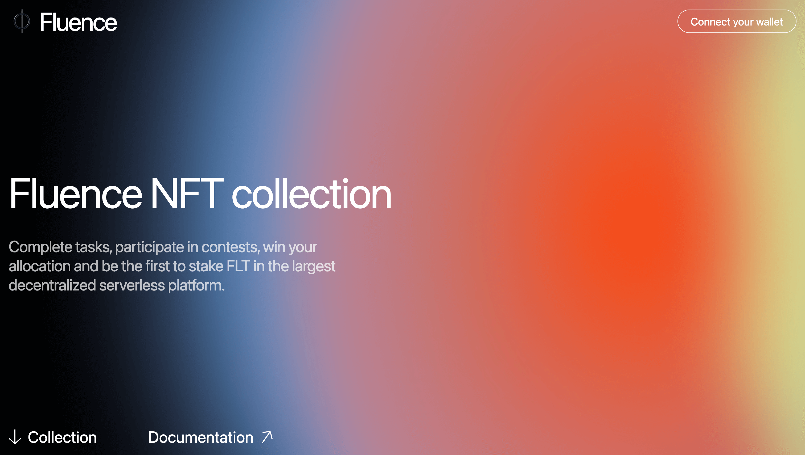
The view of the Fluence NFT Marketplace main page

:::note

Be cautious and use only the official application at [https://nft.fluence.network/](https://nft.fluence.network/). Never share your private keys or seed phrases with anyone, and always double-check the URL before signing the transactions.

:::

The main page of the Fluence NFT Marketplace features three key elements:

- **Top right:** An authentication button to connect your wallet. For a detailed guide on using crypto wallets with Fluence web applications, read the official [guide](../wallets_guide/wallets_guide.md).
- **Bottom left:** A link to the Fluence NFT collection page, where you can buy and sell NFTs and link to the user documentation.

Now, let’s look at the Fluence NFT collection page.

### Fluence NFT collection page

You can find all the minted Fluence NFTs on the main page of the NFT collection site.

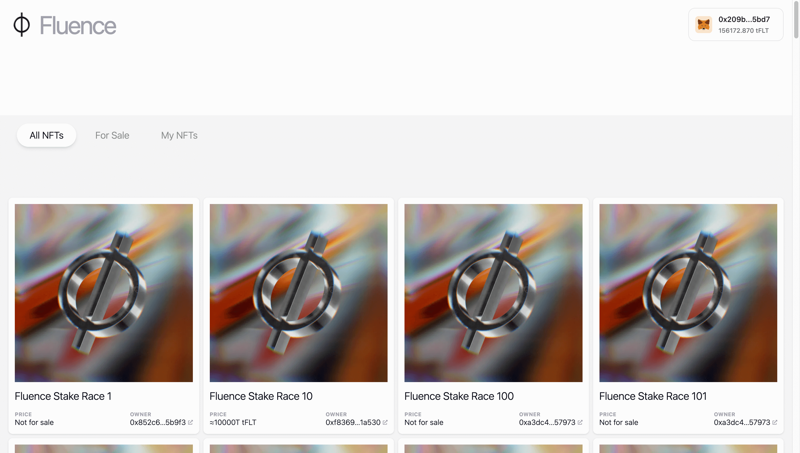
The view of the Fluence NFT Collection main page

You can apply the filters by pressing the buttons:

- `All NFTs`: All NFTs on the Marketplace.
- `For sale`: All NFTs currently sold on the Marketplace.
- `My NFTs` (only for logged-in users): NFTs you own.

## How to buy an NFT

You can buy an NFT from the Fluence NFT Collections in a few simple steps:

1.  First, find NFTs sold on the marketplace by clicking the **“For Sale”** button. In the opened list, choose an NFT that meets your needs.
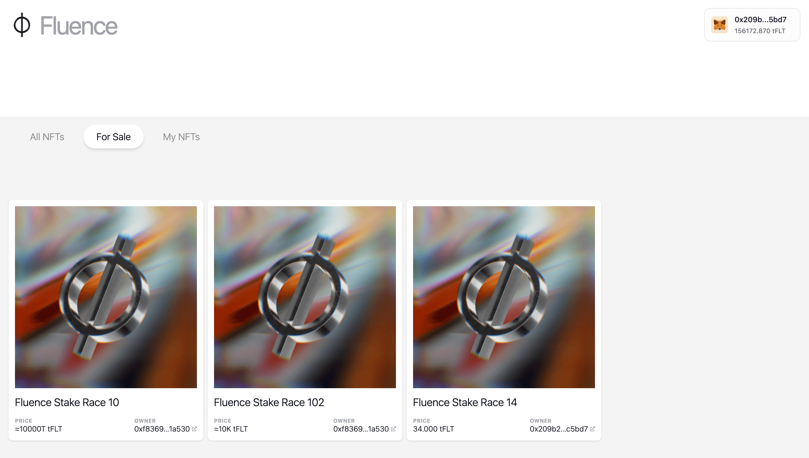

2.  Click on the card of the NFT you want to purchase and press the **“Buy NFT"** button.
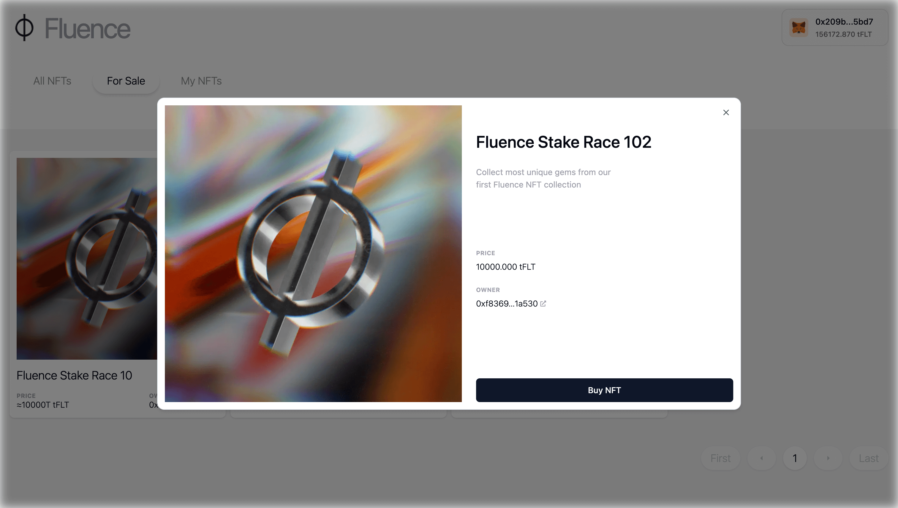

3.  Confirm the transaction in your wallet
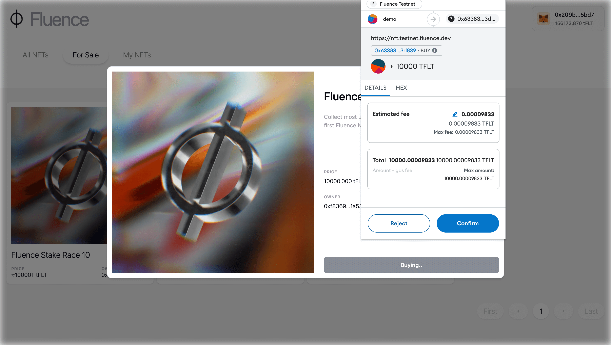

4.  Go to “My NFTs” and find your newly bought NFT by its name. Note that the purchased NFT is no longer available for purchase, as indicated by its “Not for sale” status.
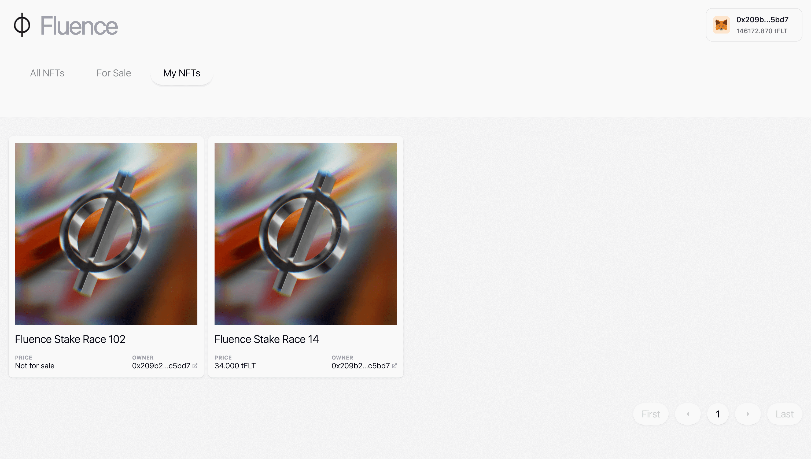

5.  Now you can stake for Capacity Commitments with the NFT you’ve purchased or keep it until you want to sell or transfer it.

## How to Sell or Transfer an NFT

You can list your NFTs for sale at a price you set or transfer them to another address.

First, open the card of the NFT you wish to sell or transfer by pressing the 'My NFTs' button and clicking on the target NFT.

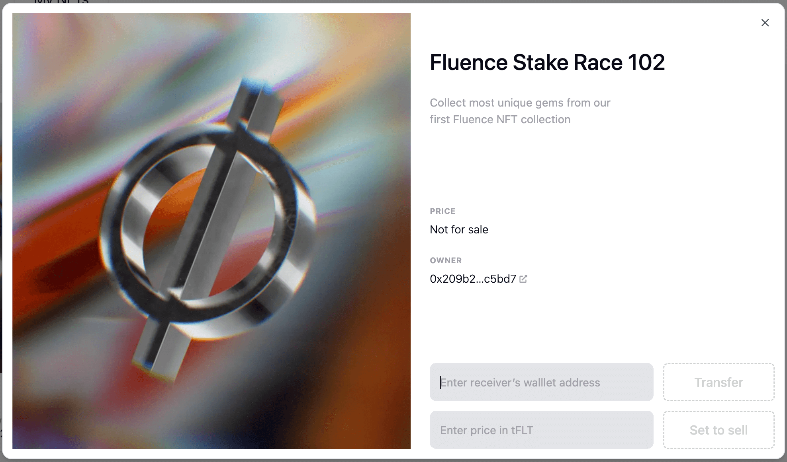

### Transfer an NFT

You can transfer your NFT regardless of its sale status. For that, open the NFT card to be transferred and follow these steps:

1.  Enter the recipient's address.
2.  Press the 'Transfer' button.
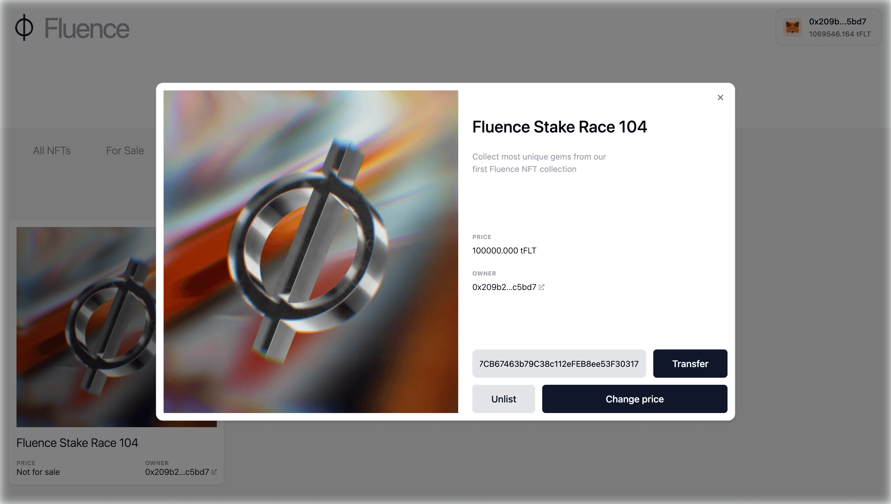

3.  Confirm the transaction in your wallet.
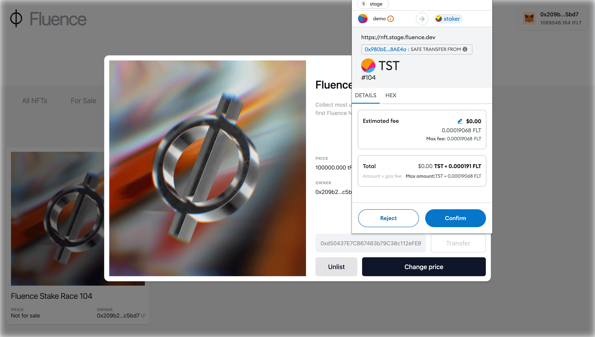

**Note:** NFTs are sold and transferred on the Fluence Network. To be able to view the NFT in their wallet, the recipient must first add the Fluence Network. Read more on preparing the wallet to work with Fluence Network in the corresponding [guide](../wallets_guide/wallets_guide.md).

### Set NFT for sale

When you list an NFT for sale, and someone buys it, the funds are automatically transferred to your address. To sell an NFT, open the NFT card to be sold and follow these steps:

1.  Approve the Marketplace to manage all your NFTs - to transfer them automatically to a buyer; if you haven’t done it before - press the “Approve collection” button.
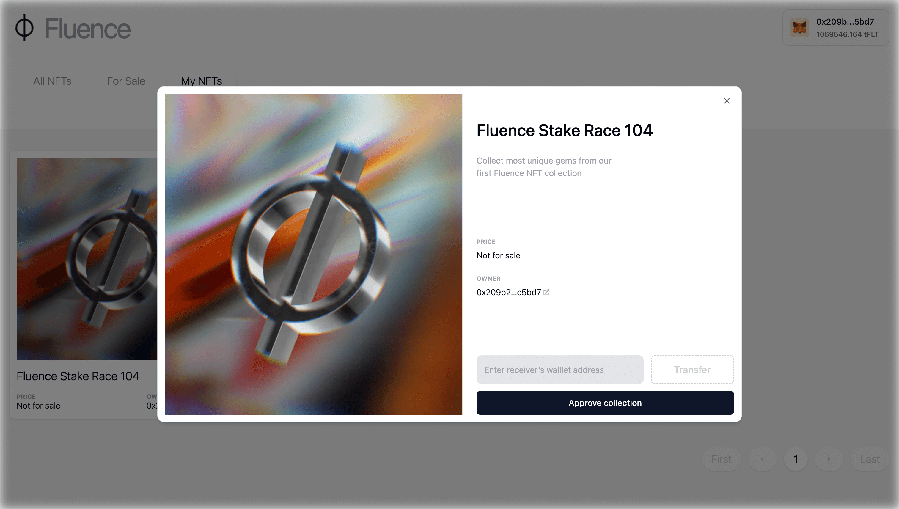

2.  Confirm the approval in your wallet.
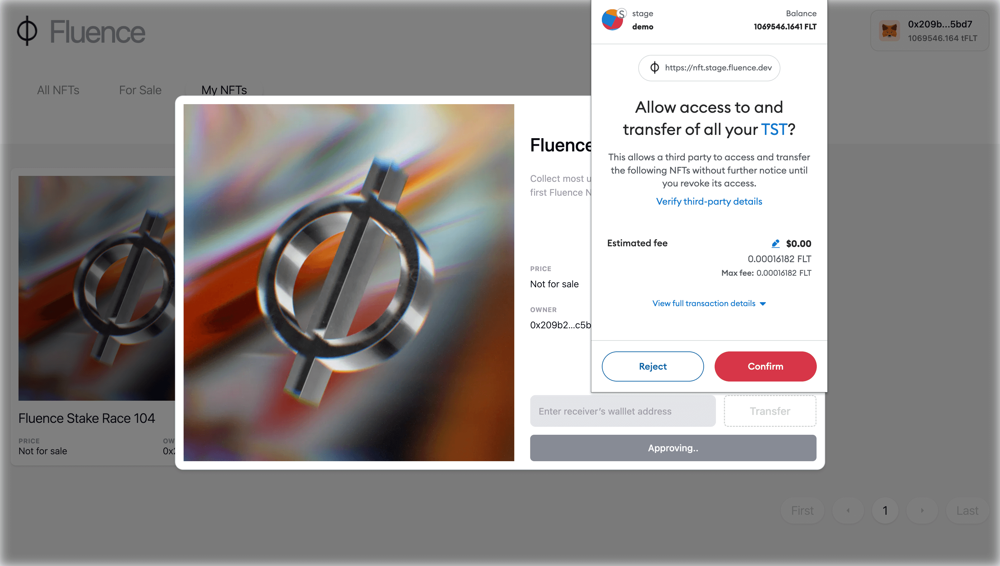

3.  Set your desired selling price for the NFT. Press the "Set to Sell" button and confirm the transaction in your wallet.
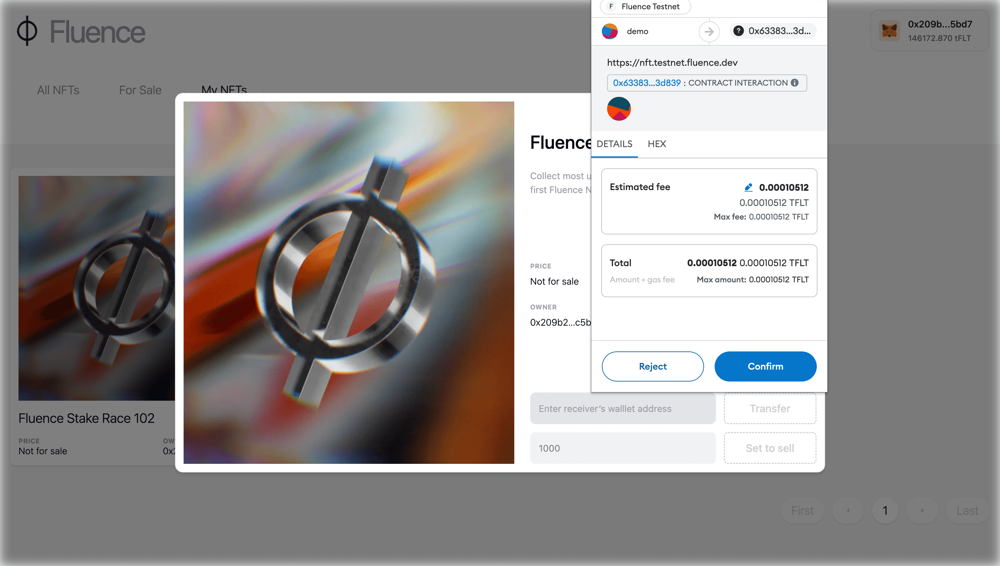

4.  Check that the listed NFT has the correct price.
5.  Wait for the NFT to be sold to someone. Once sold, you'll automatically receive your tokens.

:::note

Even if your NFT is set for sale, you still can transfer it manually without changing the “for sale” status. To do so, open its card and follow the steps described above in the “Transfer NFT” section.

:::

### How to Change the price or Delist an NFT from a sale

You can easily adjust the price or remove an NFT you've listed for sale. Click on the card of the NFT on sale and choose your action:

- To remove the NFT from sale, press the "Delist" button and confirm the transaction in your wallet.
- To change the price, enter the new amount, press the "Change price" button, and confirm the transaction in your wallet.

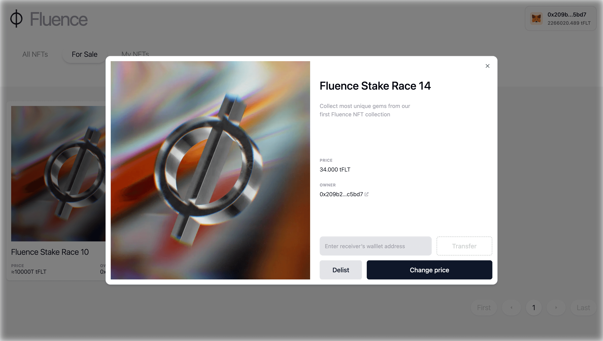
