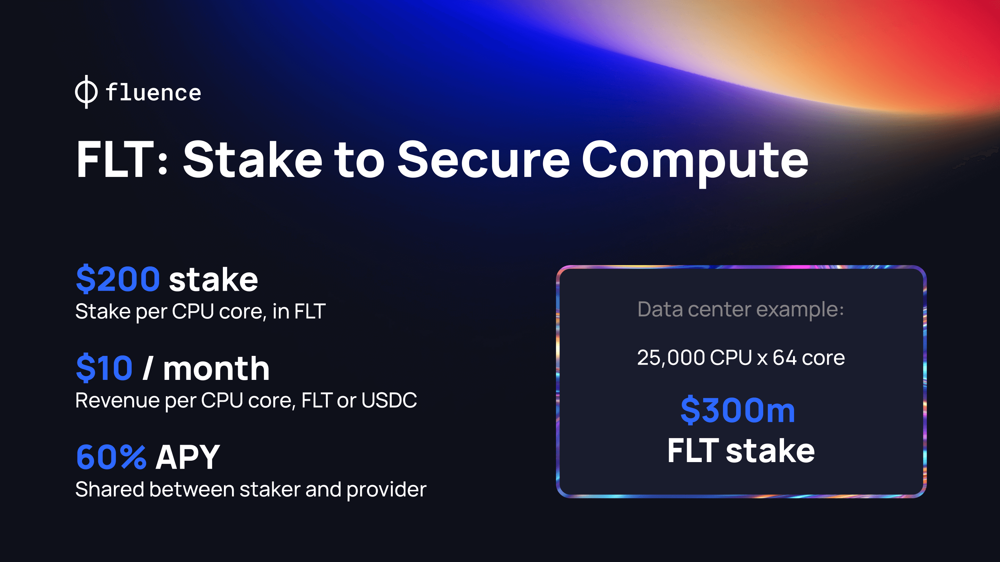

# Overview

Stakers, also known as Delegators, are crucial to the Fluence Network. They contribute FLT token collateral to ensure the Network's decentralization, security and reliability. 

In return for providing the collateral, stakers earn rewards in FLT tokens.

Becoming a Staker on the Fluence Network is rather straightforward and different options are avialble depending on your stake size and desired level of involvement. The general journey to becoming a staker is illustrated in the image below:

The flow diagram showing how to become a staker in the Fluence Network

The flow presented is a general overview of the staking process for **a token holder**.

:::note

At the final step, the staking path splits depending on your deposit size:

- For deposits of USD 12,000 or more in FLT equivalent: Stake directly using the official [Staking App](https://staking.fluence.network/).
- For smaller deposits: Join the [Staking Pool](https://www.parasail.network/delegate/fluence), powered by the re-staking protocol [Parasail](https://www.parasail.network).

:::

## Documentation structure

Learn how to prepare your crypto wallet for interacting with Fluence [**Prepare Your Wallet**](./wallets_guide/wallets_guide.md)

Once you're familiar with the essentials, follow these steps:

- [**Bridge Your Funds to Fluence**](./bridge_guide/bridge_guide.md): Learn how to transfer your FLT and USDC tokens from Ethereum to the Fluence network using the [Fluence Bridge App](https://bridge.fluence.network).
- **Choose Your Staking Method**: Select based on your deposit size and desired level of involvement in the network:
  - [**The Fluence Staking App**](./staking_app_guide/staking_app_guide.md): For deposits > $12,000 USD in FLT equivalent. Learn to stake directly for Capacity Commitments using the official [Staking App](https://staking.fluence.network/).
  - [**The Staking Pool**](https://www.parasail.network/delegate/fluence): For smaller deposits, or for those who want to abstract most of the staking process. The Pool is created with the re-staking protocol [Parasail](https://www.parasail.network).

Each section of this documentation provides detailed information and step-by-step instructions to guide you through your staking journey on the Fluence Network.

### The Fluence Network

Fluence is a decentralized compute marketplace powered by blockchain economics. The network operates through several key components and processes:

1. **Compute Providers and Capacity**: Data centers, also known as compute providers, commit hardware resources (compute capacity) to the Fluence compute marketplace. This capacity is then available for developers to rent.

   - When customers rent the committed capacity, providers are paid in USDC.
   - If the hardware remains idle but ready for immediate use, providers become eligible for FLT rewards.

1. **Proof of Capacity (PoC) Mechanism**: The Fluence Network uses PoC to ensure compute providers can deliver their committed computational capacity to the Marketplace. Providers define their resources as compute Units (CUs), with each CU consisting of:

   - 1 core
   - 4 GB of RAM
   - Additional storage space

1. **Continuous Readiness and Rewards**: To demonstrate ongoing readiness to serve user applications, CUs send cryptographic proofs (PoC) to the blockchain. For each 24-hour epoch where capacity is provisioned but not utilized by user applications, these submitted proofs determine the reward paid in FLT tokens.

1. **Stakers**: Stakers provide FLT token collateral to activate providers' compute on Fluence e and ensure network reliability. They earn FLT rewards for their role in maintaining the network's security and decentralization.

This system ensures a robust, decentralized marketplace where compute resources are efficiently allocated and providers are incentivized to maintain readiness, whether their resources are actively used or standing by for immediate deployment.

### The incentivization layer

Collateral must be staked to allow the provision of providers' compute on Fluence and incentivize them to act wisely. If anyone acts dishonestly—for example, if Compute Units fail to submit capacity proofs — this collateral is partially slashed.

This mechanism involves two parties: the **Compute Provider** with compute power, who earns from proof submission and renting compute power through the Marketplace, and the **Staker**, who earns rewards from providing the collateral. Only staked CUs are considered active in the Marketplace, which is a prerequisite for participating in the reward and user computing programs.

It's in both parties' interests to act wisely. The compute Provider puts their reputation at risk — no one wants to stake for or rent from an untrustworthy provider. The continued failure of the CU to provide the expected proofs leads to penalties and partial slashing of the collateral. If the slashing threshold is reached, the staking agreement is canceled.

### Capacity commitments

A Capacity Commitment is a formal declaration by a provider to offer a specific amount of compute capacity to the Fluence network for a set period. This commitment is made for each Compute Peer (physical server) that a provider wants to commit to the Fluence network.

Each CC has its parameters, the ones important for stakers are:

**CC parameters set by a Provider:**

- **Duration:** The period during which the staked collateral is held—generally, longer durations yield higher rewards for stakers.
- **Staking rate:** The share of rewards allocated to the staker—providers set this rate, but it's in the staker's interest to choose CCs with higher rates.
- **Staker address** (Optional): The address to which CC's provider granted exclusive staking rights if it wanted.

**CC parameters set by the Network:**

- **Collateral:** The FLT tokens amount required to activate a Capacity Commitment (CC), calculated as: `collateralPerUnit` \* `UnitCount`.

:::info **Important numbers**

Current collateral per CU: USD 200 in **FLT** **equivalent**
:::

Once a Capacity Commitment (CC) is chosen and staked, the Compute Peer tied to it must start generating proofs for capacity _starting the next epoch_ when it will be considered active. From the moment of activation, the Peer must submit the specified number of proofs for their capacity every epoch. The DAO determines the epoch length, which is currently set at 24 hours.

### Staker rewards

#### Rewards from Capacity Commitment Proofs

:::info **Important numbers**

Current target revenue per CU: USD 0.33 per epoch in **FLT** equivalent

:::

As previously explained, the collateral for the **Capacity Commitment** acts as a security measure. It incentivizes the Peer linked to the **Capacity Commitment** to consistently submit the required number of proofs for each **Compute Unit** (CU) within every epoch throughout the **Capacity Commitment's** duration.

At the end of each epoch, the smart contract tallies the number of correct proofs submitted by a **Compute Unit**. If a CU meets or exceeds the required number of correct proofs, it receives rewards. However, if a CU fails to submit enough proofs in an epoch, it's penalized by having a portion of its collateral slashed.

The reward for a Compute Unit in an epoch fluctuates around the target value. It's determined by the proportion of correct proofs submitted by the CU relative to the total number of correct proofs submitted by all providers in that epoch. This algorithm ensures that the rewards pool stays close to the target value in FLT, making smooth adjustments when necessary.

_The rewards earned by a CU for submitting proofs are shared between the compute provider and the staker. This division is determined by the staking rate outlined in the Capacity Commitment terms set by the compute Provider who created it._

#### Rewards from Deals

An active Capacity Commitment, in which Compute Units submit proofs that they're ready to serve users' workloads, can be rented by users (developers). Users publish their offer, specifying their compute requirements and the price they're willing to pay.
The Compute Marketplace's smart contract automatically matches offers from providers and developers and verifies that both parties' requirements are met. As a result, a **Deal** is created. CUs then transition from the **Capacity Commitment Proofs submission** to the **Deal** service mode.

For the time spent computing resources in a Deal, CC's Staker **continues to earn rewards in FLT** in the same amount as in the Capacity Commitment Proofs mode.

This arrangement ensures that _stakers' rewards generate stable and predictable revenue_.

#### Vesting

:::info **Important numbers**

**Duration of one vesting period:** 1 epoch (24 hours)

**Total number of vesting periods:** 182 epochs (6 months)

:::

**FLT** rewards earned each epoch are unlocked (vested) over time to encourage long-term commitment to the Network and consistent value contribution.

Rewards unlock proportionally every epoch (24 hours) at a daily unlock amount of 1/182 of vested rewards for the six months period.

Let's break this down with a simple example:

1. In the 5th epoch, you earn 182 FLT.
1. Starting from this moment, for the next 182 days (about 6 months):

   - Every day (which is one epoch), 1 FLT (1/182) from this reward becomes available.
   - This continues until all 182 FLT are unlocked.

1. Now, let's say in the 6th epoch, you earn another 182 FLT.
1. The same process starts again for this new reward:
   - Every day for the next 182 days, another 1 FLT from this second reward becomes available.

This pattern continues for each epoch where you earn rewards. It's like having multiple timers running at once, each slowly releasing your earned FLT over time.

#### Slashing

:::info **Important numbers**

Currently, the **slashing rate** for one failed epoch per compute Unit is set to **0 %** for the **first month** of the Mainnet. It will be increased in the future.

:::

Slashing penalizes Capacity Commitments in which CUs fail to prove claimed capacity or act maliciously against the Network. Currently, it is set to zero.

As previously explained, the collateral in the **Capacity Commitment** acts as a security measure. It ensures that the Peer linked to the **Capacity Commitment** consistently submits the necessary number of proofs for each **Compute Unit** (CU) within every epoch throughout the **Capacity Commitment's** lifetime. If a peer fails to send the required number of proofs for some CUs during an epoch, the CC collateral is slashed according to the slashing rate at the end of the epoch.

The formula that determines how much collateral will be slashed in total:

`totalSlashedCollateral` = `totalFailCount` \* `collateralPerUnit` \* `slashingRate`

**Where:**

- `totalFailCount`: The total number of CUs that failed to send the required proof amount during the overall CC activity time.
- `collateralPerUnit`: The collateral for 1 Compute Unit set by the **DAO**.
- `slashingRate`: The percentage of slashing for 1 compute Unit in 1 failed epoch.

If the total slashed FLT amount exceeds the allowed threshold, the CC is marked as `FAILED`, and the Peer is removed from the Network, preventing further collateral slashing. Withdrawal of slashed collateral has a lock-in period of 30 days.

:::note

If a Capacity Commitment (CC) **fails**:

1. The accumulation of new rewards ceases.
1. The vesting process for existing rewards is halted.
1. All rewards that have completed vesting up to the failure epoch remain available for withdrawal.
1. Any rewards still in the vesting process at the time of failure become permanently locked and cannot be withdrawn.

In essence, you retain access to fully vested rewards but forfeit any partially vested amounts when a CC fails.

:::

### Conclusion

Now you're familiar with all the essentials for stakers and ready to stake your FLT effectively, earn rewards and become a part of the DePIN movement.
