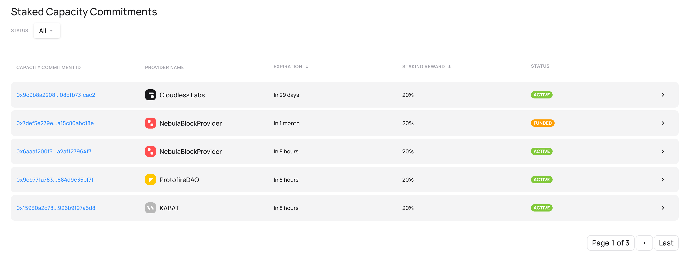
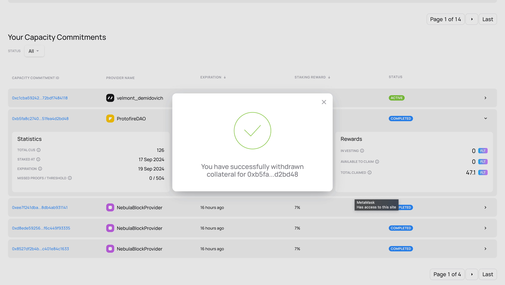

# Fluence Staking Application User Guide

## Introduction

Welcome to the Fluence Staking Application guide.

This document will help you become a delegated staker on the Fluence Protocol, where you can earn rewards by contributing to the security of its decentralized physical infrastructure (DePIN). The Staking Application is a web application that lets you browse Capacity Commitments (CCs), stake your FLT tokens and monitor capacity performance and staking rewards.

You’ll first get familiar with the Staking interface — your control panel for discovering delegated staking opportunities and tracking assets. Then, you’ll follow a step-by-step walkthrough to stake your first Capacity Commitment.

:::note
Fluence uses an L2 app chain anchored to Ethereum.  
To use your FLT and USDC tokens in the Fluence Network, you must bridge them from Ethereum.  
Read more in the [bridge guide](../bridge_guide/bridge_guide.md).
:::

## The staking application overview

:::note
Be cautious and use only the official application at [stake.fluence.network](https://stake.fluence.network). Never share your private keys or seed phrases with anyone and always double-check the URL before signing a transaction.
:::

  
The view of the main page of the Staking Application

The Staking Application consists of the following main parts:

- Top center: The navigation bar with links to the blockchain Bridge Application
- Top right: The button to connect your wallet to the application. Read more on how to connect your wallet to Fluence in this [article](../wallets_guide/wallets_guide.md)
- Panels with a summary of the activated Capacity Commitment performance:
  - **"Capacity commitments"** - distribution of activated CCs by statuses
  - **"Rewards"** - summary of rewards earned by CCs so far
- **Available for Staking:** List of Capacity Commitments available for staking
- **Staked Capacity Commitments:** Real-time information on the performance of active Capacity Commitments. If you are logged in, then the section will change to "**Your Capacity Commitments**"

:::info **The page layout differs for authenticated and unauthenticated users:**

Depending on whether you have logged in by connecting your wallet, the list of Capacity Commitments available for staking will remain the same.

But the information in the **Panels** and the **Staked Capacity Commitments** sections will be different:

- Without a connected wallet, you'll see all Capacity Commitments listed, allowing y
- ou to track and analyze overall Network performance and rewards
- When logged in with your wallet, you'll only see CCs you've activated, along with buttons to withdraw rewards and collateral

:::

The following sections will guide you through the application interface, demonstrate how to stake for a Capacity Commitment for the first time, and then monitor its performance.

### Capacity commitments statuses panel

  
The view of the Capacity Commitments statuses panel

This panel shows the number of Capacity Commitments (CCs) in each current status:

- `Funded`: The CC is activated and will become active at the start of the next epoch
- `Active`: The CC is operational, and its CUs are either submitting CC proofs or participating in Deals
- `Completed`: The CC has successfully ended, but the staker has not yet withdrawn the collateral and rewards
- `Failed`: The CC has failed, but the staker has not yet withdrawn the collateral and rewards
- `Removed`: The staker has withdrawn both collateral and rewards from a completed or failed CC

#### The CC Lifecycle

After staking and activating a Capacity Commitment, it progresses through the following stages:

- It initially enters the `Funded` status
- In the next epoch, the CC transitions to `Active` and begins participating in the network
- Once the CC completes or fails, it enters the `Completed` or `Failed` state.  
  The Provider can initiate collateral withdrawal before the staker by unregistering compute resources from the CC. In that case, the staker’s collateral is automatically returned to their wallet
- After all collateral and rewards have been withdrawn, the CC moves to the `Removed` status

#### The CC Lifecycle

After staking and activating a Capacity Commitment, it progresses through the following stages:

- It initially enters the `Funded` status
- In the subsequent epoch, the CC transitions to the `Active` status and begins participating in the Network
- Upon completion or failure, the CC remains in either the `Completed` or `Failed` status until the staker withdraws the collateral.
  The CC's Provider can start the collateral withdrawal process before the staker. This happens when the Provider unregisters the compute resources from the ended CC. In this case, the collateral is transferred to the staker's wallet.
- Finally, the CC transitions to the `Removed` status, when all rewards and collateral are withdrawn

### Capacity commitments rewards panel

  
The view of the Capacity Commitments rewards panel

This panel provides a summary of rewards earned from Capacity Commitments (CCs) across the network — or specifically from the CCs you've activated if you're logged in.

Rewards accumulate with each epoch and vest over time. Each reward can have one of the following statuses:

- `In vesting`: Rewards that have been earned but are still locked and will vest later
- `Available to claim`: Rewards that are unlocked and can be withdrawn immediately
- `Claimed`: Rewards that have already been withdrawn from the CC.  
  Both the Provider and the staker can initiate the withdrawal. If the Provider initiates it first, the rewards are automatically transferred to the staker’s wallet

:::note

For logged-in users, this panel displays a button to withdraw all available rewards from all Capacity Commitments.

:::

### Available for the Staking section

In this section, you'll find the list of Capacity Commitments available for staking.

  
The view of the Available for staking section

This section has the following components:

- A list of CCs available for staking, each displayed as an expandable card
- **Search bar**: You can filter the list by entering either:
  - Capacity Commitment ID
  - Provider name
- For users with a connected wallet, an **"only for me"** toggle is available. This filter displays only the CCs where Providers have specifically set your wallet address as the sole allowed staker

#### Capacity Commitment cards list fields

  
The view of the available for staking Capacity Commitment cards collapsed

In the collapsed view, each Capacity Commitment card includes:

- `Capacity Commitment ID`: A unique identifier for the CC, with a hyperlink to the Fluence Explorer for more details (including list of Compute Units)
- `Provider name`: The name publicly displayed by the Provider. You can use this to find more details in the Staking Application and in the [Fluence Explorer](https://explorer.fluence.dev/)
- `Staking duration`: The maximum time your assets will remain staked
- `Required collateral`: The amount of FLT tokens required to activate the CC
- `Staking reward`: The staker’s reward share for submitting Capacity Commitment proofs.  
  See the "Key Concepts" section above for more information
- `Expected APR`: The projected annual return based on target revenue per CU per epoch

:::tip
You can sort the list by clicking on any numeric field (after the provider name). This allows you to order the list in ascending or descending order.
:::

Example of the Stake page list of CCs displayed in collapsed card format.

#### Individual Capacity Commitment extended card fields

  
The view of the available for staking Capacity Commitment card extended

Clicking on a Capacity Commitment card expands it to show detailed information about the Commitment and its Provider. This expanded view also includes the option to stake.

**Commitment Information:**

- `Created at`: The date the Provider created the Capacity Commitment
- `Peer ID`: The identifier of the Peer associated with the CC.  
  For more details, visit the Explorer: `https://explorer.fluence.dev/peer/<Peer ID>`
- `Compute Capacity`: The number of Compute Units (CUs) participating in this Commitment.  
  For details on how Fluence measures compute resources, see the "Key Concepts" section above

**Provider Information:**

- `Provider lifetime`: How long the Provider has been registered on the network
- `Total CCs over time`: Total number of Capacity Commitments the Provider has created  
  For full history, visit: `https://explorer.fluence.dev/provider/<Provider id>/capacity`

#### Stake button view

The **"Stake"** button appears differently based on whether your wallet is connected and whether you're eligible to stake for that Capacity Commitment.

- If you haven't connected your wallet to the application, you'll see a **"Connect wallet"** button.

- If your wallet is connected but the Provider has set exclusive staking rights for another address, the **"Stake"** button will be disabled. In this case, choose a different CC for staking.

- If your wallet is connected and you’re eligible to stake, the **"Stake"** button will be active.  
  Read more about how to choose the right CC in the next section.

)

### Staked Capacity Commitments section

This section lists of Capacity Commitments (CCs) activated by the logged-in user or all users. CCs are displayed as expandable cards, providing various information about their performance.

The view of the Staked Capacity Commitments section

You can filter the list by the Capacity Commitment status by clicking on the "Status" collapsable list and choosing the target status of CCs to show.

:::info
Depending on whether you have logged in by connecting your wallet, the CCs listed will be different:

- Without a connected wallet, you'll see all Capacity Commitments listed, allowing you to track and analyze overall Network performance and rewards
- When logged in with your wallet, you'll only see CCs you've activated, along with buttons to withdraw rewards and collateral

:::

#### Individual CC card general information fields

In the collapsed state, each card shows the following general information about a CC:

- `Capacity Commitment ID`: A unique identifier for the CC, with a hyperlink to the Fluence Explorer. This link provides detailed information about the CC, including a list of its Compute Units (CUs)
- `Provider name`: The name set by the Provider for public display. You can use this name to identify the Provider and find more information in both the Staking Application and [Fluence Explorer](https://explorer.fluence.dev/)
- `Expiration`: The period during which the CC will remain active and earn rewards unless it fails earlier
- `Staking reward`: The share of rewards the staker earns for Capacity Commitment activity
- `Status`: The current status of the CC

#### Individual CC card data fields

By clicking on an individual CC card, you can expand it to view additional information about the CC's performance, collateral, and current rewards:

The view of a staked Capacity Commitment card extended

**Statistics:**

- `Total CPU cores`: Number of Compute Units (CU) in this Capacity Commitment (CC)
- `Staked at`: The date when this Capacity Commitment was staked
- `Expiration`: The date when this Capacity Commitment will end and stop earning rewards unless it fails earlier
- `Missed proofs / Threshold`: How many times have this CC's CUs failed to submit Proofs; How many failures are allowed before it's considered failed.
- `Average CC APR`: The estimated yearly return rate, based on the average of rewards earned so far

**Collateral:**

- `Staked collateral`: The amount of FLT staked for the CC
- `Current collateral`: Present value of collateral to be returned to the staker; equals the staked amount if not slashed. **May be zero for already ended CCs with collateral withdrawn**

**Rewards:**

Current CC rewards information mirrors the fields in the total capacity commitments rewards panel. If you're logged in and have staked for the CC, you can withdraw available rewards.

## How to Stake for a Capacity Commitment with the Staking Application

This section provides a step-by-step guide to staking for Capacity Commitments in the Fluence Staking Application.

### Prepare Your Wallet

You'll first need to connect a compatible crypto wallet to use the Staking Application. This section will guide you through ensuring your wallet is ready for use with the Staking Application.

:::tip

Read the comprehensive [guide](../wallets_guide/wallets_guide.md) on using crypto wallets with Fluence web applications.

:::

To ensure your wallet is ready for the Staking Application, verify the following:

1. Your wallet is compatible with Fluence authentication methods.
1. You've added the Fluence Network to your wallet's list of networks.
1. You've imported the FLT token, and it's visible in your wallet's token list.
1. You have FLT tokens _in the Fluence Network_. As Fluence is an L2 Network, you must first bridge your FLT tokens from Ethereum to Fluence using the official Bridge. Click "Bridge" in the top center navigation bar to access the Bridge.

Once your wallet is connected to Fluence, it's time to choose the Capacity Commitment to stake for!

### Find the CC that meets your requirements

To find a CC that matches your requirements, let's review the most important criteria:

- **Expected APR and staking rate:** These values determine your potential rewards. A low staking rate means the Provider shares fewer rewards, but this is relative. A high-performance Compute Peer with a low rate might still outperform a smaller peer with a high rate.
- **Duration:** This is the period your funds will be staked for, if they do not fail earlier because the collateral slashing threshold has been reached. Shorter terms allow quicker fund retrieval and re-staking, while longer terms yield higher rewards.
- **Provider reputation:** Use the Staking Application and Fluence Explorer to assess provider performance.

### Stake

After you've found the CC(s) you want to stake on, it's time to delegate your FLT tokens:

1.  Expand the target CC's card by clicking it
2.  Ensure you're eligible to stake: your wallet is connected to the application
3.  Click the **"Stake"** button

1.  Confirm that you agree with the staking terms in the popped-up window

1.  Sign the transaction in your wallet

1.  A message informing about a successful staking will pop up. This message has the link to the transaction in the block explorer under the "Tx: …" text

1.  You can proceed to the "**Your Capacity Commitments**" section under the list of available for staking CCs section and monitor the status and performance of the staked CC, or stay on this page and choose other CCs for staking

:::info

If someone else has staked a CC before you while you were sending the transaction, or if the transaction has reverted, you will see a message informing you of this!

:::

## How to withdraw rewards

:::info
A Capacity Commitment provider is eligible to initiate the rewards withdrawal process before a staker. In this case, the rewards are automatically transferred to the staker wallet, and the process described below is skipped.
:::

To withdraw rewards, log in to the application using the wallet address you used to activate Capacity Commitments.

The Rewards panel will then display your rewards' current status. "Available to claim" shows the rewards that have been unlocked and are ready to be claimed.

### Withdraw rewards from an individual CC

If you want to withdraw rewards from a CC where they are available, do the following:

1.  Find the CC in the list and click its card to expand it

1.  Click the **"withdraw rewards"** button
1.  Confirm the withdrawal in the popped-up window

1.  Confirm the transaction in your wallet. Notice that the information window in the Staking Application contains the ID of commitment you are withdrawing from

1.  An information message confirming the successful withdrawal will pop up

1.  Ensure that the correct amount of rewards has been transferred to your account and that in the individual CC card:
    - The amount of rewards available to claim has reduced (to zero or a smaller positive value if, during the withdrawal, a new reward was vested)
    - The total claimed value has increased by the amount of rewards withdrawn.

### Withdraw all available rewards

If you want to withdraw rewards from only one CC where they are available, do the following:

1.  Click the **"Withdraw available rewards"** button in the top right panel "Rewards."
1.  Confirm the withdrawal in the popped-up window

1.  Confirm the transaction in your wallet. Notice that the information window in the Staking Application contains the number of commitments you are withdrawing from

1.  An information message confirming the successful withdrawal will pop up

1.  Ensure that the correct amount of rewards has been transferred to your account and that in the rewards panel:

    - The amount of rewards available to claim has reduced (to zero or a smaller positive value if, during the withdrawal, a new reward was vested)
    - The total claimed amount value has increased by the amount of rewards withdrawn
    

### How to withdraw collateral

:::info
The Capacity Commitment provider is eligible to initiate the collateral withdrawal process before the staker removes its Compute Units from the ended CC. In this case, the collateral is automatically transferred to the staker's wallet, and the process described below is skipped.
:::

A staker can withdraw their collateral from a CC once it has completed or failed. The process for withdrawing collateral is essentially the same for completed and failed Capacity Commitments.

However, there's one crucial difference: _Failed CCs have a cooldown period_, during which stakers cannot withdraw collateral. In such cases, the withdrawal button won't appear in the interface until the cooldown period has passed.

:::note **Important numbers**

The cooldown period for withdrawing collateral from a **Failed CC** **now** is **0 epochs** - instant withdrawal is available.
In the **future**, it will be set to **30 days**, during which stakers cannot withdraw collateral.

:::

To withdraw collateral from a Capacity Commitment, do the following:

1.  Find the CC in the list and click its card to expand it

1.  Click the **"withdraw collateral"** button
1.  Confirm the withdrawal in the popped-up window

1.  Confirm the transaction in your wallet
1.  An information message confirming the successful withdrawal will pop up

1.  Ensure that the correct amount of tokens has been transferred to your account and that in the individual CC card:

    - The current collateral field now has 0 tokens available.
    - The "withdraw collateral" button is replaced with an "already withdrawn" caption.
    - The status field in the card now displays "withdrawn".
    
