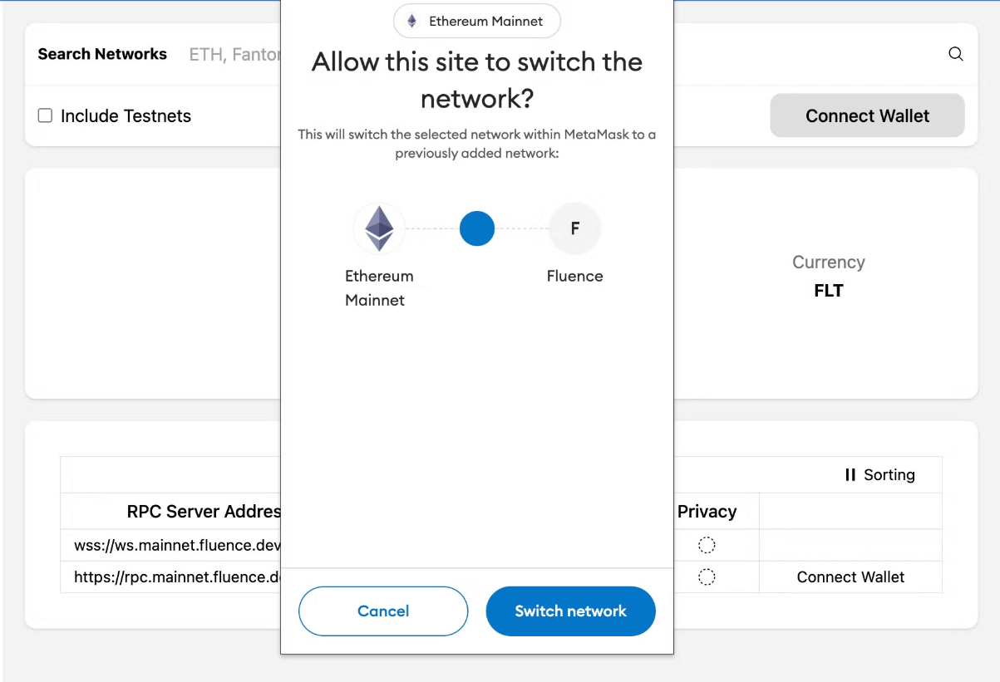
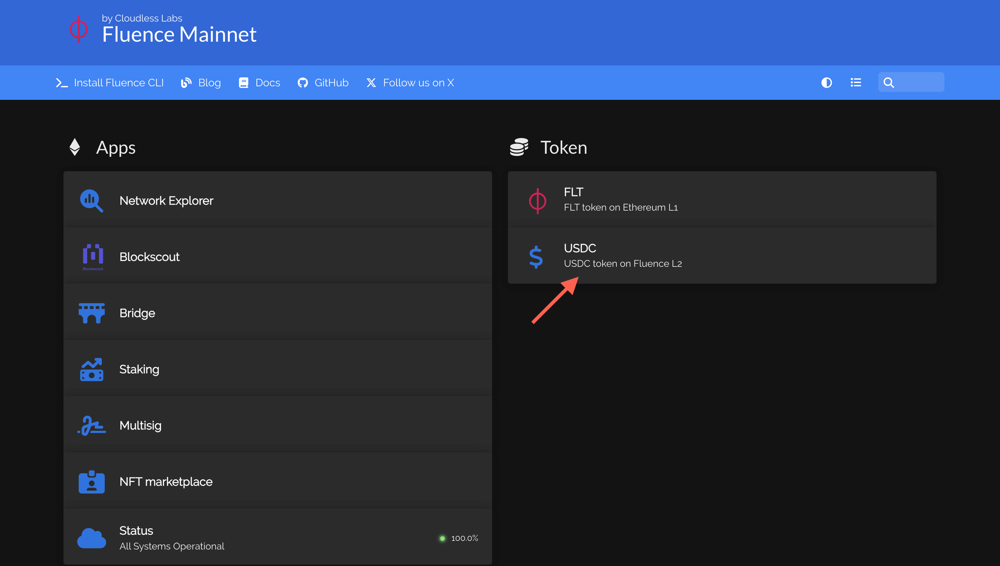
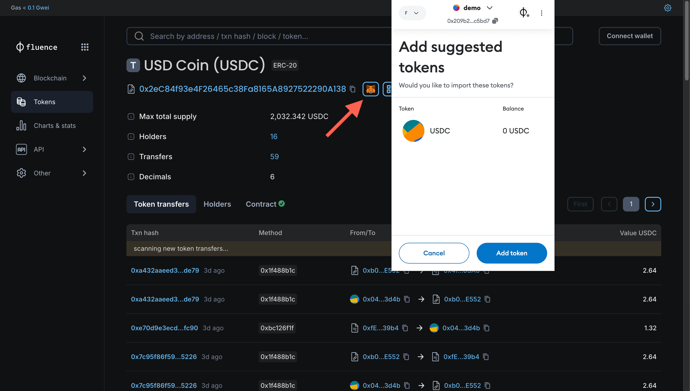
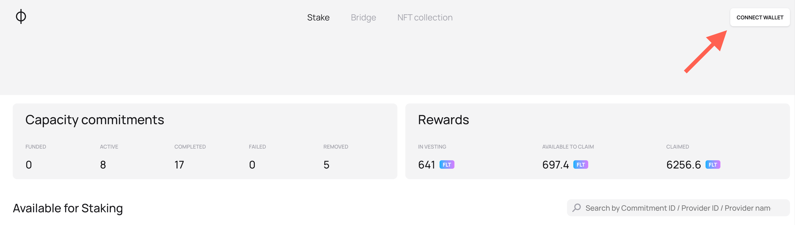
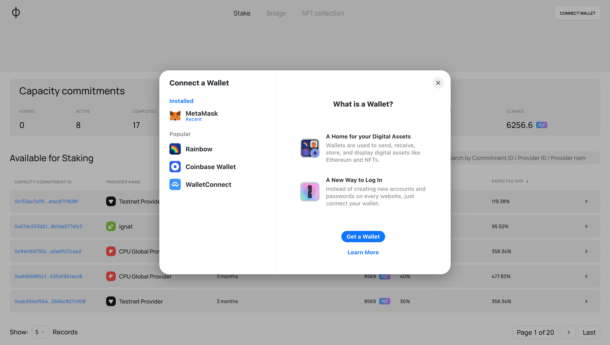
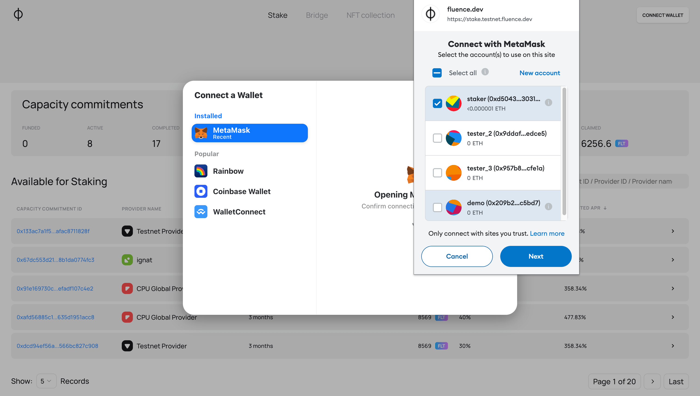
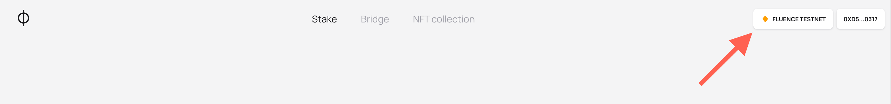
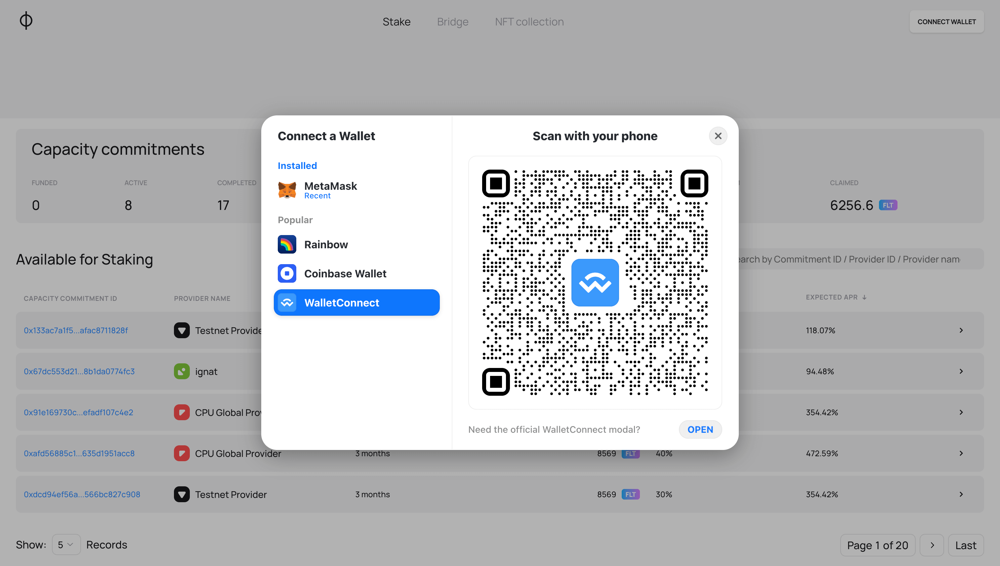
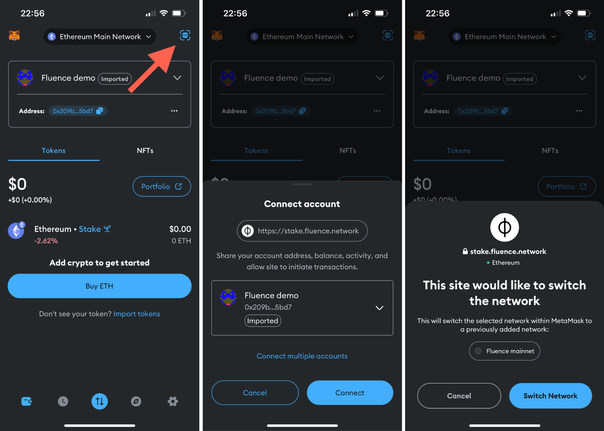

# Using wallets with Fluence web applications

## Introduction

In the Web3 world, authentication relies on a private/public key scheme—a more secure method than traditional password-based approaches. Web3 wallets offer a convenient way to manage these keys and prove identity when logging in or signing transactions.

Fluence applications, like most Web3 services, use wallet-based authentication. We've added support for most wallets on desktop and mobile platforms, so you can use your preferred crypto wallet with our services.

This guide will walk you through setting up your wallet and connecting to the Fluence Network.

We'll then explain how to connect to Fluence web applications using your chosen wallet.

All Fluence web services employ the same authentication method. While the examples in this guide focus on the Fluence Bridge application, the user experience is similar across other Fluence applications.

## Prepare your wallet

Before using Fluence web services, you must set up a compatible cryptocurrency wallet. This section will guide you through connecting your wallet to a Fluence web application and outline the supported wallet options.

You can connect with either desktop or mobile wallets — choose whichever you prefer!

:::tip

You should already have a cryptocurrency wallet. If you don't, we recommend creating one using [MetaMask's beginner guide](https://support.metamask.io/getting-started/getting-started-with-metamask/)

:::

### Supported wallets

Fluence authentication supports various wallet options through either direct app integration or WalletConnect. WalletConnect, an open-source protocol, enables a wide range of wallets to connect with decentralized applications (dApps) via QR codes or deep links.

#### Direct Connection Options

The following wallet applications are available to connect to Fluence services directly:

- Metamask
- Rainbow
- Coinbase Wallet

#### WalletConnect

If your preferred wallet isn't directly supported, you can use WalletConnect.

Through WalletConnect, you can use:

- All the wallets listed above
- Many other popular wallets, including Ledger, Binance Wallet, and Phantom

For a comprehensive list of supported wallets, visit the [WalletConnect Explorer](https://explorer.walletconnect.com/?type=wallet)

:::note

Further, Metamask is used as the examples' main wallet, but the actions shown are mostly the same for the other wallets.

:::

### Import FLT tokens to your Ethereum wallet

:::note

You can skip this part if you have already added FLT tokens to your wallet, and they are displayed in the list of available assets.

:::

Initially, FLT tokens are not displayed in your wallet connected to the Ethereum network and must be added.

To display FLT tokens in your assets list (Metamask example is shown below):

1. User the address of the FLT token contract address: [0x236501327e701692a281934230AF0b6BE8Df3353](https://etherscan.io/token/0x236501327e701692a281934230AF0b6BE8Df3353)
1. Copy this string and open your wallet, find the **“Import tokens”** button, and press it
1. In the opened window, paste the token address to the input field and wait till the token symbol and the token decimal are loaded
1. Confirm the token addition and proceed
1. The token should appear in the list of your assets

:::note

To resolve any issues on the Metamask side, check the official [documentation](https://support.metamask.io/managing-my-tokens/custom-tokens/how-to-display-tokens-in-metamask/)

:::

How to add the FLT token in MetaMask

### Add Fluence Network to your wallet

By default, your wallet does not include the Fluence network and token configuration. This section will show you how to add Fluence Network to your wallet with Chainlist or manually in your wallet.

#### Using Chainlist

You can add Fluence Network with Chainlist:

1.  Fluence can be found on Chainlist by this [link](https://chainlist.org/chain/9999999). Proceed to the site.
1.  Press **“Connect Wallet”** button.

Fluence Network listing on Chainlist
1.  In the opened window of your wallet, approve adding Fluence Network to your wallet. Confirm the action by pressing the **"Approve"** button.

Approving the addition of Fluence Network in MetaMask
1.  The wallet will then prompt you to switch the current network to the Fluence network. Confirm the switch by pressing the **"Switch network"** button.

Switching to Fluence Network in MetaMask

#### Manually

To add Fluence Network manually:

1. Open the setting of your wallet app and find the **“Networks”** section or something similar

1. Click the **“Add a Network”** button or similar
1. Fill the fields as follows:
   - **Network:** Fluence
   - **Network URL/ RPC URL:** [https://rpc.mainnet.fluence.dev](https://rpc.mainnet.fluence.dev)
   - **Chain ID:** 9999999
   - **Currency symbol:** FLT
   - **Block explorer URL:** [https://blockscout.mainnet.fluence.dev](https://blockscout.mainnet.fluence.dev/)
1. Click the **“Save”** button
1. Go to the list of your networks and ensure that Fluence is found in the list
1. Switch to Fluence Network

Now you have Fluence Network on your wallet's list of available networks and are ready to connect to Fluence services.

### (Optional) Import USDC tokens in the Fluence Network to your wallet

:::note

You can skip this part if you have already added USDC tokens to your wallet in the Fluence Network and they are displayed in the list of available assets, or if you don't plan to use USDC in the Fluence Network to create Deals.

:::

To display USDC tokens in your assets list in the Fluence Network (Metamask example is shown below):

1. Open the Fluence Mainnet [page](https://mainnet.fluence.dev/) and press the **“USDC”** button.
1. In the opened [Blockscout page](https://blockscout.mainnet.fluence.dev/token/0x2eC84f93e4F26465c38Fa8165A8927522290A138), you can see the USDC token contract address in the Fluence Network.

1. **Add automatically**: You can add the token automatically by pressing the button with the Metamask wallet icon and confirming the action in the wallet

1. **Add manually**:
   - Copy the address of the FLT token contract address from Blockscout or this string: `0x2eC84f93e4F26465c38Fa8165A8927522290A138`
   - Copy this string and open your wallet, find the **“Import tokens”** button, and press it
   - In the opened window, paste the token address to the input field and wait till the token symbol and the token decimal are loaded or input them manually (you can find this information on the Blockscout page)
   - Confirm the token addition and proceed
   - The token should appear in the list of your assets

How to add the USDC token in the Fluence Network in MetaMask

## Connect your wallet

Now, when you are ready to use your wallet, let’s authenticate by connecting it to the application. This guide shows you how to use Metamask as a direct wallet and Trust Wallet mobile with WalletConnect to log in to Fluence services like the Fluence Staking App.

First, press the **“Connect Wallet”** button in the top right corner.

Fluence App top part view without the user's wallet connected

### Connect with direct app

1. Choose a wallet to connect from the list of available ones

1. In the open wallet window, select the account for connection and confirm the action.

1. **Optional step:** If your wallet is connected to a different network, you will need to switch to the Fluence Mainnet first. The application will prompt you to switch the network. Confirm the switch.

1. When the wallet is connected, the “Connect” button in the top right corner will be replaced with new buttons: one with the network name and one with the connected wallet address on it.

1. You can press the button with the wallet address to see the connected wallet details and log out.

### Connect with WalletConnect

If your preferred wallet isn't directly supported, you can use WalletConnect to link it to the Fluence Bridge. The actions are similar to the direct connection, but the process starts with a QR code scan.

1. Select WalletConnect from the list of available wallets.
1. A QR code will appear on your screen.

1. Choose the app for authentication:

   - For mobile: open your preferred wallet app on the phone and scan the QR code displayed
   - For desktop: press the “Open” button under the QR. Choose the desktop app for authentication you prefer

   In this guide, **Metamask mobile app** is used as an example.

1. Open your mobile wallet app and look for a scan or WalletConnect option (usually in the settings or the main menu).
1. Use your wallet app to scan the QR code displayed on the Fluence Bridge website.
1. Your wallet app will ask for confirmation to connect. Approve the connection.
1. **Optional step:** If your wallet is connected to a different network, you will need to switch to the Fluence Mainnet first. The application will prompt you to switch the network. Confirm the switch.

How to connect to a Fluence Application through WalletConnect and a mobile application

Now that you've connected your wallet to a Fluence Application, you're all set to start using it and participate in the Fluence Network.
